# DATA ORCID CHILE

Umfassender Leitfaden für die Rollen Nutzer und OAI-Nutzer.

**VERSION:** 2.1 · **AKTUALISIERT:** September 2026

## 1. Zweck und Geltungsbereich

Mit DATA ORCID CHILE können Sie öffentliche ORCID-Informationen einsehen und analysieren, die durch OpenAlex-Metadaten ergänzt werden. Dieses Handbuch begleitet die Rollen Nutzer und OAI-Nutzer: Anmeldung, Recherche, Analysen, Downloads, Integration und Kontoeinstellungen.

Beide Rollen arbeiten innerhalb der ihrem Konto zugeordneten Einrichtung und der aktivierten Module. OAI-Nutzer können zusätzlich Artikel auswählen, DOI importieren, die OAI-PMH-Metadatenzuordnung bearbeiten und den Zugriff für die Metadatenernte verwalten.

Diese Ausgabe behandelt Exporte im Hintergrund, die Veröffentlichung über OAI-PMH und die an verfügbare Module angepasste Hilfe.

| AKTION | NUTZER | OAI-NUTZER |
| --- | --- | --- |
| Institutionelle Module einsehen | Verfügbar | Verfügbar |
| Sichtbare Daten und Berichte herunterladen | Verfügbar | Verfügbar |
| Mögliche Dubletten prüfen | Nur Lesezugriff | Nur Lesezugriff |
| OAI-PMH-Inhalte einsehen | Nur Lesezugriff | Verfügbar |
| Artikel auswählen und DOI importieren | Nur Lesezugriff | Verfügbar |
| dataorcid-Zuordnung bearbeiten | Nur Lesezugriff | Verfügbar |
| Eigenes Konto und Passwort ändern | Verfügbar | Verfügbar |

> **WICHTIG:** Die Abbildungen zeigen die Oberfläche der Version 2.1 mit fiktiven Demonstrationsdaten. Namen, ORCID iDs, DOIs, RORs und Beispieladressen dürfen nicht als echte Datensätze verwendet werden.

## 2. Zugang und Navigation

### 2.1 Anmelden

Rufen Sie www.orcid.cl auf und melden Sie sich mit Ihrem Benutzernamen oder Ihrer institutionellen E-Mail-Adresse und Ihrem Passwort an. Nutzen Sie die dauerhafte Anmeldung nur auf einem persönlichen oder von Ihrer Einrichtung verwalteten Gerät.

Die Willkommens-E-Mail enthält Ihre Zugangsdaten und einen Link zu diesem PDF-Handbuch, das ohne Anmeldung heruntergeladen werden kann. Der Link öffnet die Ausgabe in Ihrer Kontosprache: Englisch, Spanisch, Französisch, Portugiesisch oder Deutsch. Ändern Sie bei der Anmeldung das vorläufige Passwort.

Falls Sie Ihr Passwort vergessen haben, öffnen Sie die Wiederherstellung, geben Sie Ihre Konto-E-Mail-Adresse ein und folgen Sie dem erhaltenen Link. Die Bildschirmmeldung verrät nicht, ob eine Adresse registriert ist. Prüfen Sie bei ausbleibender Nachricht den Spamordner und wenden Sie sich an das zuständige Team.

Die Sprachauswahl bietet die aktivierten Sprachen Englisch, Spanisch, Französisch, Portugiesisch und Deutsch. Eine während einer angemeldeten Sitzung gewählte Sprache wird als Kontoeinstellung gespeichert.

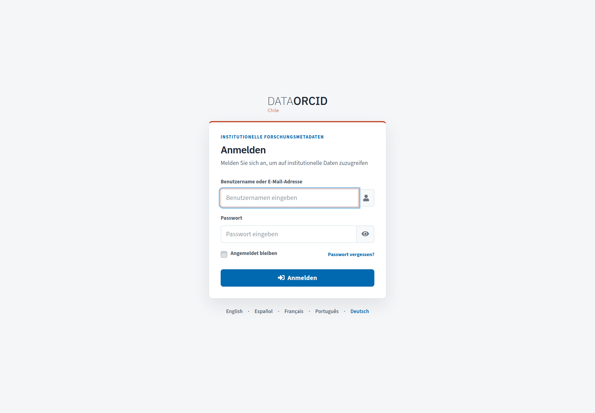

ABBILDUNG 1. Anmeldung und Sprachauswahl.

## 2.2 Aufbau der Oberfläche

Das Seitenmenü ordnet die Funktionen unter Erkunden, Daten verwalten, Integrieren und Hilfe ein. Hinzu kommt der Zugang zur Übersicht. Die obere Leiste zeigt die aktive Einrichtung, die Sprache und persönliche Optionen. Verfügbare Module hängen von der Dienstkonfiguration und Ihrer Kontorolle ab. Der Link „Benutzerhandbuch“ mit PDF-Symbol neben Ihren Kontooptionen lädt dieses Handbuch in der aktiven Sprache herunter.

Aktualisierungsanzeigen zeigen, ob Informationen aktuell sind oder Aufmerksamkeit erfordern. Prüfen Sie diesen Status, bevor Sie eine Zahl interpretieren oder einen Datensatz herunterladen.

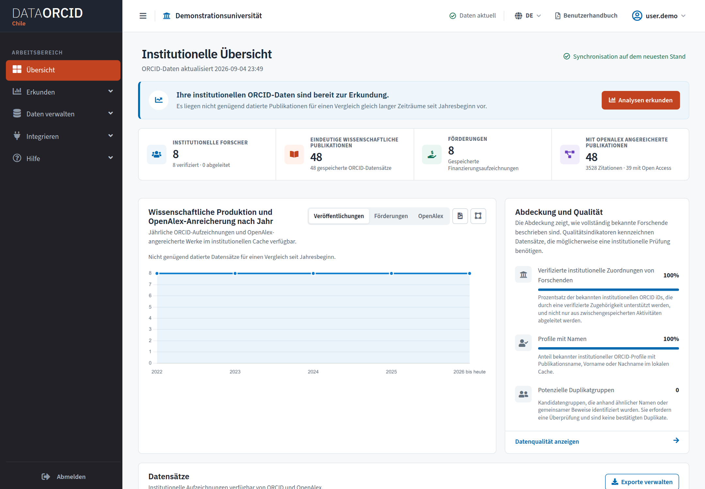

ABBILDUNG 2. Institutionelle Übersicht und Navigation für die Rolle Nutzer.

1. Prüfen Sie, ob die angezeigte Einrichtung Ihrem Konto entspricht.
2. Öffnen Sie eine Menügruppe und wählen Sie die gewünschte Seite.
3. Prüfen Sie in jeder Ansicht die Filter und Aktualisierungsdaten.
4. Melden Sie sich nach Abschluss unten im Seitenmenü ab.

## 3. Erkunden

### 3.1 Institutionelle Übersicht

Die Übersicht vereint Forschende der Einrichtung, eindeutige wissenschaftliche Publikationen, Förderungen und mit OpenAlex angereicherte Veröffentlichungen. Sie enthält Trends, Abdeckung, Datenqualität und Verknüpfungen zu Recherche und Downloads.

Beginnen Sie hier, um den Gesamtstand zu prüfen. Öffnen Sie die passende Analyse, um eine Kennzahl genauer zu untersuchen, und nutzen Sie die Qualitätsansichten, um Informationslücken zu verstehen.

Die Zahlen spiegeln die in der Plattform verfügbaren Informationen wider. Eine Person kann im institutionellen Verzeichnis stehen, obwohl keine öffentlichen Werke oder Förderungen im Cache vorliegen.

ABBILDUNG 3. Allgemeine Kennzahlen der Demonstrationseinrichtung.

> **WICHTIG:** ORCID-Datensätze zählen Vorkommen in der Quelle. Kanonische Publikationen fassen mögliche Wiederholungen zusammen. Unterschiedliche Zahlen müssen daher keinen Fehler bedeuten.

## 3.2 Verzeichnis der Forschenden

Im Verzeichnis können Sie nach Namen, ORCID iD oder E-Mail suchen, nach Affiliation Manager und Belegen für die institutionelle Zugehörigkeit filtern sowie Ergebnisse sortieren. Pro Seite sind 10, 25 oder 50 Zeilen möglich.

Suche und Sortierung gelten für die gesamte Ergebnismenge. CSV- und Excel-Exporte enthalten die gefilterten Ergebnisse einschließlich der Datensätze außerhalb der sichtbaren Seite.

Verifizierte Belege können aus ROR-, GRID- oder Ringgold-Kennungen stammen. Eine aus dem Cache abgeleitete Zugehörigkeit ist ein Arbeitshinweis und von einer verifizierten Zuordnung zu unterscheiden.

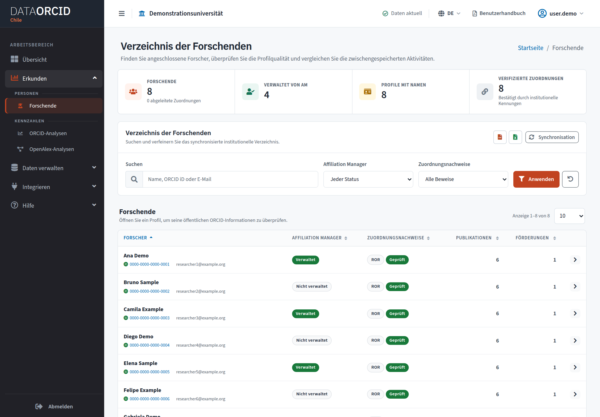

ABBILDUNG 4. Verzeichnis mit Filtern, Sortierung, Seitennavigation und Exporten.

1. Geben Sie einen Suchbegriff ein und setzen Sie die passenden Filter.
2. Wählen Sie eine Spaltenüberschrift, um die Sortierung zu ändern.
3. Öffnen Sie eine ORCID iD für das Portfolio oder exportieren Sie die gefilterte Menge.

## 3.3 Portfolio einer forschenden Person

Wenn Sie eine ORCID iD im Verzeichnis öffnen, sehen Sie öffentliche Profildaten, Biografie, Kennungen, grafische Zusammenfassungen, institutionellen Kontext und verfügbare Aktivitäten.

Aus ORCID aktualisieren ruft dieses öffentliche Profil erneut ab, ohne die gesamte Einrichtung zu aktualisieren. Vollständigen Bericht herunterladen erzeugt eine Excel-Datei. Verfügbare Abschnitte wie Ausbildung, Beschäftigung, Werke und Förderungen können auch einzeln exportiert werden.

Der Link ORCID.org öffnet das ursprüngliche öffentliche Profil. Ein Abschnitt kann fehlen, weil keine öffentlichen Daten vorliegen. Der institutionelle Kontext unterscheidet Werkdatensätze aus der Quelle von zusammengefassten eindeutigen Publikationen.

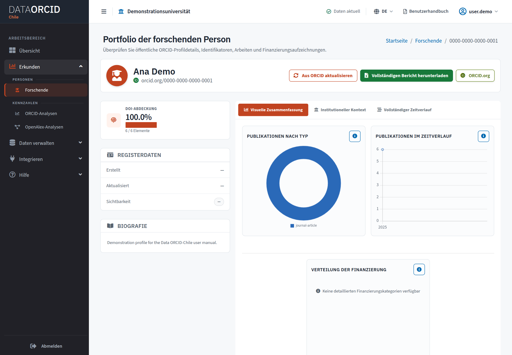

ABBILDUNG 5. Öffentliches Portfolio einer fiktiven forschenden Person.

## 3.4 ORCID-Analysen

ORCID-Analysen verwenden die aus ORCID zwischengespeicherten institutionellen Datensätze. Die Filter kombinieren Zeitraum, Werktyp, Fördertyp und forschende Person. Ein leerer Filter schließt alle verfügbaren Werte ein.

Übersicht, Publikationen, Förderung und Forschende bieten unterschiedliche Ansichten der gefilterten Menge. Prüfen Sie beim Wechsel des Abschnitts die Filter.

Die Daten jedes Diagramms können als CSV oder Excel exportiert werden. Wo eine Bildfunktion vorhanden ist, lässt sich auch die Darstellung speichern.

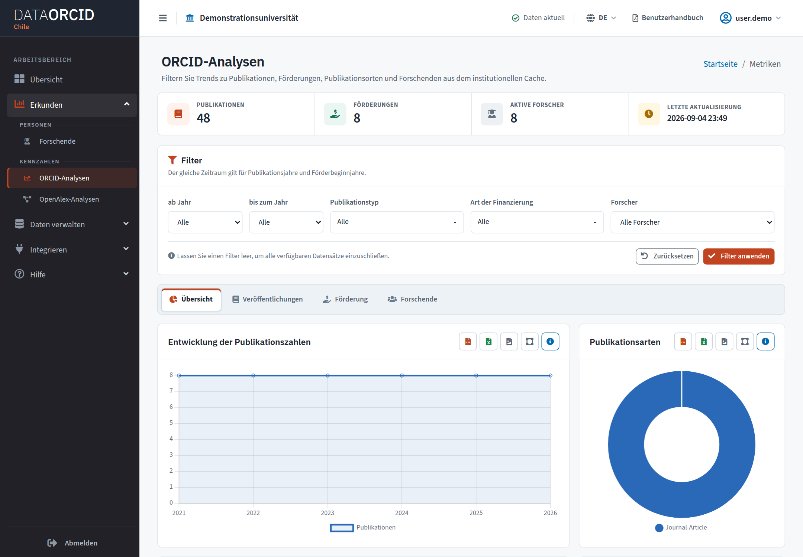

ABBILDUNG 6. Übersicht der ORCID-Analysen mit gemeinsamen Filtern.

## 3.4.1 Publikationen

Publikationen zeigt die jährliche Entwicklung, Werktypen und führende Zeitschriften oder Quellen. Die Kennzahlen beruhen auf ORCID-Datensätzen im institutionellen Bereich und den aktiven Filtern.

Grenzen Sie die Abfrage mit dem Zeitraum ein und vergleichen Sie über den Werktyp gleichartige Mengen. Bewahren Sie vor der Übernahme eines Diagramms in einen Bericht das Abrufdatum und die verwendeten Kriterien auf.

Ein Werk kann in mehreren ORCID-Profilen erscheinen. Die Summe der Datensätze entspricht deshalb nicht zwingend den eindeutigen Publikationen der Einrichtung.

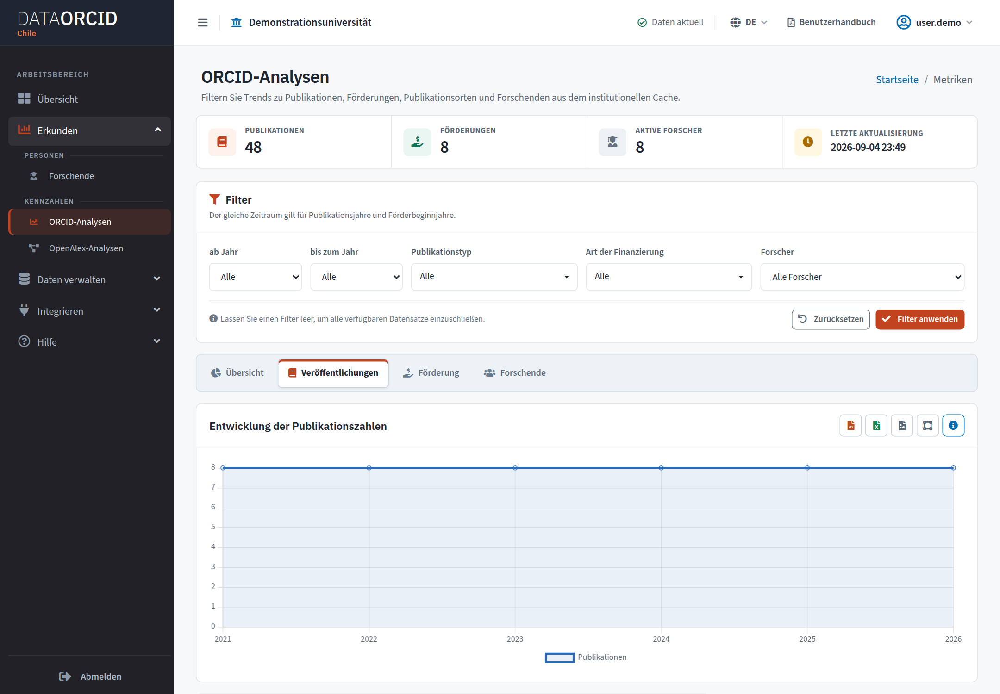

ABBILDUNG 7. Kennzahlen zu ORCID-Publikationen.

## 3.4.2 Förderung

Förderung gruppiert Datensätze nach Beginnjahr, Typ und Förderorganisation. Kombinieren Sie Zeitraum, Fördertyp und forschende Person, um die gemeldete Aktivität zu prüfen.

Die Daten stammen aus öffentlichen ORCID-Profilen. Fehlende Beträge, Währungen oder Projektnummern kennzeichnen Lücken der verfügbaren Informationen.

Ein Werk und eine Förderung im selben Profil belegen nicht, dass das Projekt diese Veröffentlichung finanziert hat. Verstehen Sie Tabellen und Diagramme als Kontext der erfassten Aktivität.

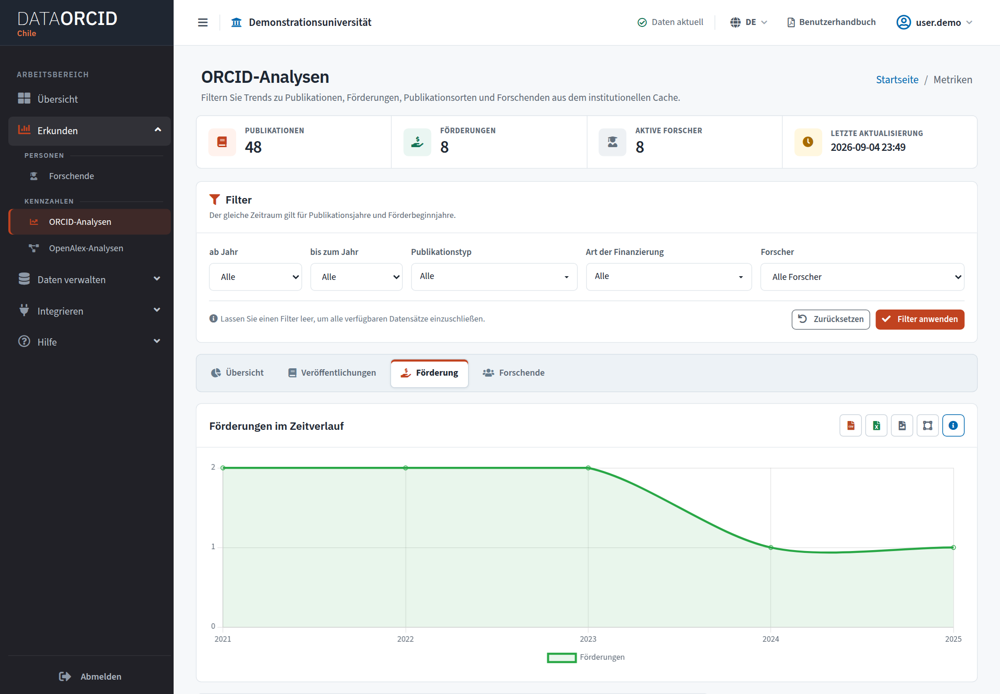

ABBILDUNG 8. Kennzahlen zu öffentlich verzeichneten Förderungen in ORCID.

## 3.4.3 Forschende

Forschende zeigt Personen mit den meisten Werk- oder Förderdatensätzen in der gefilterten Menge. Namen und ORCID iDs führen zu den einzelnen Portfolios; die Listen lassen sich exportieren.

Die Position in diesen Listen spiegelt erfasste Aktivität und deren Abdeckung wider. Sie ist keine umfassende Leistungsbewertung und enthält möglicherweise nicht die gesamte Produktion einer Person.

Bewahren Sie zur Überprüfung eines Ergebnisses Zeitraum und Filter auf, öffnen Sie das Portfolio und vergleichen Sie die Angaben mit dem öffentlichen Ursprungsprofil.

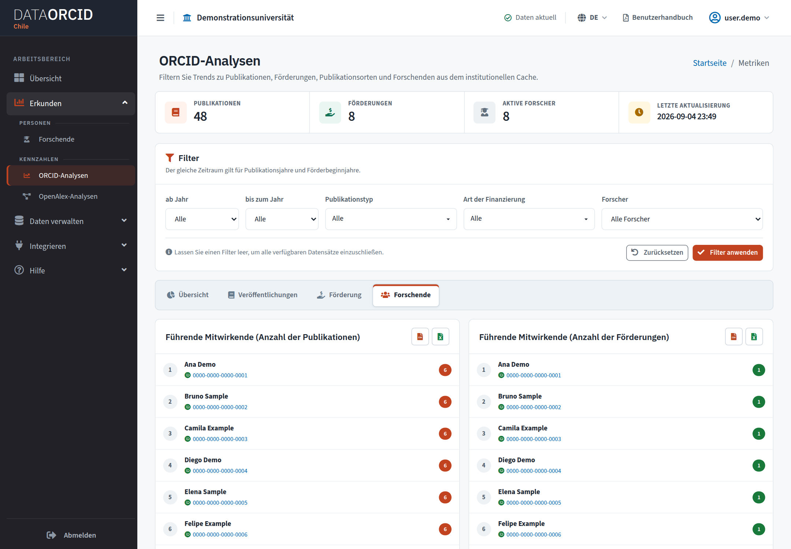

ABBILDUNG 9. Listen der Forschenden nach erfasster Aktivität.

## 4. Daten verwalten

### 4.1 Synchronisierung und Downloads

Für Nutzer und OAI-Nutzer dient diese Seite der Statusanzeige und dem Download. Sie zeigt die Aktualität von Werken, Förderungen, Profilen und OpenAlex-Metadaten sowie den letzten verfügbaren Lauf.

Institutionelle Downloads umfassen je nach Verfügbarkeit ORCID-Werke, Förderungen, Forschende und OpenAlex-Anreicherungen. Die Dateien geben den auf der Seite angegebenen Stand des Caches wieder.

Diese Rollen prüfen den Status und laden verfügbare Daten herunter. Falls eine institutionelle Synchronisierung nötig ist oder ein Lauf fehlgeschlagen ist, bitten Sie das zuständige Team um Prüfung.

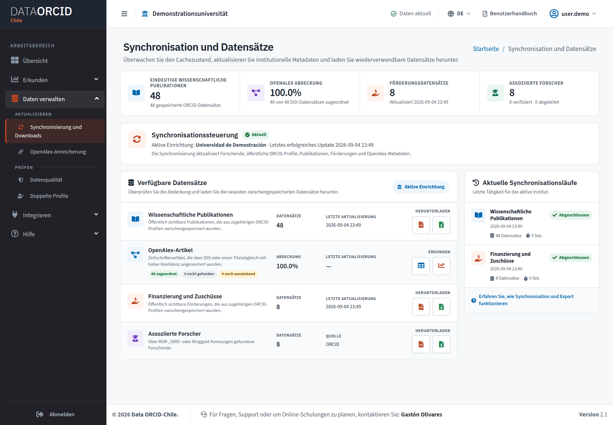

ABBILDUNG 10. Institutioneller Status und herunterladbare Datensätze.

## 4.2 Exporte im Hintergrund

Große CSV- und Excel-Downloads werden im Hintergrund vorbereitet. Das schwebende Exportfenster Exporte zeigt Wartestatus, Fortschritt und einen privaten Link, sobald die Datei bereitsteht. Sie können währenddessen weiter in der Plattform navigieren.

Eine gleichwertige Anfrage kann eine noch gültige Datei wiederverwenden. Bei geänderten Quelldaten wird ein neuer Export erstellt. Dateien sind nur begrenzt verfügbar; fordern Sie eine abgelaufene Datei erneut in der ursprünglichen Ansicht an.

Die Aktion zum Löschen aller Exporte entfernt Ihre abgeschlossenen Exporte samt Dateien. Wartende und laufende Aufgaben bleiben erhalten. Das Schließen oder Minimieren einer Meldung ändert nur deren Anzeige.

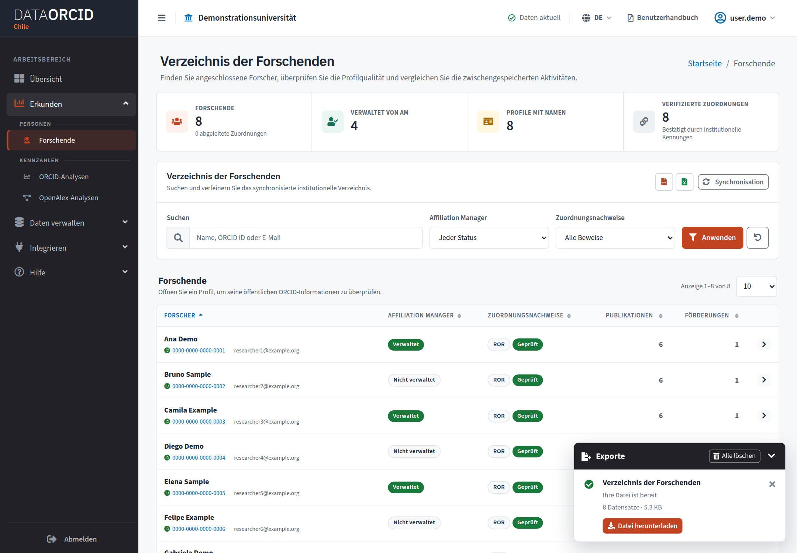

ABBILDUNG 11. Schwebendes Exportfenster mit einer fertigen Demonstrationsdatei.

1. Setzen Sie die benötigten Filter und die Sortierung.
2. Wählen Sie CSV oder Excel und prüfen Sie die schwebende Meldung.
3. Nutzen Sie die Downloadaktion, sobald die Datei bereitsteht.
4. Bewahren Sie die Datei zusammen mit Abfragedatum, institutionellem Bereich und Filtern auf.

## 4.3 Datenqualität

Die Datenqualität unterscheidet vier Perspektiven: Übersicht, Belege zu Forschenden, Förderkontext und technische Integrität. Sie zeigt die Abdeckung von DOI und Jahresangaben, die Vollständigkeit von Förderungen, verifizierte oder abgeleitete Zugehörigkeiten und die OpenAlex-Konsistenz.

Prozentwerte beschreiben die vorhandenen Felder. Ein fehlender Wert ist eine Abdeckungslücke und sollte nicht automatisch als Systemfehler verstanden werden.

Nutzen Sie diese Ansichten, um die Grenzen eines Berichts zu dokumentieren und prüfbedürftige Datensätze zu finden. Notieren Sie bei Unstimmigkeiten das betreffende Modul und die Kennung und informieren Sie das zuständige Team.

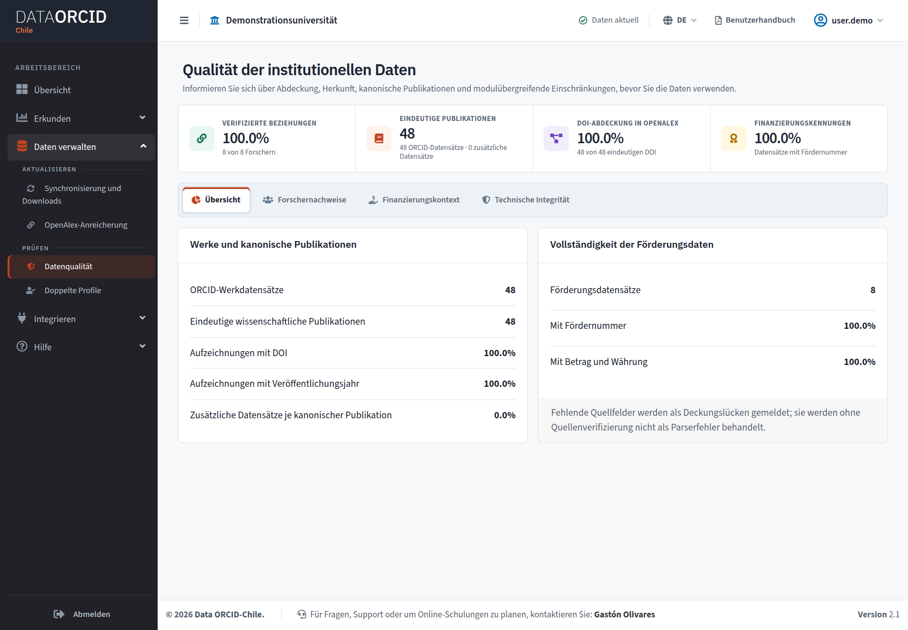

ABBILDUNG 12. Übersicht der institutionellen Datenqualität.

## 4.4 Doppelte Profile

Dieses Modul erkennt algorithmisch Kandidaten, die mehrere ORCID iDs derselben Person darstellen könnten. Sie können suchen, nach Konfidenz oder Status filtern, Ansichten wechseln, die Methodik lesen, die Analyse aktualisieren und Ergebnisse exportieren.

Nutzer und OAI-Nutzer prüfen Kandidaten und deren Belege. Ein Kandidat bestätigt noch keine Dublette. Eine erneute Analyse führt ORCID-Profile weder zusammen noch verändert sie diese.

Vergleichen Sie vor einer Meldung Namen, Kennungen und verfügbare Belege. Gleiche Namen allein beweisen nicht, dass zwei Profile derselben Person gehören.

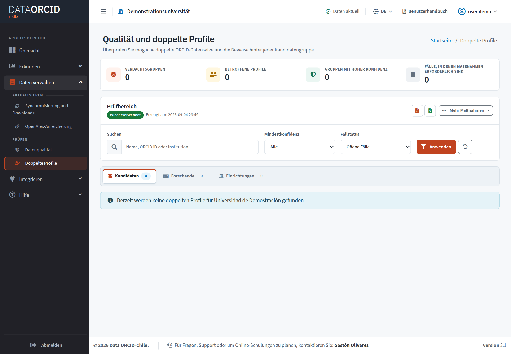

ABBILDUNG 13. Prüfung möglicherweise doppelter Profile.

## 4.5 OpenAlex-Anreicherung

Die Anreicherungsansicht ordnet Artikel als zugeordnet, ausstehend, nicht gefunden, fehlerhaft oder ohne DOI ein. Sie können nach Titel, DOI, ORCID iD, Quelle oder Thema suchen, sortieren, die Seitengröße ändern und Zeilendetails öffnen.

Der Export behält die Filter der Datenmenge bei. Der Analyselink öffnet die zusammengefasste Auswertung. Die Abdeckung bezieht sich auf geeignete ORCID-Artikel, nicht auf die gesamte mögliche Produktion der Einrichtung.

Die Zuordnung bevorzugt DOI. Einige Datensätze können durch einen vorsichtigen Vergleich von Titel, Jahr und Typ verknüpft werden. Ein nicht zugeordneter Datensatz bleibt in ORCID vorhanden, auch wenn er keine angereicherten Metadaten liefert.

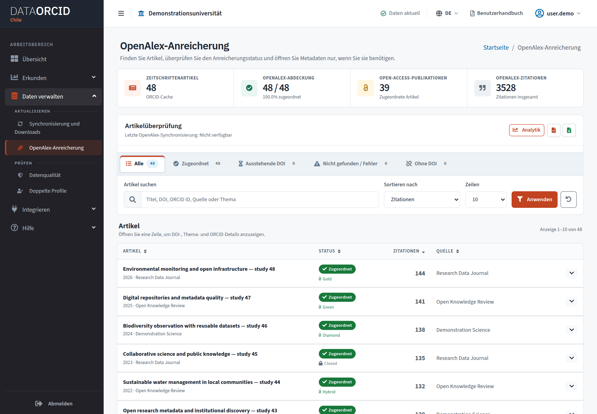

ABBILDUNG 14. Artikel und Status der OpenAlex-Anreicherung.

## 5. OpenAlex-Analysen

### 5.1 Filter, Kennzahlen und Exporte

OpenAlex-Analysen ergänzen die ORCID-Artikel Ihrer Einrichtung um Zitationen, Open Access, Autorenschaften, Zugehörigkeiten, Themen, Sprachen, Quellen und FWCI. Prüfen Sie vor der Auswertung die Abdeckung der Datenmenge.

Allgemeine Filter umfassen Zeitraum, Dokumenttyp, Open Access, Sprache und Zugehörigkeit. Über die sichtbaren Kennzahlen passen Sie die Karten an; Informationsschaltflächen erläutern Definitionen und Methoden.

Diagramme bieten PNG oder SVG, sofern die Funktion verfügbar ist. Tabellen bieten CSV oder Excel. Suche, Sortierung und Seitennavigation beziehen sich auf die gesamte Menge, auch außerhalb der sichtbaren Zeilen.

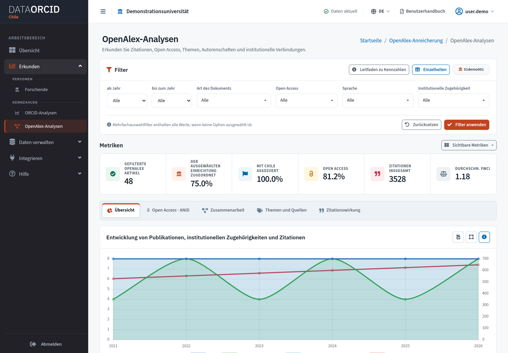

ABBILDUNG 15. OpenAlex-Übersicht mit Filtern, Kennzahlen und jährlicher Entwicklung.

## 5.2 Open Access · ANID

Dieser Abschnitt zeigt Publikationen, Zitationen, Quellen und Trends für Diamond-OA- und Green-OA-Artikel gemäß den aktiven Filtern. Die Kategorien folgen dem von OpenAlex erfassten Open-Access-Status.

Die Kategorien schließen sich nach diesem Status gegenseitig aus. Der Prozentwert jeder Gruppe bezieht sich auf alle angereicherten Artikel, die den Filtern entsprechen, nicht nur auf Open-Access-Artikel.

Die Darstellungen zeigen Entwicklung, Zusammensetzung und Zeitschriften mit den meisten Publikationen oder Zitationen. Verwenden Sie in umfangreichen Diagrammen den internen vertikalen Bildlauf, um die Kategorien zu durchsehen.

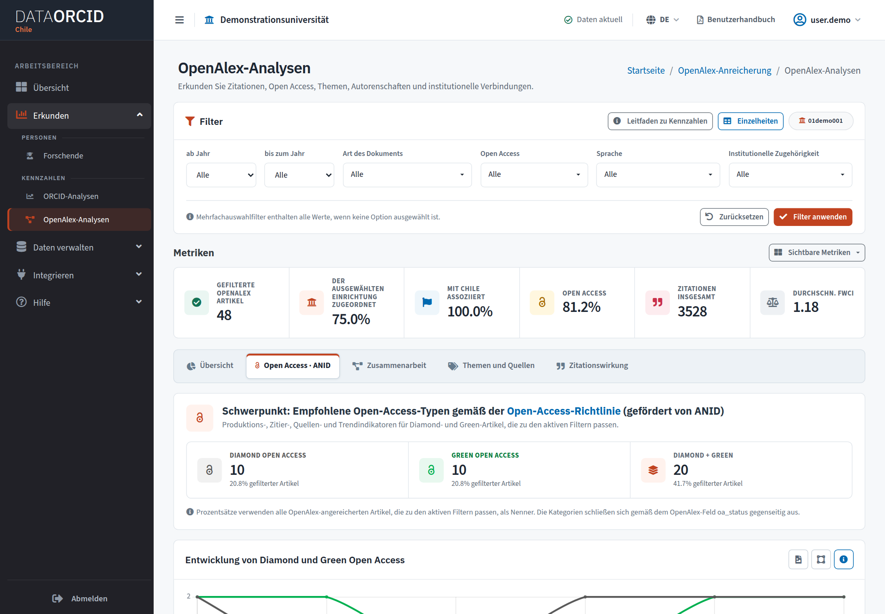

ABBILDUNG 16. Kennzahlen zu Diamond OA und Green OA.

> **WICHTIG:** Green OA beschreibt die Verfügbarkeit eines Artikels in einem Repositorium. Es bedeutet weder, dass die ganze Zeitschrift grün ist, noch bestätigt es allein die Einhaltung einer Richtlinie.

## 5.2.1 Open-Access-Tabellen

Die Tabellen der Zeitschriften und meistzitierten Artikel bieten Suche, Spaltensortierung, Seitengröße, Seitennavigation und Export. Die Ergebnisse berücksichtigen die allgemeinen Seitenfilter.

Suchen Sie zur Prüfung einer Quelle deren Namen und sortieren Sie nach Publikationen oder Zitationen. Nutzen Sie für einzelne Artikel die passende Tabelle und prüfen Sie DOI, Jahr und Open-Access-Status.

Halten Sie beim Berichten eines Prozentwerts Bezugsmenge und Abrufdatum fest. Änderungen können durch Zeitraum, Filter, OpenAlex-Aktualisierungen oder eine höhere Zuordnungsabdeckung entstehen.

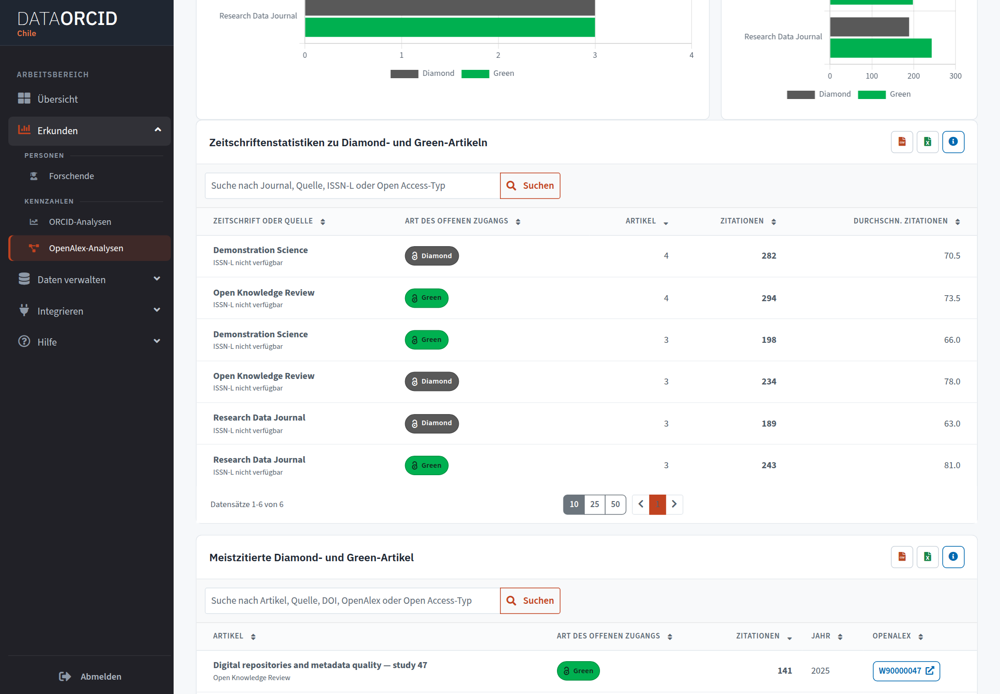

ABBILDUNG 17. Tabellen zu Open-Access-Quellen und -Artikeln.

## 5.3 Zusammenarbeit

Zusammenarbeit zeigt Autoren mit chilenischer Zugehörigkeit sowie Länder und Einrichtungen aus den OpenAlex-Autorenschaften. Diese Ansichten beschreiben die Zugehörigkeiten der durch die Filter ausgewählten angereicherten Artikel.

Ein Artikel kann in mehreren Ländern oder Einrichtungen zählen. Die Summe der Kategorien kann daher die Artikelzahl überschreiten. Eine in einem Werk genannte Zugehörigkeit belegt außerdem kein aktuelles Beschäftigungsverhältnis.

Prüfen Sie die Methode über die Informationsfunktion des Diagramms und exportieren Sie dessen Daten, um eine Zusammenarbeit zu dokumentieren. Diese Ansichten sind keine vollständige Erhebung aller ORCID-Profile der Einrichtung.

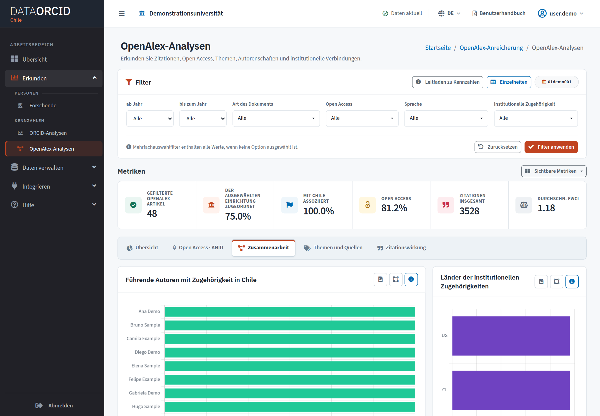

ABBILDUNG 18. Zusammenarbeit aus OpenAlex-Autorenschaften und Zugehörigkeiten.

## 5.4 Themen und Quellen

Dieser Abschnitt verteilt Artikel nach Themenbereichen und Fachgebieten, Dokumenttyp, Open Access, Sprache und Quelle. Die Themen stammen aus der OpenAlex-Klassifikation.

Sprachen erscheinen mit übersetzten Namen anhand der verfügbaren Codes. Fehlende Werte werden als unbekannt zusammengefasst; diese Kategorie ist keine zusätzliche Sprache oder Disziplin.

Filtern Sie nach einem bestimmten Zeitraum oder einer Datenmenge und exportieren Sie Tabellen oder Diagramme. Die Verteilung beschreibt die verfügbaren angereicherten Artikel, nicht die gesamte fachliche Aktivität der Einrichtung.

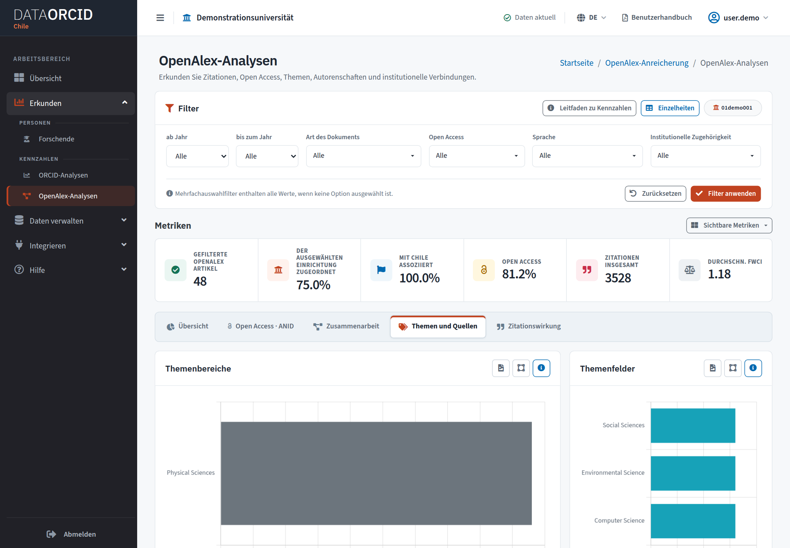

ABBILDUNG 19. Fachgebiete, Sprachen, Dokumenttypen und Quellen.

## 5.5 Zitationswirkung

Die Zitationswirkung sortiert gefilterte Artikel nach ihrer aktuellen Zitationszahl in OpenAlex. Die Werte können sich bei späteren Aktualisierungen ändern. Prüfen Sie beim Vergleich von Publikationen DOI, Jahr und Quelle.

Der Zitationstrend gruppiert diesen aktuellen Zähler nach Publikationsjahr. Er zeigt nicht die in jedem Kalenderjahr erhaltenen Zitationen.

FWCI bietet eine nach Fachgebiet, Jahr und Dokumenttyp normalisierte Wirkungsmessung, sofern OpenAlex einen Wert liefert. Ein fehlender Wert entspricht nicht null. Lesen Sie vor der Verwendung im Bericht die Definition der Kennzahl.

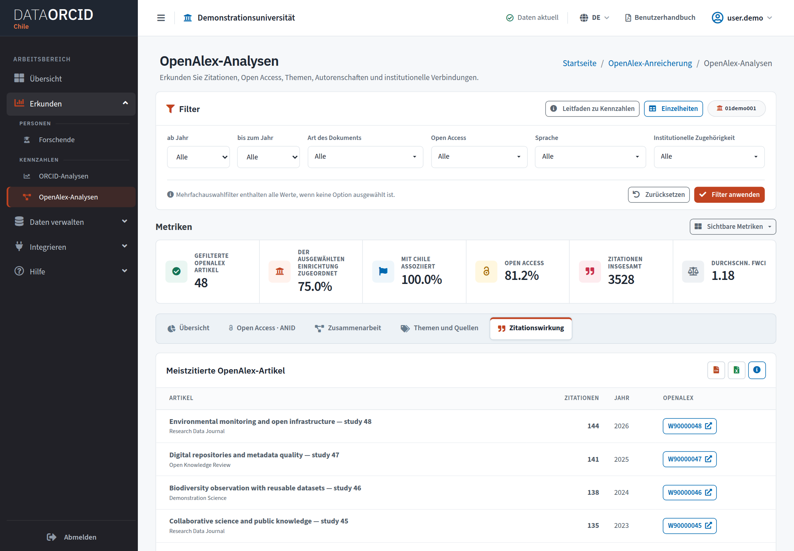

ABBILDUNG 20. Artikel mit den aktuell höchsten Zitationszahlen.

## 6. Integrieren

### 6.1 Aus der ORCID-API lesen

Die Anleitung zum Lesen aus der API enthält cURL-Suchbeispiele nach Einrichtung, ROR, Name und Land sowie eine Übersicht öffentlicher Endpunkte und Testlinks. Sie richtet sich an Personen, die die Quelle mit einem technischen Werkzeug abfragen müssen.

Wählen Sie das passende Beispiel, prüfen Sie die Parameter und ersetzen Sie Beispielwerte, bevor Sie es in Ihrer Umgebung ausführen. Die Abfragen liefern öffentlich sichtbare Daten.

Die Anleitung erklärt den lesenden ORCID-Zugriff. Sie synchronisiert weder Ihre gesamte Einrichtung noch gewährt sie Zugriff auf private Profile.

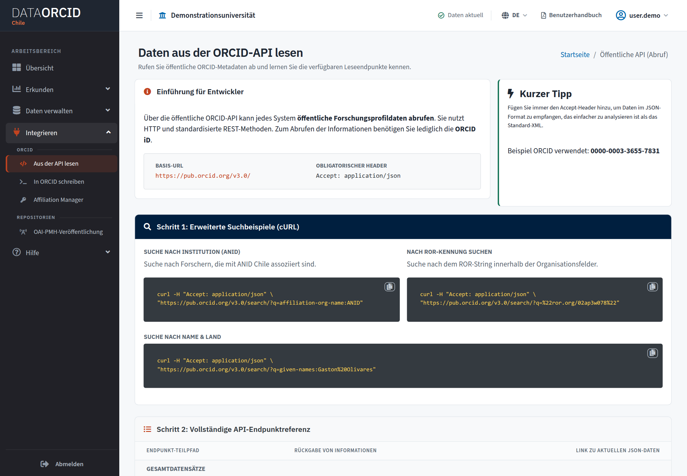

ABBILDUNG 21. Anleitung zur Abfrage der öffentlichen ORCID-API.

## 6.2 In ORCID schreiben

Die Anleitung zum Schreiben in ORCID beschreibt ein herunterladbares Projekt, Voraussetzungen, Konfiguration, CSV-Struktur und Autorisierungsablauf. Sie erläutert, wie eine autorisierte Integration Informationen zu einem Profil hinzufügt.

Lesen Sie die Projektanleitung und stimmen Sie die Nutzung mit dem institutionellen ORCID-Team ab. Ein DATA-ORCID-CHILE-Konto ersetzt nicht die von ORCID verlangten Zugangsdaten und Genehmigungen.

Schreibzugriffe benötigen geeignete Zugangsdaten und die ausdrückliche Zustimmung der Person, der die ORCID iD gehört. Fügen Sie keine Geheimnisse, Passwörter oder Token in Tabellen oder Supportanfragen ein.

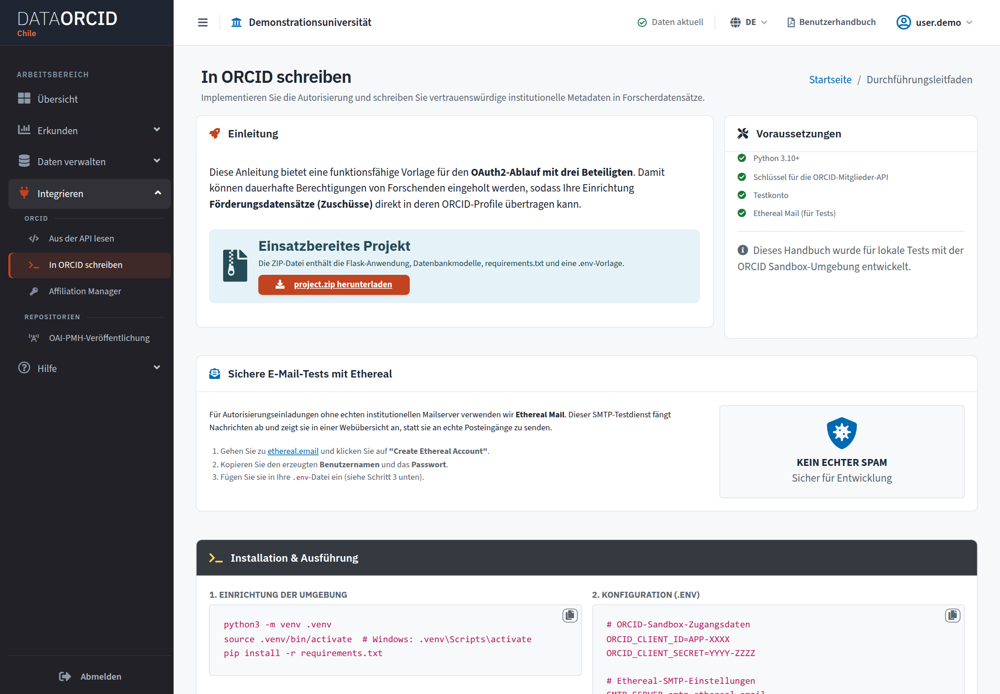

ABBILDUNG 22. Anleitung und Referenzprojekt zum Schreiben in ORCID.

## 6.3 Affiliation Manager

Diese Option speichert die Client ID der institutionellen Affiliation-Manager-Anwendung in Ihrem Konto. Der Wert beginnt meist mit APP- und hilft, durch diese Anwendung verwaltete Profile zu erkennen.

Prüfen Sie vor einer Änderung den richtigen institutionellen Wert, tragen Sie ihn ein und speichern Sie. Er ist weder Passwort noch Geheimnis oder API-Schlüssel.

Die Kennung hilft bei der Interpretation des Verwaltungsstatus von Profilen. Das Speichern gewährt für sich genommen keine Schreibberechtigung für die ORCID iD einer Person.

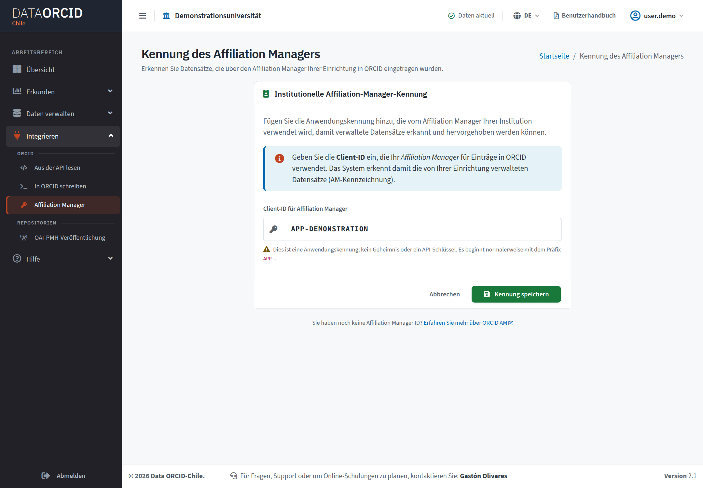

ABBILDUNG 23. Affiliation-Manager-Kennung im Konto.

> **WICHTIG:** Ändern Sie diesen Wert nur, wenn Sie die korrekte Client ID kennen oder Anweisungen des zuständigen ORCID-Teams erhalten haben.

## 6.4 ORCID-Ressourcen

Die ORCID-Ressourcen stehen unter Hilfe und sammeln Links zu Mitgliedschaft, API-Zugangsdaten, Affiliation Manager, CSV-Vorlagen und Integrationen mit OJS, DSpace-CRIS, VIVO und Dataverse.

Wählen Sie die Ressource für Ihre Aufgabe: eine Integration verstehen, eine Vorlage vorbereiten oder Dokumentation lesen. Externe Links öffnen sich außerhalb von DATA ORCID CHILE und können eigene Zugangsvoraussetzungen haben.

Beginnen Sie bei Fragen zu dieser Plattform mit dem Hilfecenter, dessen Inhalt an die aktivierten Module angepasst wird.

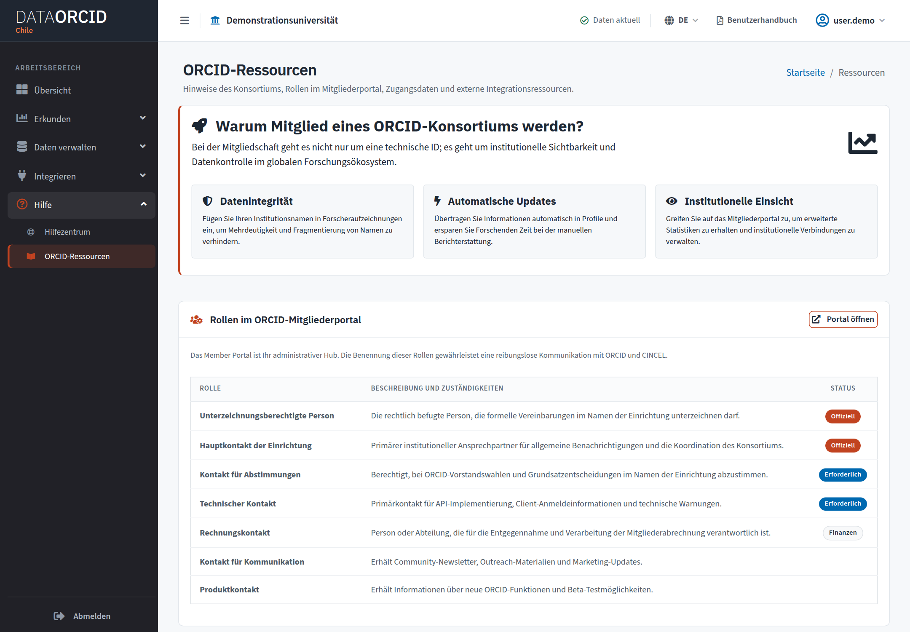

ABBILDUNG 24. ORCID-Ressourcen und Dokumentation unter Hilfe.

## 6.5 Veröffentlichung über OAI-PMH

Über die OAI-PMH-Veröffentlichung sehen Sie das institutionelle Repositorium ein, aus dem andere Systeme Metadaten ausgewählter Artikel ernten können. Die Registerkarten gliedern Übersicht, Artikel, Metadatenzuordnung, DOI-Importe und Zugriff für die Metadatenernte.

Nutzer können verfügbare Inhalte einsehen. OAI-Nutzer können zusätzlich Artikel freigeben oder ausschließen, DOI-Entscheidungen importieren, den letzten aktiven Import rückgängig machen, das Format dataorcid anpassen und private Ernte-URLs verwalten.

Die Übersicht zeigt verfügbare, durch OpenAlex validierte, freigegebene und nicht freigegebene Artikel. Die Validierung erfordert eine OpenAlex-Zugehörigkeit passend zum aktiven ROR. Standardrichtlinie und manuelle Entscheidungen bestimmen die wirksame Auswahl.

Ist der Anbieter deaktiviert oder nicht konfiguriert, bitten Sie das zuständige Team um Aktivierung. Ein ausgewählter Artikel ist verfügbar, wenn der Anbieter aktiviert ist und die verwendete URL Zugriff hat.

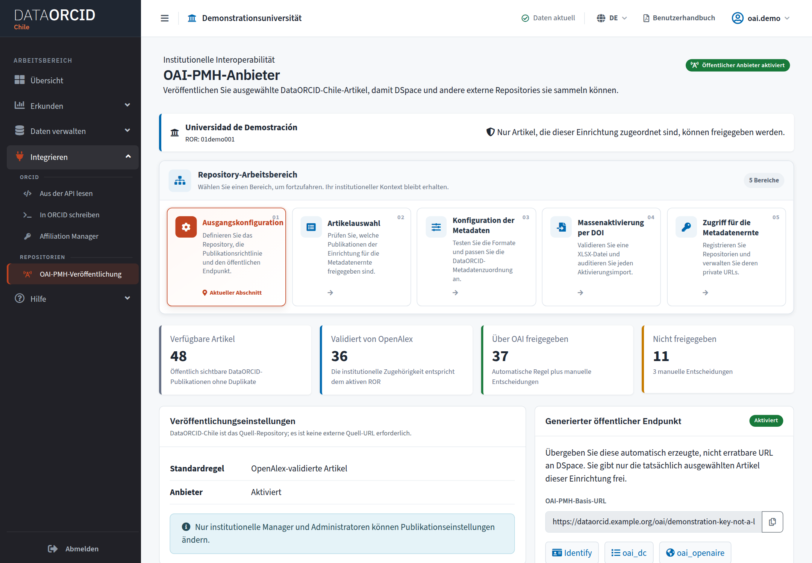

ABBILDUNG 25. OAI-PMH-Übersicht für OAI-Nutzer.

## 6.6 OAI-PMH-Artikelauswahl

Die Tabelle bietet Suche und Filter nach OAI-Status, Zugehörigkeitsvalidierung, Dokumenttyp und Aktivierungsquelle. Sie können nach verfügbaren Spalten sortieren und die gefilterte Auswahl zur Prüfung exportieren.

Als OAI-Nutzer ändern Sie einen Artikel über Freigeben oder Ausschließen. Markieren Sie für mehrere Artikel die Zeilen und verwenden Sie die Freigabe- oder Ausschlussaktion für die Auswahl. Die Seitenauswahl markiert nur Zeilen der aktuellen Seite.

Manuelle Entscheidungen haben Vorrang vor der automatischen Richtlinie. Der Ausschluss aus OAI-PMH löscht den Artikel weder aus ORCID noch aus OpenAlex oder dem Recherchecache.

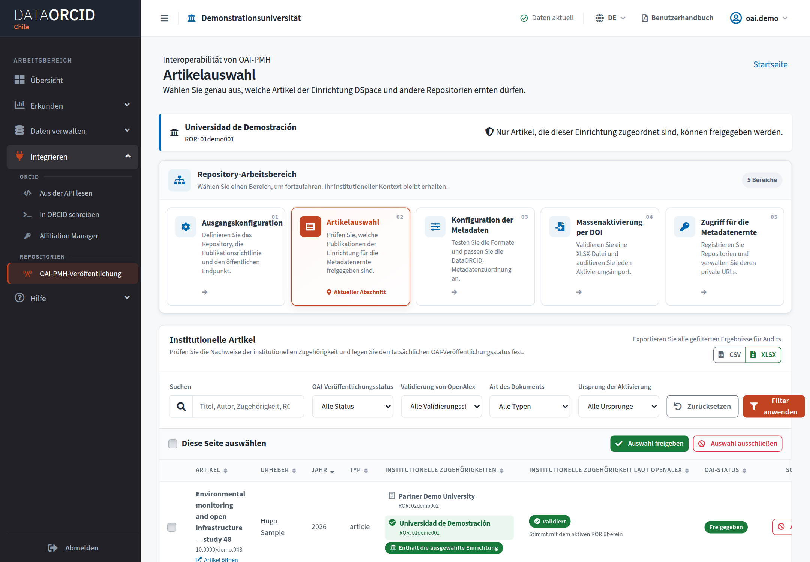

ABBILDUNG 26. Artikelauswahl mit den Aktionen für OAI-Nutzer.

1. Filtern und prüfen Sie DOI, Titel und Zugehörigkeiten vor der Auswahl.
2. Wenden Sie die Aktion auf die gewünschten Zeilen an und prüfen Sie den neuen Status.
3. Rufen Sie den aktivierten Anbieter auf, um das veröffentlichte Ergebnis zu prüfen.

## 6.7 Metadatenformate und Zuordnung

Der Anbieter stellt drei Formate bereit: oai_dc, oai_openaire und dataorcid. Die ersten beiden behalten ihre Standardstruktur. Der Editor passt ausschließlich das Format dataorcid an.

Wählen Sie als OAI-Nutzer ein Katalogfeld und fügen Sie es hinzu. Sie können dessen Zielnamen ändern oder es ausblenden. Titel und Kennung sind Pflichtfelder; ausgeblendete Felder werden nicht ausgegeben.

Zuordnung speichern übernimmt Ihre Änderungen. Die Funktion zum Wiederherstellen der Vorgaben setzt das ursprüngliche Profil zurück, sofern sie verfügbar ist. Nutzer können die Zuordnung einsehen, aber nicht bearbeiten.

Die erzeugte Basis-URL und Testlinks zeigen die Antwort des aktivierten Anbieters. Stimmen Sie das erforderliche Format mit dem Metadatenempfänger ab. Die Zuordnung ändert die veröffentlichte Ausgabe, nicht die ursprünglichen ORCID-Daten.

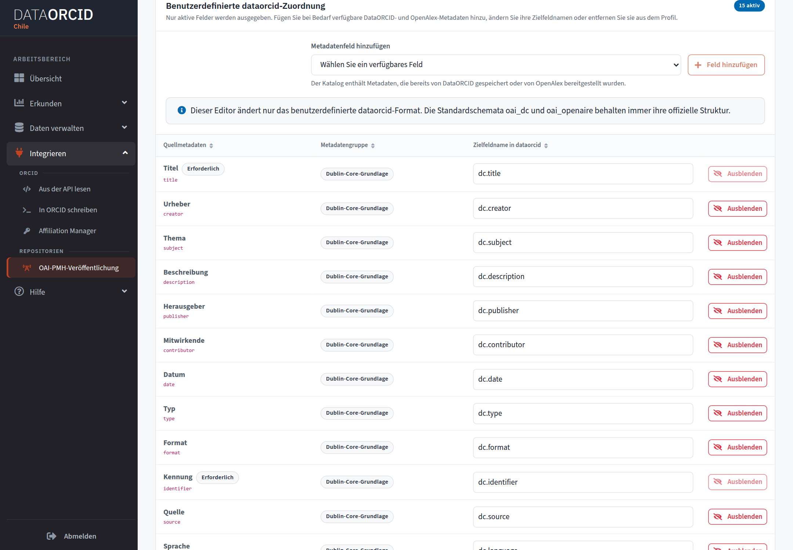

ABBILDUNG 27. Editor des Formats dataorcid für OAI-Nutzer.

## 6.8 Massenaktivierung per DOI

OAI-Nutzer können institutionelle Artikel mit einer XLSX-Tabelle aktivieren. Das System erkennt DOIs, die bereits zu öffentlichen Artikeln im institutionellen Bereich gehören. Der Import fügt keine externen Publikationen hinzu und synchronisiert ORCID nicht.

Laden Sie die Vorlage herunter und tragen Sie pro Zeile eine DOI in die vorgesehene Spalte ein. Wählen Sie die XLSX-Datei und wählen Sie Validieren und aktivieren. Prüfen Sie das Ergebnis vor Abschluss der Aufgabe.

Ungültige, doppelte oder nicht gefundene DOIs werden gemeldet, ohne Artikel außerhalb des Bereichs zu ändern. Jeder Import führt einen Verlauf mit Datei, Datum, Validierungsergebnissen und aktivierten Artikeln.

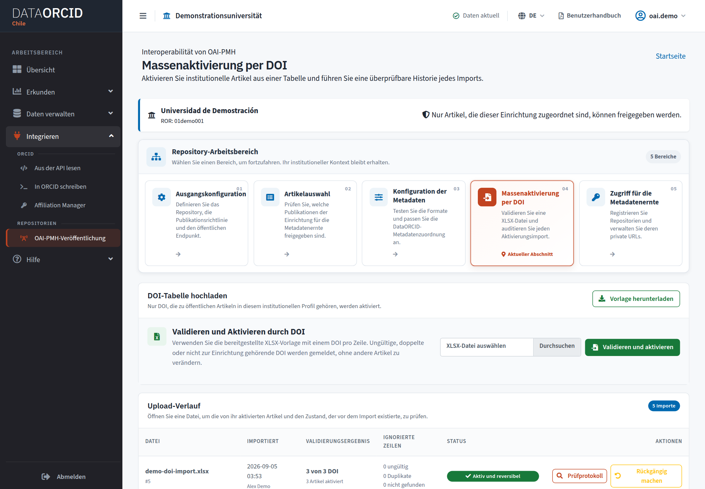

ABBILDUNG 28. Hochladen einer DOI-Tabelle und Importverlauf.

> **WICHTIG:** Ein DOI-Import erfasst Entscheidungen zur OAI-PMH-Veröffentlichung. Er bestätigt keine in OpenAlex fehlende Zugehörigkeit und ändert das öffentliche Ursprungsprofil nicht.

## 6.9 Importprüfung und Rücknahme

Die Prüffunktion im Importverlauf öffnet Dateidetails mit aktivierten Artikeln und deren vorherigem Status. Sie können angewendete und zurückgenommene Importe sowie den letzten aktiven, rücknehmbaren Import unterscheiden.

OAI-Nutzer können den letzten aktiven Import rückgängig machen. Prüfen Sie die Details, wählen Sie Diesen Import rückgängig machen und bestätigen Sie in der Plattform. Um einen älteren Import zurückzunehmen, müssen zuerst die späteren zurückgenommen werden.

Die Rücknahme stellt die diesem Import zurechenbaren Änderungen wieder her und bewahrt spätere manuelle Änderungen. Prüfen Sie das Ergebnis und kehren Sie zur Artikeltabelle zurück, um den wirksamen Status einzusehen.

Nutzer können den verfügbaren Verlauf und die Prüfung einsehen. Falls eine Korrektur nötig ist und Ihnen die OAI-Bearbeitungsberechtigung fehlt, bitten Sie das zuständige Team um Prüfung.

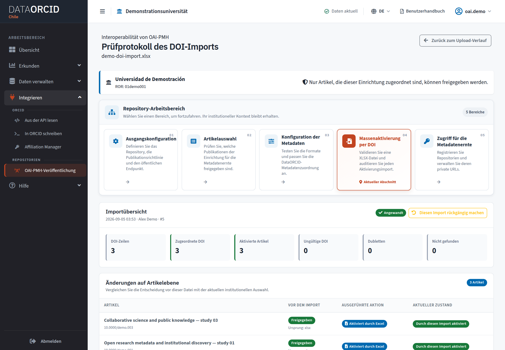

ABBILDUNG 29. Prüfung eines DOI-Demonstrationsimports.

## 6.10 Zugriff für die Metadatenernte

Unter Zugriff für die Metadatenernte können OAI-Nutzer die URI jedes institutionellen Repositoriums registrieren und eine private URL für dessen Harvester erzeugen. Nutzer sehen Repositorien und Status; Schlüssel und Bedienelemente sind Konten mit OAI-Bearbeitungsrecht vorbehalten.

Geben Sie die HTTP- oder HTTPS-Adresse ohne Zugangsdaten, Abfrageparameter oder Fragment ein und wählen Sie Private URL erzeugen. Kopieren Sie die ganze Adresse. Die URI bezeichnet den Empfänger; der zufällige URL-Schlüssel gewährt Zugriff unabhängig von IP-Adresse oder Cloudflare.

Tragen Sie in DSpace-CRIS die private URL als OAI Provider ein, wählen Sie Simple Dublin Core (oai_dc) und die Ernte nur von Metadaten. Starten oder planen Sie die Ernte in DSpace. Eine DataORCID-Anmeldung ist nicht erforderlich.

Aktivieren Sie nach Einrichtung des Harvesters die Beschränkung auf registrierte private URLs und speichern Sie den Zugriffsmodus. Die allgemeine URL funktioniert dann nicht mehr. Ein Widerruf sperrt eine URL; eine neue URL macht die alte ungültig und muss im Harvester ersetzt werden.

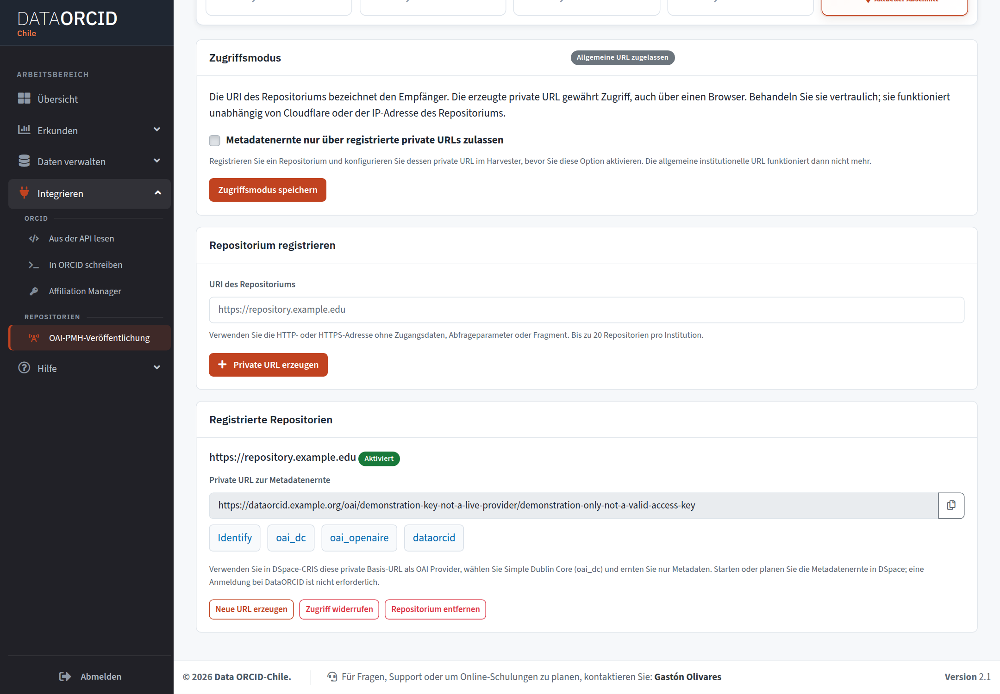

ABBILDUNG 30. Demonstrationsrepositorium mit privater URL für die Metadatenernte.

> **WICHTIG:** Wer eine private URL kennt, kann das XML auch im Browser lesen. Behandeln Sie die URL vertraulich. Nach Widerruf aller URLs bleibt die allgemeine URL gesperrt, solange der eingeschränkte Modus aktiv ist.

## 7. Hilfecenter

Das Hilfecenter steht unter Hilfe. Es bietet eine Sofortsuche und Themen zu ersten Schritten, Quellen, Datenfluss, Kennzahlen, Downloads, Datenwörterbuch, Berechtigungen, Integrationen, Fehlerbehebung und Versionshinweisen.

Die Inhalte begleiten die Abläufe für Nutzer und OAI-Nutzer. Themen und Links passen sich den aktivierten Modulen an; ein deaktiviertes Modul erscheint auch nicht in der aktiven Hilfe.

Geben Sie einen Begriff wie DOI, Export oder Open Access ein, um Erklärungen zu finden. Öffnen Sie das Thema und folgen Sie dessen Links zur jeweiligen Funktion. Nutzen Sie diese Hilfe, bevor Sie eine Bedienungsfrage weitergeben.

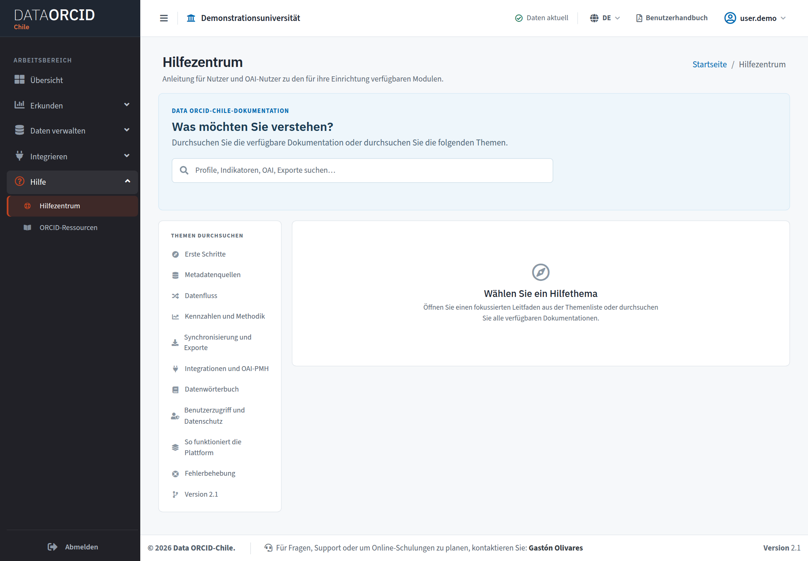

ABBILDUNG 31. Suche und Themen im Hilfecenter.

## 8. Konto und Sicherheit

### 8.1 Mein Profil

Über die persönlichen Optionen ändern Sie Vorname, Nachname, E-Mail-Adresse und Position. Prüfen Sie die Werte, nehmen Sie Änderungen vor und speichern Sie. Die E-Mail-Adresse dient Benachrichtigungen und der Passwortwiederherstellung.

Einrichtung, ROR und Rolle lassen sich auf dieser Seite nicht ändern. Falls die Angaben nicht Ihrer Situation entsprechen, bitten Sie das zuständige Team um Prüfung.

Mit der Sprachauswahl behalten Sie die Oberfläche in Ihrer bevorzugten aktivierten Sprache. Kontoänderungen verändern nicht das öffentliche ORCID-Profil einer forschenden Person.

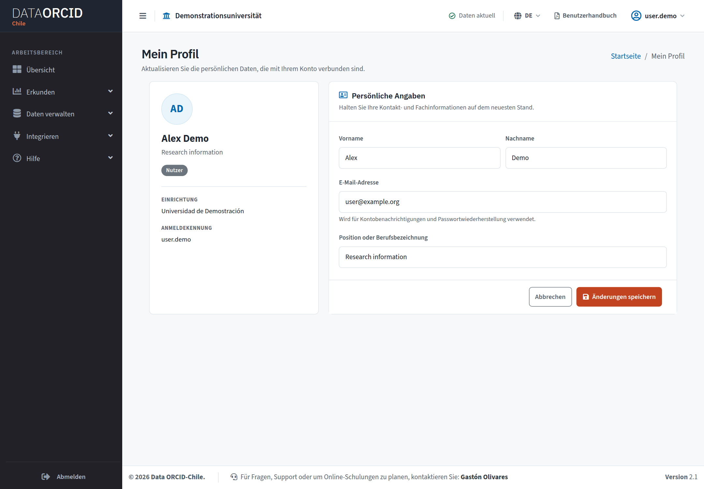

ABBILDUNG 32. Bearbeitung der persönlichen Angaben des fiktiven Kontos.

## 8.2 Passwort und Abmelden

Geben Sie für eine Passwortänderung das aktuelle Passwort, ein neues mit mindestens acht Zeichen und dessen Bestätigung ein. Das System begrenzt die Länge zudem auf 72 UTF-8-Bytes; manche Zeichen benötigen mehr als ein Byte.

Speichern Sie die Änderung und prüfen Sie die Bestätigung. Verwenden Sie ein eigenes Passwort für dieses Konto und geben Sie es nicht weiter. Falls Sie das aktuelle Passwort nicht kennen, nutzen Sie die Wiederherstellung auf der Anmeldeseite.

Die Abmeldefunktion steht unten im Seitenmenü. Nutzen Sie sie nach Abschluss, besonders auf gemeinsam verwendeten Geräten. Fügen Sie keine Zugangsdaten oder privaten personenbezogenen Informationen in Suchanfragen, Dateien oder Supportanfragen ein.

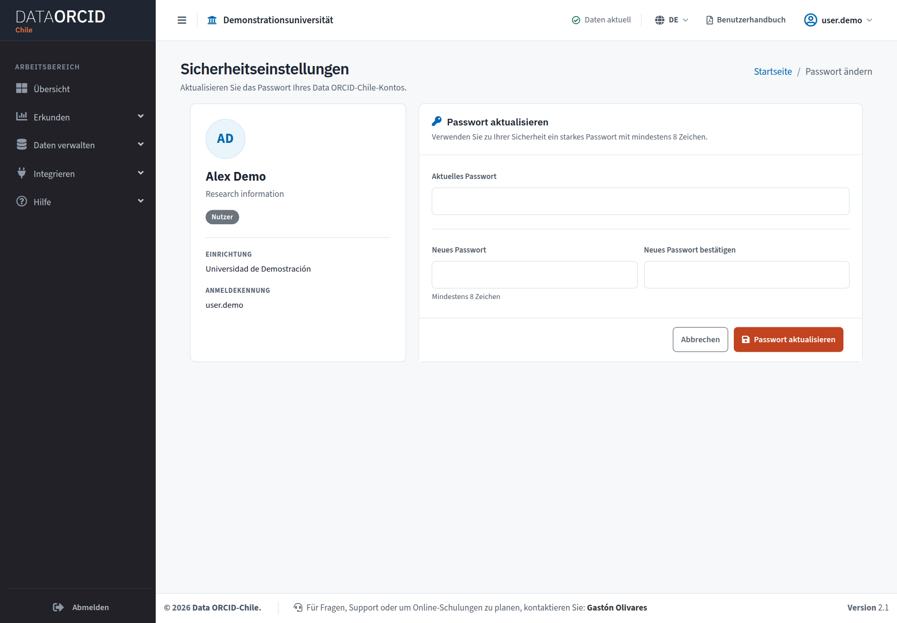

ABBILDUNG 33. Änderung des Kontopassworts.

## 9. Quellen, Methoden und gute Praxis

### 9.1 Bildung des institutionellen Bereichs

ROR ist die wichtigste institutionelle Kennung. Verifizierte GRID- oder Ringgold-Kennungen ergänzen die ORCID-Suche, sofern verfügbar. Die Ergebnisse werden zusammengeführt und nach ORCID iD dedupliziert; Herkunftsbelege bleiben erhalten.

### 9.2 Zusammenhang von ORCID, OpenAlex und OAI-PMH

ORCID liefert öffentliche Profile und Datensätze. OpenAlex ergänzt analytische Metadaten zu geeigneten Artikeln mit akzeptierter Zuordnung. OAI-PMH veröffentlicht Metadaten der wirksamen institutionellen Auswahl; es lädt keine Volltexte herunter und ändert ORCID nicht.

### 9.3 Gute Praxis

1. Prüfen Sie vor dem Zitieren einer Zahl Aktualisierungsdatum, Einrichtung und Filter.
2. Unterscheiden Sie ORCID-Datensätze, kanonische Publikationen und angereicherte Artikel.
3. Lesen Sie Definitionen und Methoden über die Informationsschaltflächen.
4. Bewahren Sie Datum, Filter und Bereich mit jedem Export auf.
5. Behandeln Sie mögliche Dubletten und Abdeckungslücken als prüfbedürftige Hinweise.
6. Vergleichen Sie Mengen mit gleichwertigen Zeiträumen, Bezugsgrößen und Abdeckungen.
7. Prüfen Sie OAI-PMH-Auswahl und Format, bevor Sie die URL mit dem empfangenden System teilen.

## 10. Glossar

| BEGRIFF | BESCHREIBUNG |
| --- | --- |
| ORCID iD | Dauerhafte Kennung einer forschenden Person. |
| ROR | Wichtigste institutionelle Kennung der Plattform. |
| GRID und Ringgold | Verifizierte ältere institutionelle Kennungen, die die Suche ergänzen, aber ROR nicht ersetzen. |
| ORCID-Datensatz | Öffentliche Angabe in einem Profil, etwa ein Werk oder eine Förderung. |
| Kanonische Publikation | Über normalisierte DOI oder vorsichtig über Titel und Jahr zusammengefasste Veröffentlichung. |
| Cache | Lokale Kopie abgerufener Informationen. Ihr Datum hilft, die Aktualität der Datenmenge einzuschätzen. |
| OpenAlex-Abdeckung | Anteil geeigneter ORCID-Artikel mit Zuordnung und OpenAlex-Metadaten. |
| Zitationen | Aktuelle Zitationszahl einer Publikation laut verfügbaren OpenAlex-Informationen. |
| FWCI | Nach Fachgebiet, Jahr und Dokumenttyp normalisierte Zitationswirkung. |
| Diamond OA | OpenAlex-Kategorie für Artikel in vollständig offenen Zeitschriften ohne Publikationsgebühren für Autoren. |
| Green OA | OpenAlex-Kategorie für den Zugang über eine Kopie in einem Repositorium. |
| AM | ORCID Affiliation Manager; seine Client ID hilft, verwaltete Profile zu erkennen. |

## 10.1 Begriffe zu Export und Integration

| BEGRIFF | BESCHREIBUNG |
| --- | --- |
| Export im Hintergrund | Vorbereitung einer Datei, während Sie die Plattform weiter nutzen. |
| Gültige Datei | Abgeschlossener Export, der noch heruntergeladen und gegebenenfalls wiederverwendet werden kann. |
| OAI-PMH | Protokoll, mit dem ein System Metadaten aus einem anderen erntet. |
| Anbieter | Dienst, der die institutionelle Auswahl über eine Basis-URL bereitstellt. |
| Harvester | Empfangendes System, das den Anbieter abfragt und Metadaten übernimmt. |
| Freigegebener Artikel | Artikel in der wirksamen Auswahl; die öffentliche Verfügbarkeit erfordert zusätzlich einen aktivierten Anbieter. |
| OpenAlex-Validierung | Übereinstimmung einer Artikelzugehörigkeit mit dem ROR der aktiven Einrichtung. |
| Manuelle Entscheidung | Ein- oder Ausschluss mit Vorrang vor der automatischen Richtlinie. |
| oai_dc | Dublin-Core-Metadatenformat des Anbieters. |
| oai_openaire | OpenAIRE-Format des Anbieters. |
| dataorcid | Format, dessen Felder und Zielnamen OAI-Nutzer anpassen können. |
| DOI-Import | XLSX-Tabelle zur Aktivierung bereits vorhandener institutioneller Artikel mit Prüfprotokoll. |
| Importrücknahme | Rückgängigmachen des letzten aktiven Imports unter Erhalt späterer manueller Änderungen. |

## 11. Fehlerbehebung

### Es werden keine Daten angezeigt

Setzen Sie die Filter zurück und prüfen Sie die Aktualisierungsanzeige. Ist die institutionelle Datenmenge nicht verfügbar, bitten Sie das zuständige Team um Statusprüfung.

### Eine Zahl unterscheidet sich zwischen Modulen

Prüfen Sie, ob ORCID-Datensätze, kanonische Publikationen oder OpenAlex-Artikel gezählt werden. Vergleichen Sie Zeitraum, Typ, Open Access, Zugehörigkeit und Aktualisierungsdatum.

### Ein Export ist leer, ausstehend oder abgelaufen

Prüfen Sie, ob die Ansicht Ergebnisse enthält, und entfernen Sie zu enge Filter. Das schwebende Exportfenster zeigt den Status. Fordern Sie abgelaufene Dateien erneut an; melden Sie bei Stillstand einer Aufgabe die Ansicht und den Anfragezeitpunkt.

### Ich kann OAI-PMH-Artikel oder Zuordnungen nicht bearbeiten

Nutzer haben Lesezugriff. Auswahl, DOI-Importe und Zuordnung erfordern die Rolle OAI-Nutzer für die Einrichtung. Falls Ihre Arbeit diese Berechtigung benötigt, bitten Sie um Prüfung.

### Eine DOI wird nicht aktiviert oder ein Import lässt sich nicht zurücknehmen

Prüfen Sie Vorlage und Bericht zu ungültigen, doppelten oder nicht gefundenen DOIs. Importe aktivieren nur Artikel im institutionellen Bereich. Nur der letzte aktive Import lässt sich zurücknehmen; prüfen Sie Verlauf und spätere Änderungen.

### Ein Modul fehlt oder der öffentliche Anbieter funktioniert nicht

Die Verfügbarkeit hängt von aktivierten Modulen und Anbieterstatus ab. Nutzen Sie das Hilfecenter und bitten Sie das zuständige Team um Prüfung. Fügen Sie Seite, Datum, Filter und eine Bildschirmaufnahme ohne sensible Informationen bei.

## KONTAKTINFORMATIONEN

Consorcio para el Acceso a la Información Científica Electrónica

Moneda 1375, 13. Stock · Santiago, Chile · +56 2 2365 4589

[secretariaejecutiva@cincel.cl](mailto:secretariaejecutiva@cincel.cl) · [www.cincel.cl](https://www.cincel.cl)
