# DATA ORCID CHILE

A complete guide to options and features for User and OAI User.

**VERSION:** 2.1 · **UPDATED:** September 2026

## 1. Purpose and scope

DATA ORCID CHILE lets you explore and analyze public ORCID information enriched with OpenAlex metadata. This manual follows the User and OAI User journey: access, discovery, analytics, downloads, integration, and account settings.

Both roles work within the institution assigned to their account and the modules that are enabled. OAI User adds actions for article selection, DOI imports, OAI-PMH metadata mapping, and harvesting access.

This edition covers background exports, OAI-PMH publishing, and help adapted to the available modules.

| ACTION | USER | OAI USER |
| --- | --- | --- |
| Explore institutional modules | Available | Available |
| Download visible data and reports | Available | Available |
| Inspect duplicate candidates | Read only | Read only |
| Review OAI-PMH content | Read only | Available |
| Select articles and import DOI | Read only | Available |
| Edit dataorcid mapping | Read only | Available |
| Edit own account and password | Available | Available |

> **IMPORTANT:** Screenshots show the version 2.1 interface with fictional demonstration data. Example names, ORCID iDs, DOIs, RORs, and addresses must not be used as real records.

## 2. Access and navigation

### 2.1 Signing in

Visit www.orcid.cl and sign in with your account username or institutional email and password. Remember me is appropriate only on a personal device or one managed by your institution.

The welcome email includes your credentials and a link to this PDF manual, which you can download without signing in. The link opens the edition matching your account language: English, Spanish, French, Portuguese, or German. Change the temporary password when you sign in.

If you have forgotten your password, open the recovery link, enter your account email, and follow the link you receive. The on-screen response does not disclose whether an address is registered. If no message arrives, check spam and contact the responsible support team.

The selector offers the enabled languages: English, Spanish, French, Portuguese, and German. A language selected while signed in is saved as your account preference.

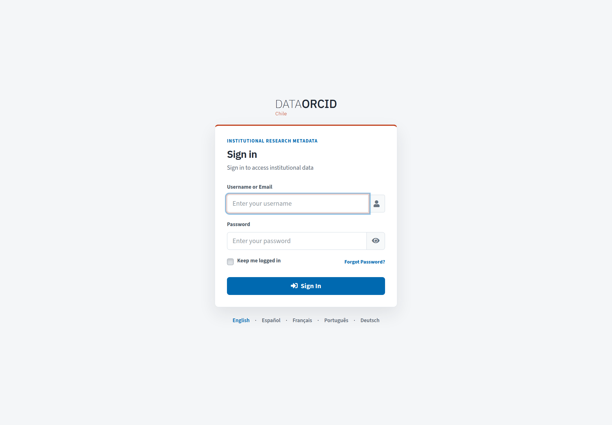

FIGURE 1. Sign-in and language selection.

## 2.2 Interface structure

The sidebar organizes work into Explore, Manage data, Integrate, and Support, alongside the Overview shortcut. The top bar shows the active institution, language, and personal options. Available modules depend on service configuration and your account role. The “User manual” link, with a PDF icon beside your account options, downloads this manual in the active language.

Update indicators help you recognize whether information is current or needs attention. Check this status before interpreting a figure or downloading a dataset.

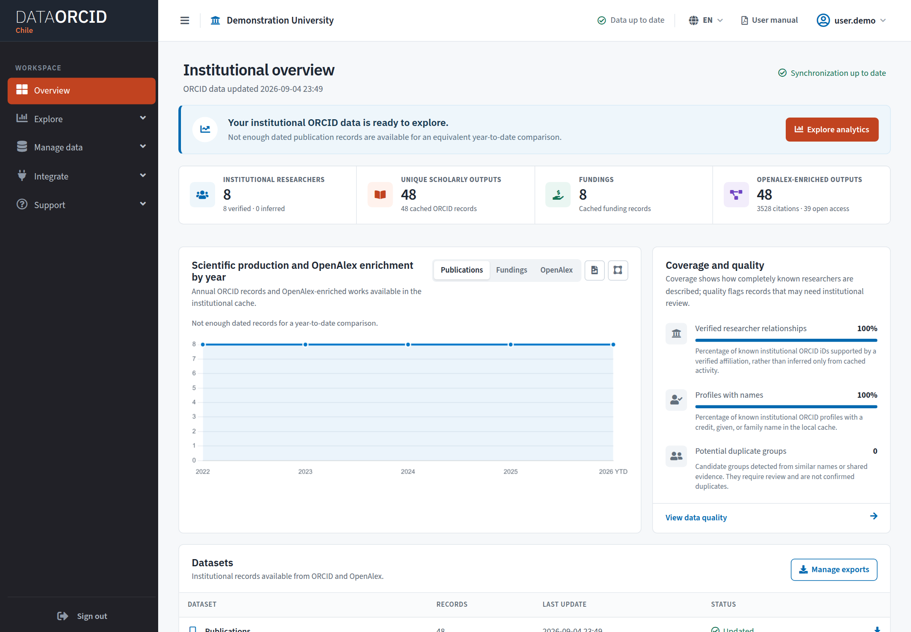

FIGURE 2. Institutional overview and navigation for the User role.

1. Confirm that the displayed institution matches your account.
2. Expand a menu group and choose the page you need.
3. Review filters and update dates in each view.
4. When finished, sign out at the bottom of the sidebar.

## 3. Explore

### 3.1 Institutional overview

The Overview brings together institutional researchers, unique scholarly outputs, funding, and OpenAlex-enriched publications. It includes trends, coverage, data quality, and shortcuts to discovery and downloads.

Start here to check the overall state. Open the relevant analytics page to investigate a figure and use the quality shortcuts to understand information gaps.

Figures reflect information available in the platform. A researcher may appear in the institutional directory without any public works or funding records in the cache.

FIGURE 3. General indicators for the demonstration institution.

> **IMPORTANT:** ORCID records count source occurrences. Canonical outputs consolidate possible repetitions. These figures can differ without indicating an error.

## 3.2 Researcher directory

The Directory lets you search by name, ORCID iD, or email, filter by Affiliation Manager and institutional relationship evidence, and sort the results. You can display 10, 25, or 50 rows per page.

Search and sorting apply to the result set. CSV and Excel export the filtered results, including records beyond the visible page.

Verified evidence may come from ROR, GRID, or Ringgold identifiers. A cache-inferred relationship is an operational signal and should be distinguished from a verified association.

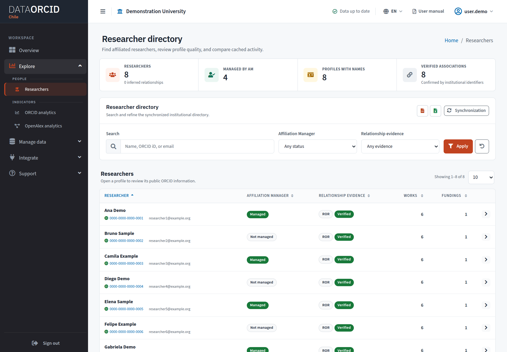

FIGURE 4. Directory with filters, sorting, pagination, and exports.

1. Enter a search term and apply the relevant filters.
2. Select a column heading to change the order.
3. Open an ORCID iD to view its portfolio or export the filtered set.

## 3.3 Researcher portfolio

Opening an ORCID iD from the Directory lets you inspect public record details, biography, identifiers, visual summaries, institutional context, and available activities.

Refresh from ORCID requests that public profile again; it does not update the entire institution. Download full report produces an Excel file. You can also export available sections such as education, employment, works, and funding.

The ORCID.org link opens the original public record. A section may be absent because it contains no public data. Institutional context helps distinguish source work records from consolidated unique outputs.

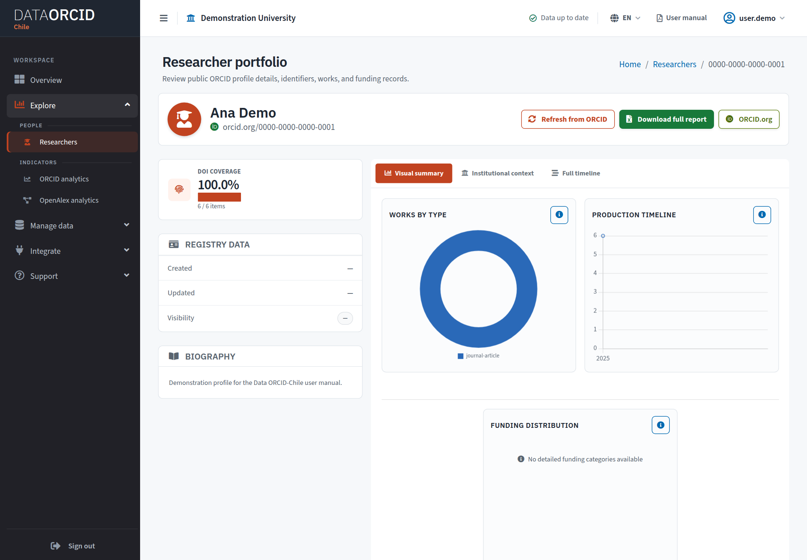

FIGURE 5. Public portfolio of a fictional researcher.

## 3.4 ORCID analytics

ORCID analytics uses institutional records cached from ORCID. Filters combine period, work type, funding type, and researcher. An empty filter includes all available values.

Overview, Publications, Funding, and Researchers offer different views of the filtered set. Check the filters when switching sections.

Each chart's data exports provide CSV or Excel. Where an image control is present, you can also save the visualization.

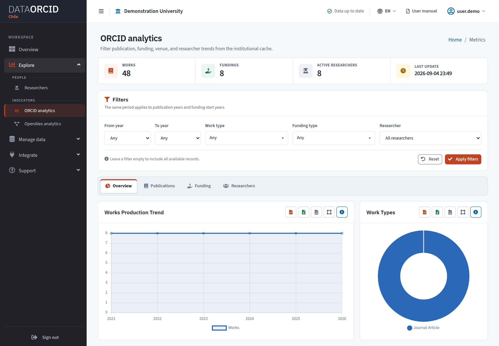

FIGURE 6. ORCID analytics overview and shared filters.

## 3.4.1 Publications

Publications shows annual trends, work types, and leading journals or sources. Indicators use ORCID records within the institutional scope and active filters.

Use the period filter to narrow the query and the work type filter to compare equivalent sets. Before adding a chart to a report, retain its retrieval date and the criteria used.

A work may appear in more than one ORCID profile. A sum of records therefore does not necessarily represent unique institutional publications.

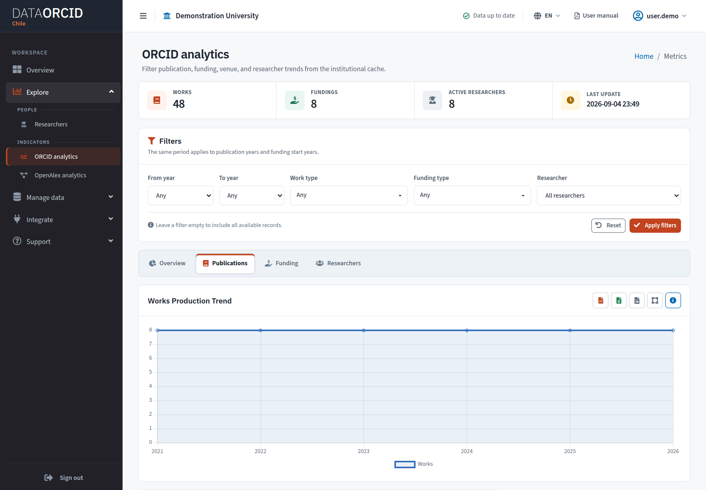

FIGURE 7. ORCID publication indicators.

## 3.4.2 Funding

Funding groups records by start year, type, and funding organization. Combine period, funding type, and researcher filters to review declared activity.

The data comes from public ORCID records. Missing amounts, currencies, or project numbers describe gaps in the available information.

A work and funding record appearing in the same person's profile do not establish that the project funded that publication. Interpret these tables and charts as context for recorded activity.

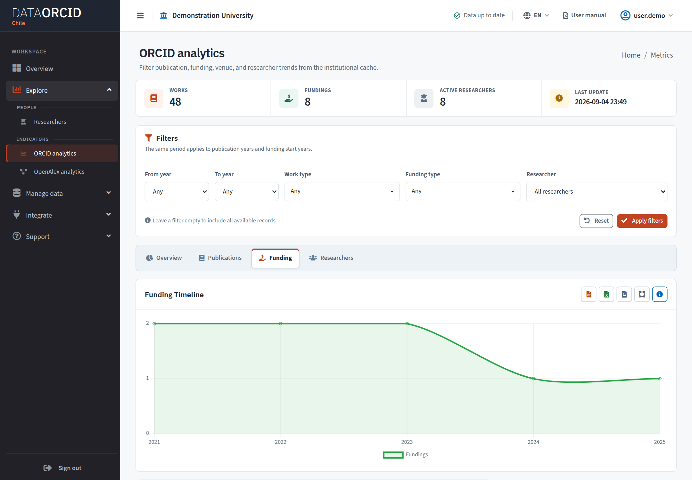

FIGURE 8. Indicators for public funding records in ORCID.

## 3.4.3 Researchers

Researchers identifies people with the most work or funding records in the filtered set. Names and ORCID iDs provide access to individual portfolios, and the lists can be exported.

A position in these lists reflects recorded activity and its coverage. It is not a comprehensive performance assessment and may not include a person's entire output.

To verify a result, retain the period and filters, open the portfolio, and compare the information with the public source record.

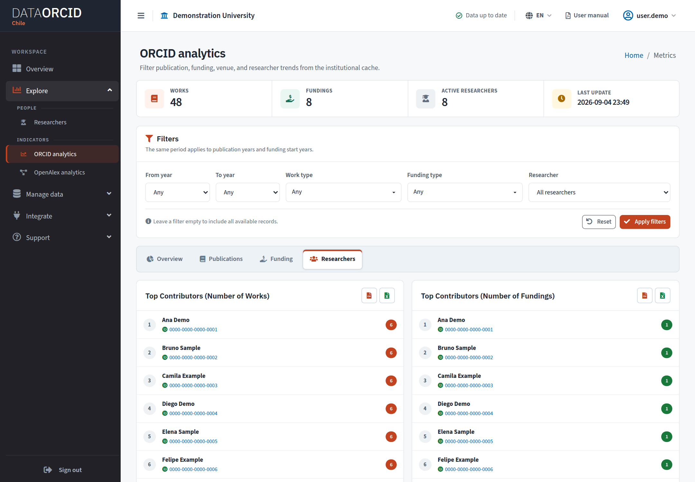

FIGURE 9. Researcher lists by recorded activity.

## 4. Manage data

### 4.1 Synchronization and downloads

For User and OAI User, this page is a status monitor and download center. It shows the freshness of works, funding, profiles, and OpenAlex metadata, together with the latest available run.

Institutional downloads include ORCID works, funding, researchers, and OpenAlex enrichment, according to dataset availability. Files reflect the cache state indicated on the page.

These roles inspect status and download available data. If an institutional synchronization is needed or a failed run appears, ask the responsible team to review it.

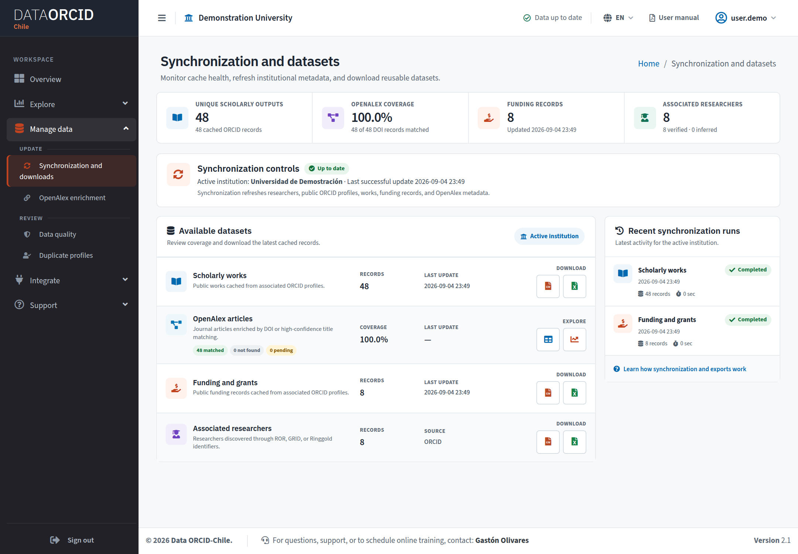

FIGURE 10. Institutional status and downloadable datasets.

## 4.2 Background exports

Large CSV and Excel downloads are prepared in the background. The floating Exports center shows waiting status, progress, and a private link when the file is ready. You can continue navigating within the platform.

An equivalent request may reuse a file that is still valid. If source data changes, a new export is prepared. Files have a limited lifetime; request an expired file again from its source view.

Delete all removes your completed exports and their files. Queued or running jobs are preserved. Closing or minimizing a notification only changes its display.

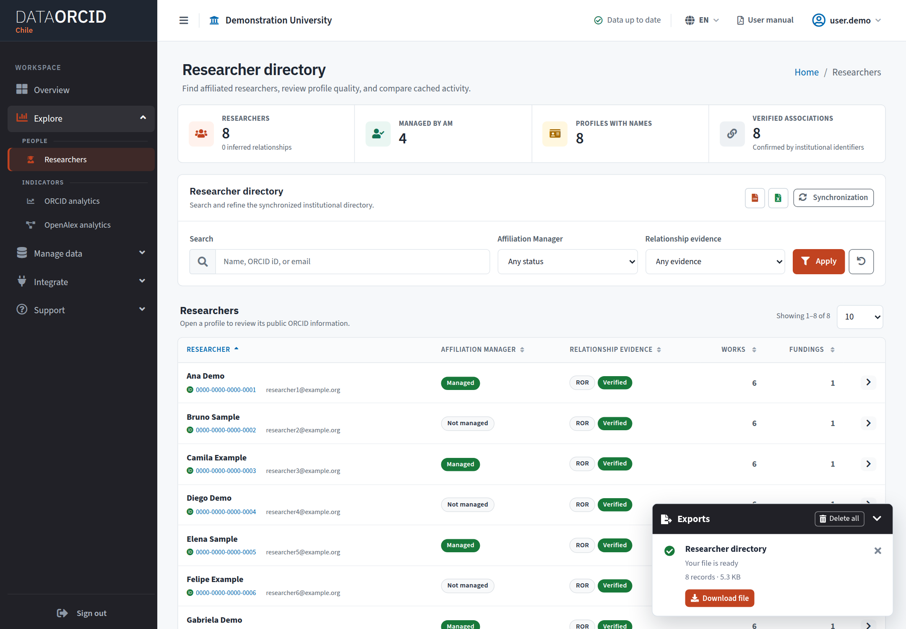

FIGURE 11. Floating center with a demonstration export ready to download.

1. Apply the filters and sorting you need.
2. Select CSV or Excel and check the floating notification.
3. When it is ready, select Download file.
4. Keep the file with the query date, institutional scope, and filters.

## 4.3 Data quality

Data quality separates four perspectives: Overview, Researcher evidence, Funding context, and Technical integrity. It reports DOI and year coverage, funding completeness, verified or inferred relationships, and OpenAlex consistency.

Percentages describe available fields. An absence is a coverage gap and should not automatically be interpreted as a system error.

Use these views to document a report's limitations and locate records that need review. If you identify an inconsistency, record the relevant module and identifier and report it to the responsible team.

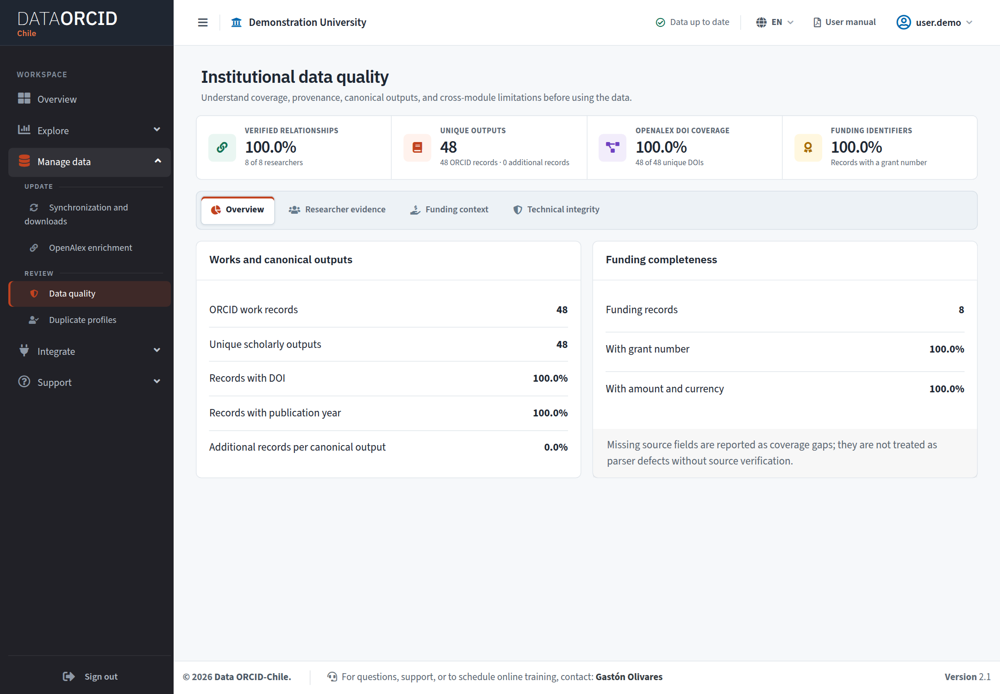

FIGURE 12. Institutional data quality overview.

## 4.4 Duplicate profiles

This module identifies algorithmic candidates that may represent multiple ORCID iDs for one person. You can search, filter by confidence or status, switch between available views, read the methodology, refresh the analysis, and export results.

User and OAI User inspect candidates and their evidence. A candidate does not confirm a duplicate, and refreshing the analysis does not merge or modify ORCID records.

Compare names, identifiers, and available evidence before reporting a case. A name match alone does not establish that two records belong to the same person.

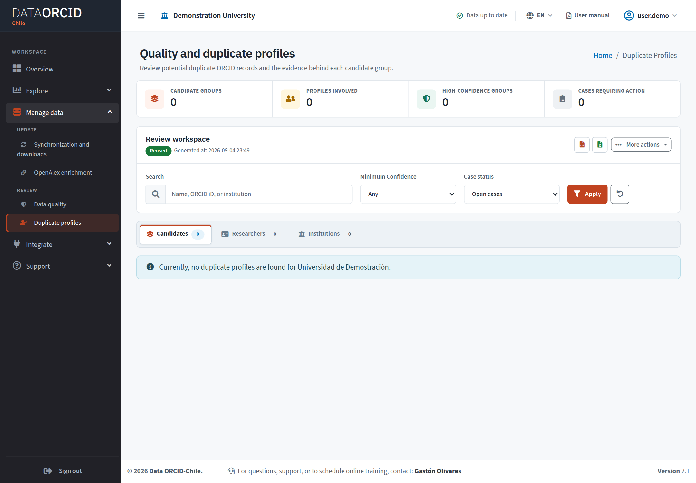

FIGURE 13. Review of possible duplicate profiles.

## 4.5 OpenAlex enrichment

The enrichment review classifies articles as matched, pending, not found, error, or without DOI. You can search by title, DOI, ORCID iD, source, or topic, sort results, change page size, and expand row details.

Exports preserve the dataset filters. The Analytics link opens aggregate analysis. Coverage uses eligible ORCID articles, rather than all possible institutional output, as its basis.

Matching prioritizes DOI. Some records may be linked through a conservative comparison of title, year, and type. An unmatched record still exists in ORCID even if it contributes no enriched metadata.

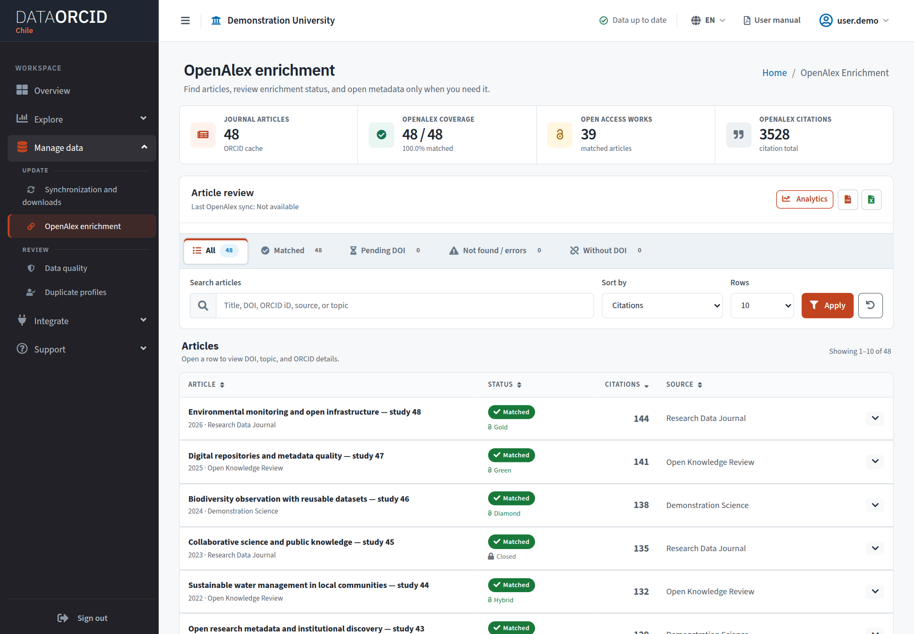

FIGURE 14. Articles and OpenAlex enrichment states.

## 5. OpenAlex analytics

### 5.1 Filters, metrics, and exports

OpenAlex analytics supplements ORCID articles from your assigned institution with citations, open access, authorships, affiliations, topics, languages, sources, and FWCI. Check dataset coverage before interpreting results.

General filters include period, document type, open access, language, and affiliation. Visible metrics customizes the cards, and information buttons explain definitions and methods.

Charts offer PNG or SVG where the control is available. Tables offer CSV or Excel. In tables with search, sorting, and pagination, these criteria apply to the whole set, not only visible rows.

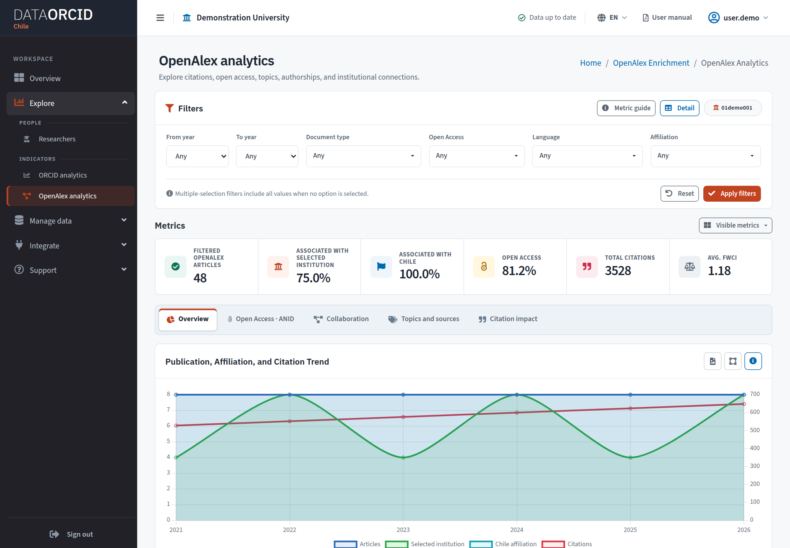

FIGURE 15. OpenAlex overview with filters, metrics, and annual trend.

## 5.2 Open Access · ANID

This section presents output, citations, sources, and trends for Diamond OA and Green OA articles matching the active filters. Categories correspond to the open-access status recorded by OpenAlex.

The categories are mutually exclusive according to that status. Each group's percentage uses all enriched articles matching the filters as its denominator, not only open-access articles.

Visualizations show trends, composition, and journals with the most output or citations. Use internal vertical scrolling to explore categories in long charts.

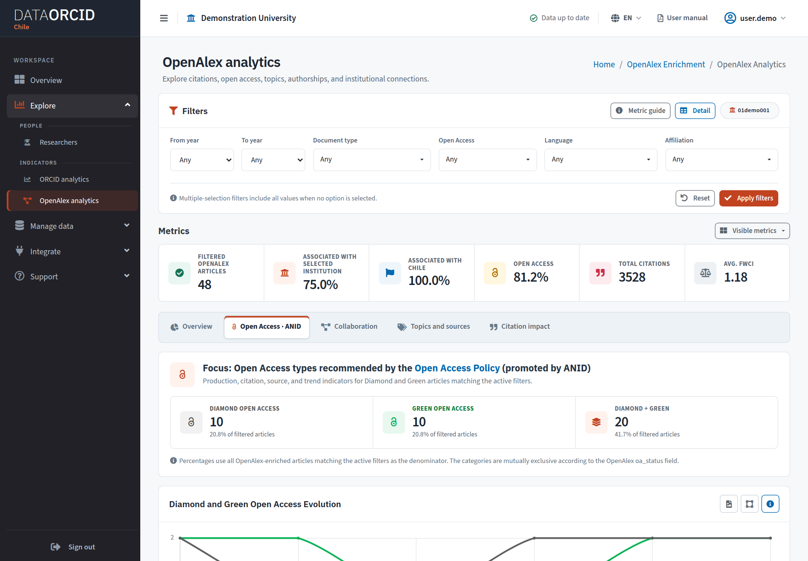

FIGURE 16. Diamond OA and Green OA indicators.

> **IMPORTANT:** Green OA describes an article's repository availability. It does not mean the entire journal is green or independently certify policy compliance.

## 5.2.1 Open-access tables

Journal and most-cited article tables provide search, column sorting, page size, pagination, and export. Results respect the page's general filters.

To review a source, search its name and sort by output or citations. To identify articles, use the relevant table and check DOI, year, and open-access status.

Retain the denominator and retrieval date when reporting a percentage. A change may reflect the period, filters, an OpenAlex update, or increased matching coverage.

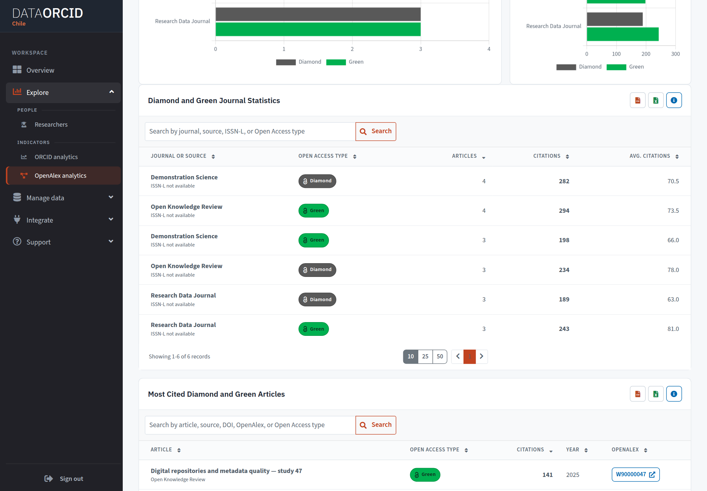

FIGURE 17. Open-access source and article tables.

## 5.3 Collaboration

Collaboration shows authors with Chilean affiliations and countries and institutions present in OpenAlex authorships. These views describe affiliations on enriched articles included by the filters.

One article may count in several countries or institutions. Category totals can therefore exceed the article count. An affiliation recorded on a work also does not establish a current employment relationship.

Use each chart's information control to check the method and export its data to document collaboration. These views are not a census of every ORCID profile at the institution.

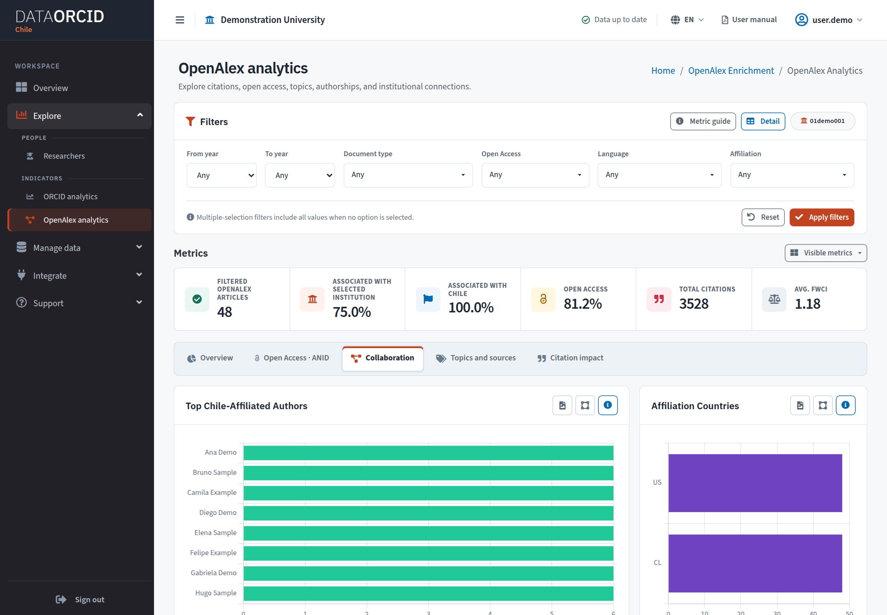

FIGURE 18. Collaboration derived from OpenAlex authorships and affiliations.

## 5.4 Topics and sources

This section distributes articles by thematic domains and fields, document type, open access, language, and source. Topics come from OpenAlex classification.

Languages are displayed with localized names based on the available codes. Missing values are grouped as unknown; that category should not be interpreted as an additional language or discipline.

Use filters to review a specific period or set and export tables or charts. The distribution describes the enriched articles available, not all disciplinary activity at the institution.

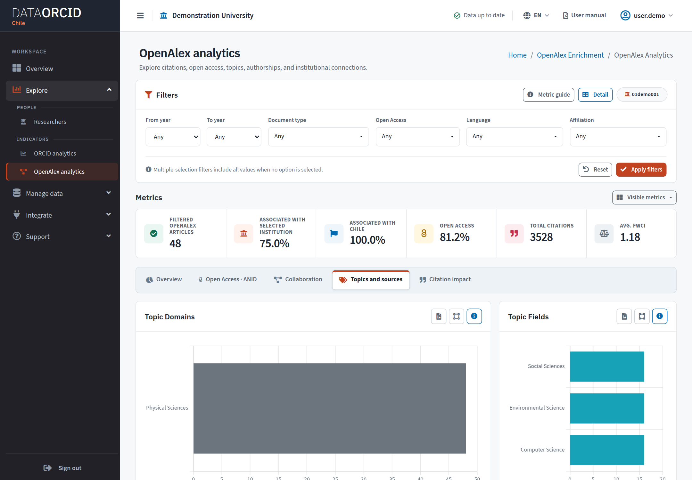

FIGURE 19. Thematic fields, languages, document types, and sources.

## 5.5 Citation impact

Citation impact ranks filtered articles by their current OpenAlex citation count. Totals may change after later updates. Check DOI, year, and source when comparing publications.

The citation trend groups that current count by publication year. It does not represent citations received during each calendar year.

FWCI provides an impact measure normalized by field, year, and document type where OpenAlex supplies a value. A missing value is not zero. Read the metric definition before using it in a report.

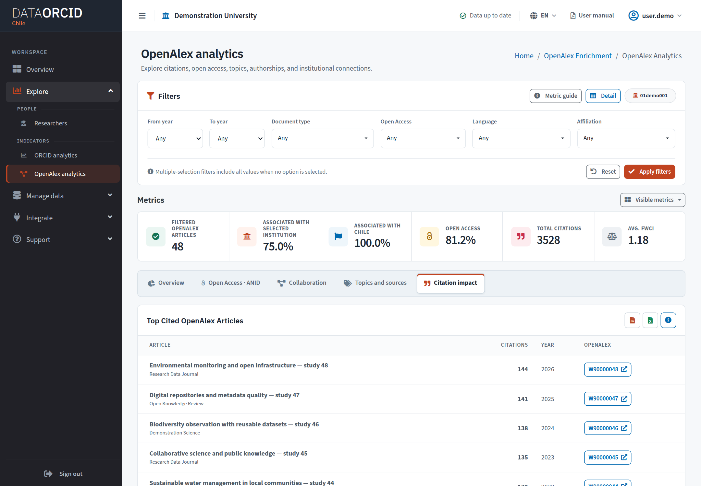

FIGURE 20. Articles with the highest current citation counts.

## 6. Integrate

### 6.1 Read from the ORCID API

Read from the API contains cURL search examples by institution, ROR, name, and country, plus a reference to public endpoints and trial links. It is intended for people who need to query the source with a technical tool.

Choose the relevant example, review its parameters, and replace sample values before running it in your environment. Queries retrieve publicly visible data.

The guide explains how to read ORCID. It does not run a synchronization of your entire institution or grant access to private records.

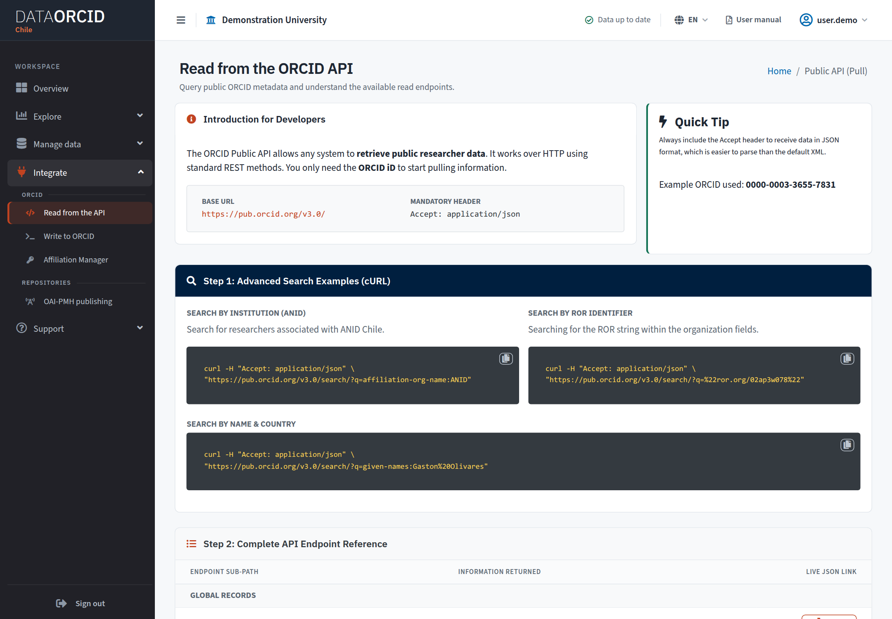

FIGURE 21. Guide to querying the public ORCID API.

## 6.2 Write to ORCID

Write to ORCID documents a downloadable project, its requirements, configuration, CSV structure, and authorization flow. It explains how an authorized integration adds information to a record.

Read the project instructions and coordinate its use with the institutional team responsible for ORCID. A DATA ORCID CHILE account does not replace the credentials and authorizations required by ORCID.

Writing to a record requires appropriate credentials and explicit authorization from the ORCID iD holder. Do not include secrets, passwords, or tokens in spreadsheets or support requests.

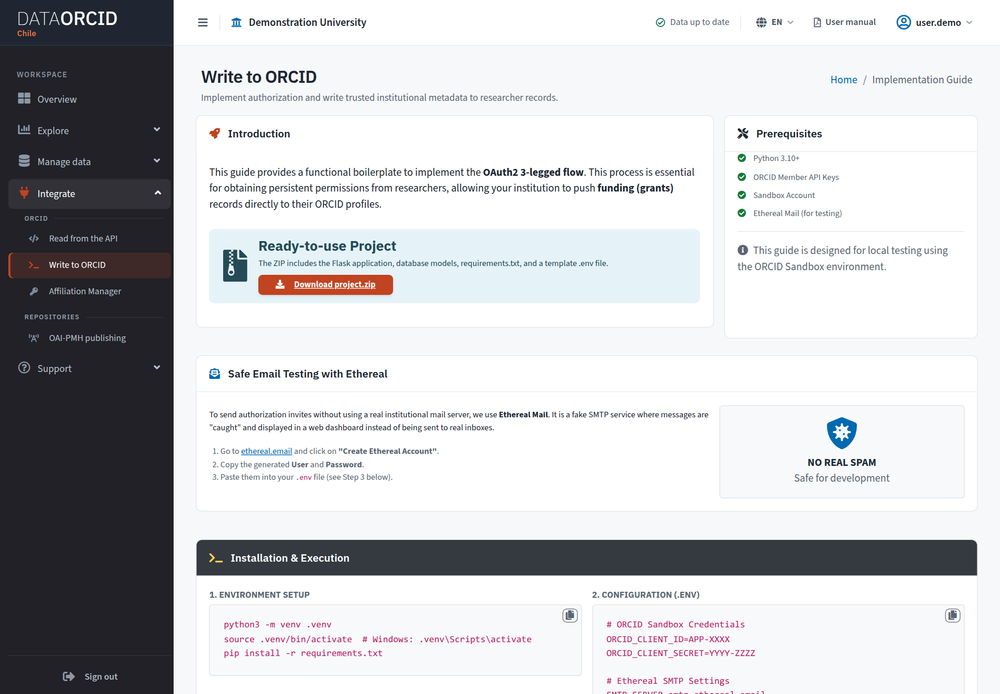

FIGURE 22. Guide and reference project for writing to ORCID.

## 6.3 Affiliation Manager

This option stores the Client ID of the institutional Affiliation Manager application in your account. The value usually begins with APP- and helps identify records managed through that application.

Confirm the correct institutional value before editing, enter it in the field, and save. It is not a password, secret, or API key.

The identifier helps interpret managed-record status. Saving it does not itself grant permission to write to someone's ORCID iD.

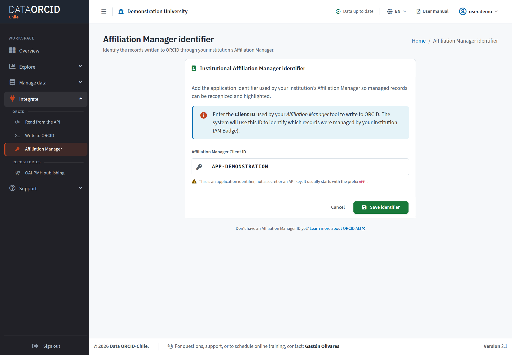

FIGURE 23. Affiliation Manager identifier in the account.

> **IMPORTANT:** Change this value only if you know the correct Client ID or have instructions from the team responsible for ORCID.

## 6.4 ORCID resources

ORCID resources appears under Support and collects links about membership, API credentials, Affiliation Manager, CSV templates, and integrations with platforms such as OJS, DSpace-CRIS, VIVO, and Dataverse.

Choose the resource for your task: understanding an integration, preparing a template, or reading documentation. External links open outside DATA ORCID CHILE and may have their own access requirements.

For questions about this platform's functions, start with the Help center, which adapts its content to the enabled modules.

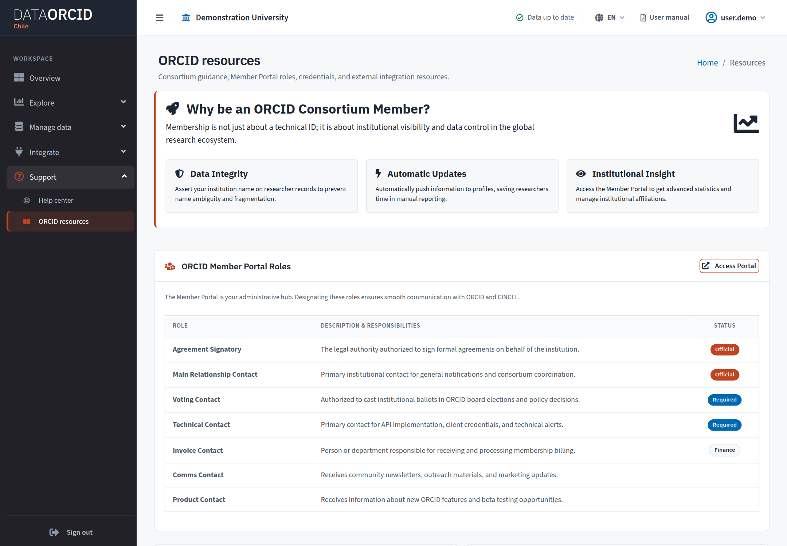

FIGURE 24. ORCID resources and documentation under Support.

## 6.5 OAI-PMH publishing

OAI-PMH publishing lets you review the institutional repository from which other systems can harvest metadata for selected articles. Tabs organize the overview, articles, metadata mapping, DOI imports, and harvesting access.

User can inspect available content. OAI User can also expose or exclude articles, import DOI decisions, undo the latest active import, customize the dataorcid format, and manage private harvesting URLs.

The overview shows available articles, OpenAlex-validated articles, exposed articles, and articles not exposed. Validation requires an OpenAlex affiliation matching the active ROR. The default policy and manual decisions determine the effective selection.

If the provider is disabled or unconfigured, ask the responsible team to enable it. A selected article is available while the provider is enabled and the requested URL has access.

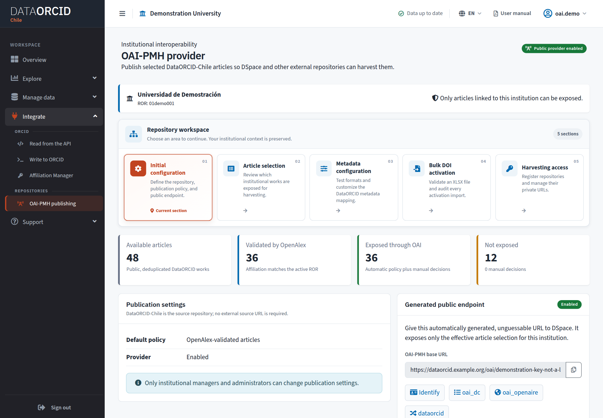

FIGURE 25. OAI-PMH overview available to OAI User.

## 6.6 OAI-PMH article selection

The table supports search and filters for OAI status, affiliation validation, document type, and activation origin. You can sort by the available columns and export the filtered selection for review.

With OAI User, Expose or Exclude changes an individual article. For multiple articles, mark their rows and use Expose selected or Exclude selected. Select this page marks only rows on the current page.

Manual decisions override the automatic policy. Excluding an article from OAI-PMH does not delete it from ORCID, OpenAlex, or the browsing cache.

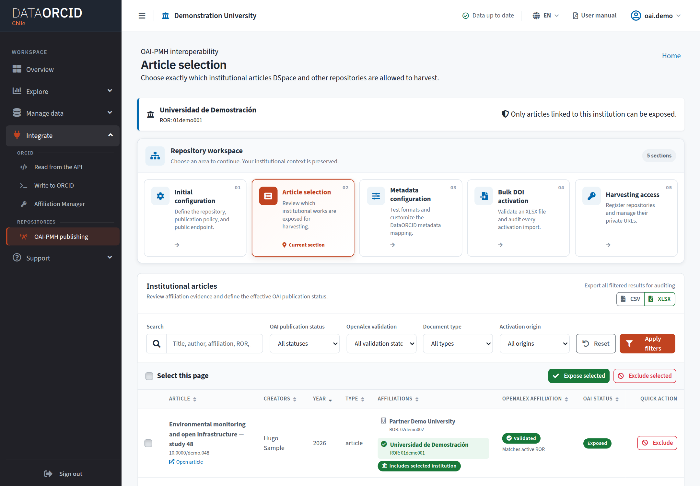

FIGURE 26. Article selection with OAI User actions.

1. Filter and review DOI, title, and affiliations before selecting.
2. Apply the action to the intended rows and check their new status.
3. Inspect the enabled provider to review the published result.

## 6.7 Metadata formats and mapping

The provider offers three formats: oai_dc, oai_openaire, and dataorcid. The first two retain their standard structure. The editor customizes only the dataorcid format.

With OAI User, select a catalog field and choose Add field. You can change its destination name or hide it. Title and identifier are required; hidden fields are not emitted.

Save mapping applies your changes. Restore defaults returns to the initial profile when the control is available. User can inspect the mapping but cannot edit it.

The generated base URL and trial links let you inspect the enabled provider's response. Coordinate the required format with the metadata recipient. Mapping changes the published output, not the original ORCID data.

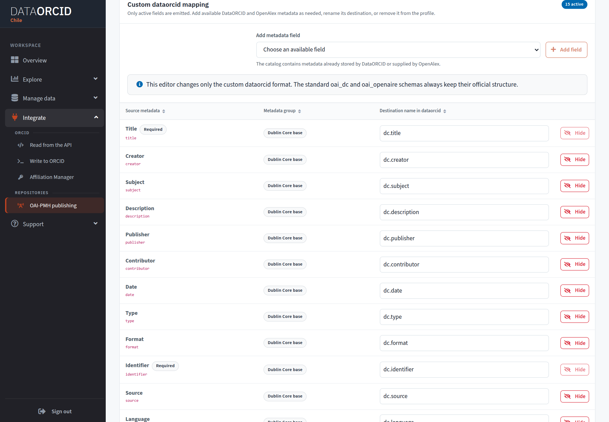

FIGURE 27. dataorcid format editor for OAI User.

## 6.8 Bulk DOI activation

OAI User can activate institutional articles using an XLSX spreadsheet. The system recognizes DOIs already belonging to public articles within the institutional scope. Importing does not add outside publications or synchronize ORCID.

Use Download template and enter one DOI per row in the indicated column. Select the XLSX file and choose Validate and activate. Review the result before considering the task complete.

Invalid, duplicate, or unmatched DOIs are reported without changing articles outside the scope. Each import retains a history with its file, date, validation results, and activated articles.

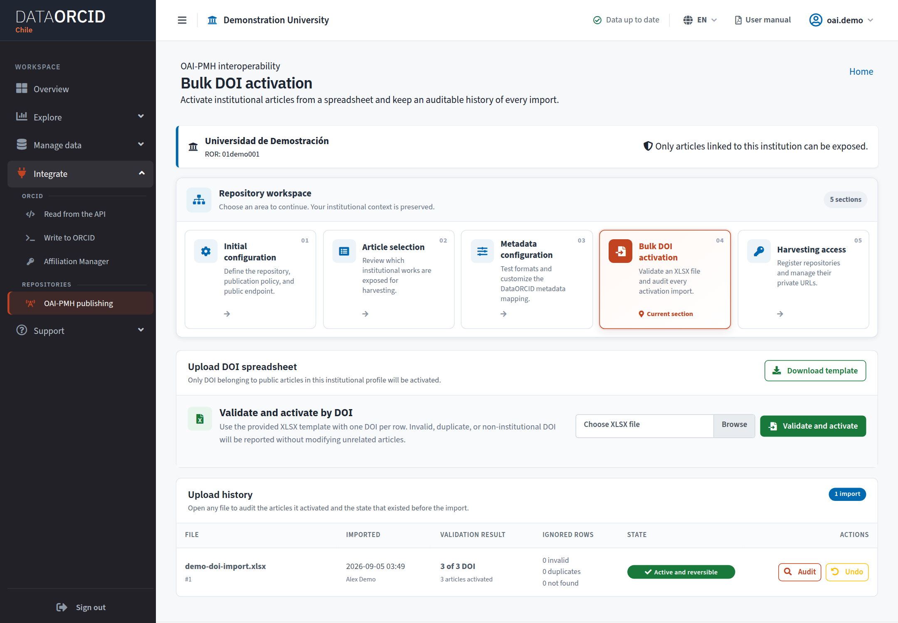

FIGURE 28. DOI spreadsheet upload and import history.

> **IMPORTANT:** A DOI import records OAI-PMH publication decisions. It does not certify a missing OpenAlex affiliation or modify the public source record.

## 6.9 Import audit and undo

In the upload history, Audit opens the file detail so you can review activated articles and their previous state. You can distinguish applied imports, undone imports, and the latest active reversible import.

OAI User can undo the latest active import. Review the detail, select Undo, and confirm in the platform. To reverse an older import, undo the newer ones first.

Undo restores changes attributable to that import while preserving later manual changes. Check the result and return to the articles table to inspect effective status.

User can review the available history and audit. If a correction is needed and you lack OAI editing permission, ask the responsible team to review it.

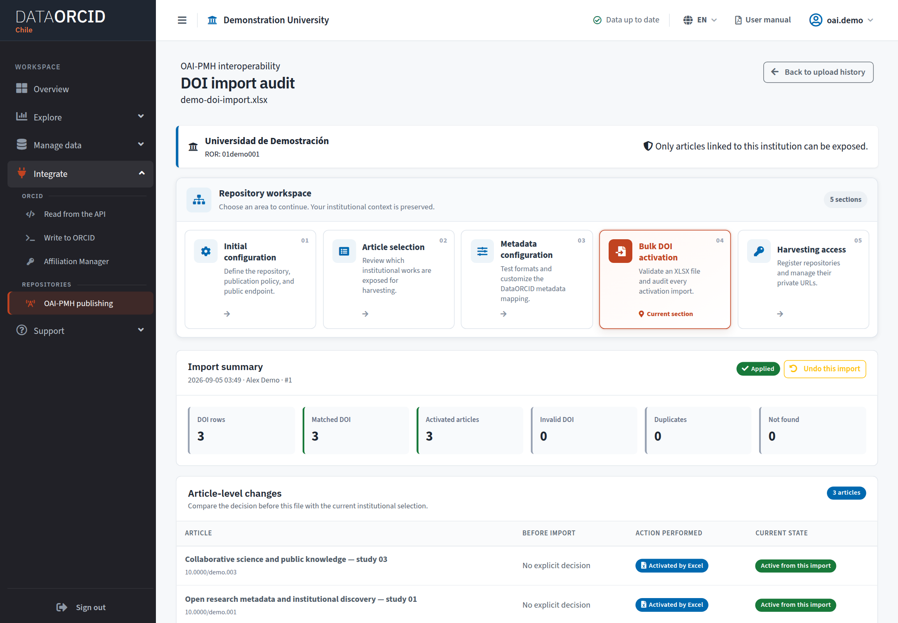

FIGURE 29. Audit of a demonstration DOI import.

## 6.10 Harvesting access

In Harvesting access, OAI User can register each institutional repository URI and generate a private URL for its harvester. User can review repositories and their status; credentials and controls are reserved for accounts with OAI editing permission.

Enter the repository HTTP or HTTPS address without credentials, query parameters, or a fragment, then choose Generate private URL. Copy the complete address. The URI identifies the recipient; the random URL key grants access independently of the IP address or Cloudflare.

In DSpace-CRIS, configure the private URL as OAI Provider, choose Simple Dublin Core (oai_dc), and harvest metadata only. Start or schedule harvesting in DSpace. No DataORCID sign-in is required.

After configuring the harvester, enable Allow harvesting only through registered private URLs and save the access mode. The general URL will stop working. Revoke access blocks one URL; Generate new URL invalidates the old one and requires updating the harvester.

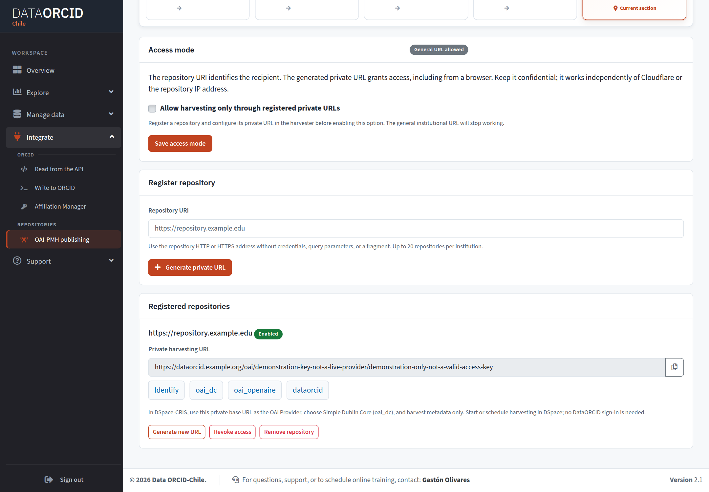

FIGURE 30. Demonstration repository and its private harvesting URL.

> **IMPORTANT:** Anyone who knows a private URL can read the XML, including in a browser. Keep it confidential. Revoking every URL keeps the general URL blocked while restricted mode remains active.

## 7. Help center

The Help center is under Support. It includes instant search and topics covering first steps, sources, data flow, metrics, downloads, the data dictionary, permissions, integrations, troubleshooting, and release notes.

Content follows the User and OAI User workflows. Topics and links adapt to enabled modules; a disabled module is also absent from the active help content.

Enter a term such as DOI, export, or open access to locate explanations. Open the topic and use its links to return to the relevant function. Consult this help before escalating an operational question.

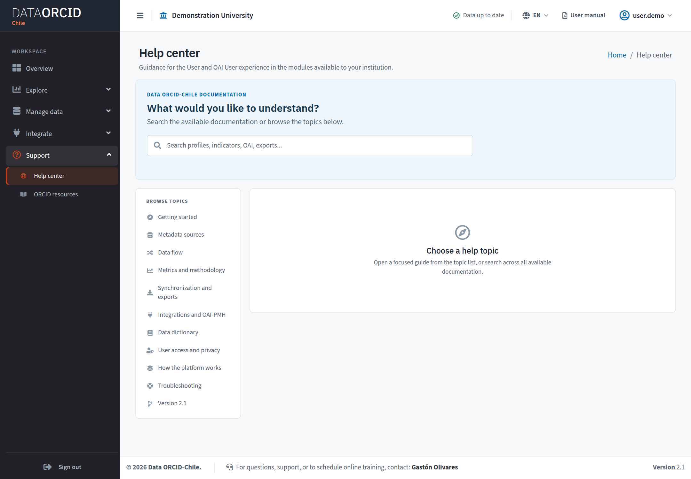

FIGURE 31. Help center search and topics.

## 8. Account and security

### 8.1 My profile

Personal options let you update your first name, last name, email, and position. Review the values, make your changes, and save. Email is used for notifications and password recovery.

Institution, ROR, and role cannot be changed on this screen. If they do not match your circumstances, ask the responsible team to review them.

The language selector lets you keep the interface in your preferred enabled language. Account changes do not alter a researcher's public ORCID record.

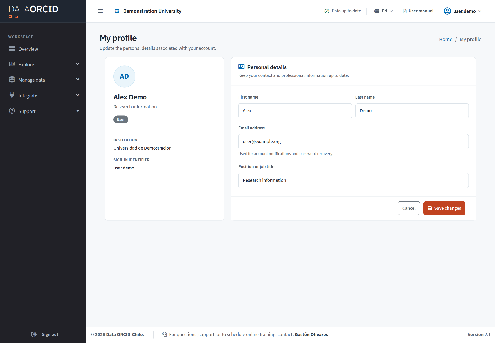

FIGURE 32. Editing personal details of the fictional account.

## 8.2 Password and sign-out

To change your password, enter the current password, a new password with at least eight characters, and its confirmation. The system also limits it to 72 UTF-8 bytes; some characters use more than one byte.

Save the change and check the confirmation. Use a password exclusive to this account and do not share it. If you do not know your current password, use the recovery option on the sign-in page.

Sign out is at the bottom of the sidebar. Use it when finished, especially on shared devices. Avoid including credentials or private personal information in searches, files, or support requests.

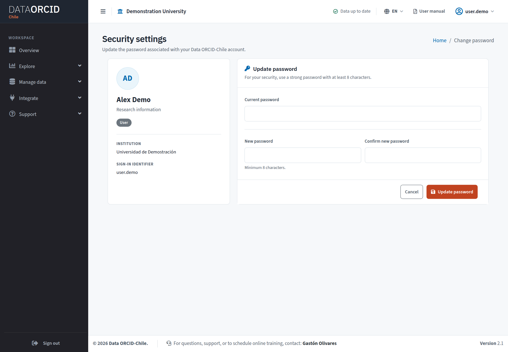

FIGURE 33. Account password change.

## 9. Sources, methods, and good practice

### 9.1 How institutional scope is built

ROR is the main institutional key. Verified GRID or Ringgold identifiers complement ORCID discovery when available. Results are combined and deduplicated by ORCID iD while retaining provenance evidence.

### 9.2 How ORCID, OpenAlex, and OAI-PMH relate

ORCID supplies public profiles and records. OpenAlex adds analytical metadata for eligible articles with an accepted match. OAI-PMH publishes metadata for the effective institutional selection; it does not download full text or modify ORCID.

### 9.3 Good practice

1. Check the update date, institution, and filters before citing a figure.
2. Distinguish ORCID records, canonical outputs, and enriched articles.
3. Read definitions and methods through information buttons.
4. Keep date, filters, and scope with each export.
5. Treat duplicate candidates and coverage gaps as signals requiring review.
6. Compare sets with equivalent periods, denominators, and coverage.
7. Review OAI-PMH selection and format before sharing its URL with the receiving system.

## 10. Glossary

| TERM | DESCRIPTION |
| --- | --- |
| ORCID iD | Persistent identifier for a researcher. |
| ROR | Main institutional identifier used by the platform. |
| GRID and Ringgold | Verified legacy institutional identifiers that complement discovery; they do not replace ROR. |
| ORCID record | Public data added to a profile, such as a work or funding record. |
| Canonical output | Publication consolidated by normalized DOI or, conservatively, by title and year. |
| Cache | Local copy of retrieved information. Its date helps establish dataset freshness. |
| OpenAlex coverage | Proportion of eligible ORCID articles with a match and OpenAlex metadata. |
| Citations | Current publication citation count according to available OpenAlex information. |
| FWCI | Field-weighted citation impact, normalized by field, year, and document type. |
| Diamond OA | OpenAlex category for articles in fully open journals without author publication charges. |
| Green OA | OpenAlex category for access through a repository copy. |
| AM | ORCID Affiliation Manager; its Client ID helps identify managed records. |

## 10.1 Export and integration terms

| TERM | DESCRIPTION |
| --- | --- |
| Background export | File preparation while you continue using the platform. |
| Valid file | Completed export that is still downloadable and, where applicable, reusable. |
| OAI-PMH | Protocol used by one system to harvest metadata from another. |
| Provider | Service exposing the institutional selection through a base URL. |
| Harvester | Receiving system that queries the provider and ingests metadata. |
| Exposed article | Article included in the effective selection; public availability also requires an enabled provider. |
| OpenAlex validation | An article affiliation matching the active institution's ROR. |
| Manual decision | Inclusion or exclusion that overrides the automatic policy. |
| oai_dc | Provider's Dublin Core metadata format. |
| oai_openaire | Provider's OpenAIRE metadata format. |
| dataorcid | Format whose fields and destination names can be customized by OAI User. |
| DOI import | XLSX spreadsheet that activates articles already in the institutional scope and retains an audit. |
| Import undo | Action reversing the latest active import while preserving later manual changes. |

## 11. Troubleshooting

### No data appears

Reset filters and check the update indicator. If the institutional dataset is unavailable, ask the responsible team to review its status.

### A figure differs between modules

Check whether it counts ORCID records, canonical outputs, or OpenAlex articles. Review period, type, open access, affiliation, and update date.

### An export is empty, pending, or expired

Confirm that the view has results and remove overly restrictive filters. Check the floating center for status. Request an expired file again; if a task does not progress, report the view and request time.

### I cannot edit OAI-PMH articles or mappings

User has read-only access. Selection, DOI imports, and mapping require OAI User assigned to the institution. If this permission is needed for your work, request a review.

### A DOI is not activated or I cannot undo an import

Check the template and the report of invalid, duplicate, or unmatched DOIs. Imports only activate articles in institutional scope. Only the latest active import can be undone; review the history and later changes.

### A module is missing or the public provider fails

Availability depends on enabled modules and provider status. Consult the Help center and ask the responsible team to review. Include page, date, filters, and a screenshot without sensitive information.

## CONTACT INFORMATION

Consorcio para el Acceso a la Información Científica Electrónica

Moneda 1375, 13th floor · Santiago, Chile · +56 2 2365 4589

[secretariaejecutiva@cincel.cl](mailto:secretariaejecutiva@cincel.cl) · [www.cincel.cl](https://www.cincel.cl)
