# DATA ORCID CHILE

Guía integral de opciones y funcionalidades de Usuario y Usuario OAI.

**VERSIÓN:** 2.1 · **ACTUALIZACIÓN:** Septiembre de 2026

## 1. Propósito y alcance

DATA ORCID CHILE permite consultar y analizar información pública de ORCID enriquecida con metadatos de OpenAlex. Este manual acompaña el recorrido de Usuario y Usuario OAI: acceso, consulta, analíticas, descargas, integración y ajustes de cuenta.

Ambos perfiles trabajan dentro de la institución asignada a su cuenta y de los módulos habilitados. Usuario OAI añade acciones sobre la selección de artículos, las cargas DOI, el mapeo de metadatos y el acceso de recolección OAI-PMH.

Esta edición incorpora las exportaciones en segundo plano, la publicación OAI-PMH y la ayuda adaptada a los módulos disponibles.

| ACCIÓN | USUARIO | USUARIO OAI |
| --- | --- | --- |
| Consultar módulos institucionales | Disponible | Disponible |
| Descargar datos e informes visibles | Disponible | Disponible |
| Revisar candidatos duplicados | Consulta | Consulta |
| Consultar contenido OAI-PMH | Consulta | Disponible |
| Seleccionar artículos y cargar DOI | Consulta | Disponible |
| Editar mapeo dataorcid | Consulta | Disponible |
| Editar cuenta y contraseña propias | Disponible | Disponible |

> **IMPORTANTE:** Las capturas muestran la interfaz de la versión 2.1 con datos ficticios de demostración. Los nombres, ORCID iD, DOI, ROR y direcciones de ejemplo no deben utilizarse como registros reales.

## 2. Acceso y navegación

### 2.1 Inicio de sesión

Para ingresar en www.orcid.cl, utiliza el nombre de usuario o correo institucional y la contraseña de tu cuenta. Mantener sesión iniciada es adecuado solamente en un equipo personal o administrado por tu institución.

El correo de bienvenida incluye un enlace para elegir tu contraseña y otro para descargar este manual PDF en el idioma de tu cuenta, sin iniciar sesión. El enlace para establecer la contraseña caduca en 24 horas y solo puede usarse una vez. Si caduca, solicita otro desde la recuperación de contraseña.

Si no recuerdas la contraseña, abre el enlace de recuperación, indica el correo de tu cuenta y sigue el enlace recibido. La respuesta de la pantalla no confirma si una dirección está registrada. Si no llega el mensaje, revisa el correo no deseado y consulta al equipo responsable.

El selector permite utilizar los idiomas habilitados: inglés, español, francés, portugués y alemán. La elección realizada durante una sesión queda asociada a tu preferencia de idioma.

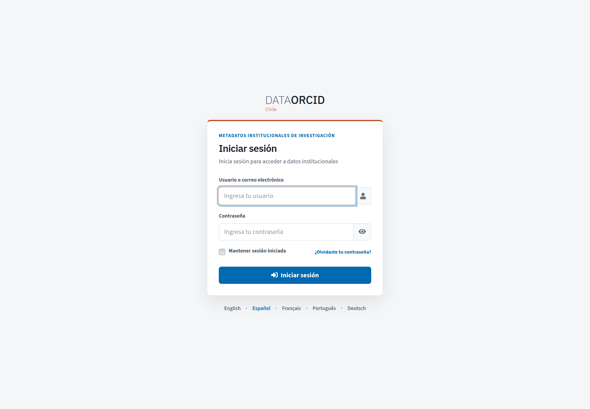

FIGURA 1. Inicio de sesión y selección de idioma.

## 2.2 Estructura de la interfaz

El menú lateral organiza el trabajo en Explorar, Gestionar datos, Integrar y Soporte, además del acceso al Resumen. La barra superior muestra la institución activa, el idioma y las opciones personales. Los módulos disponibles dependen de la configuración del servicio y del rol de la cuenta. El enlace «Manual de usuario», con un icono PDF junto a las opciones de tu cuenta, descarga este manual en el idioma activo.

Los indicadores de actualización ayudan a reconocer si la información está vigente o requiere atención. Consulta ese estado antes de interpretar una cifra o descargar un conjunto.

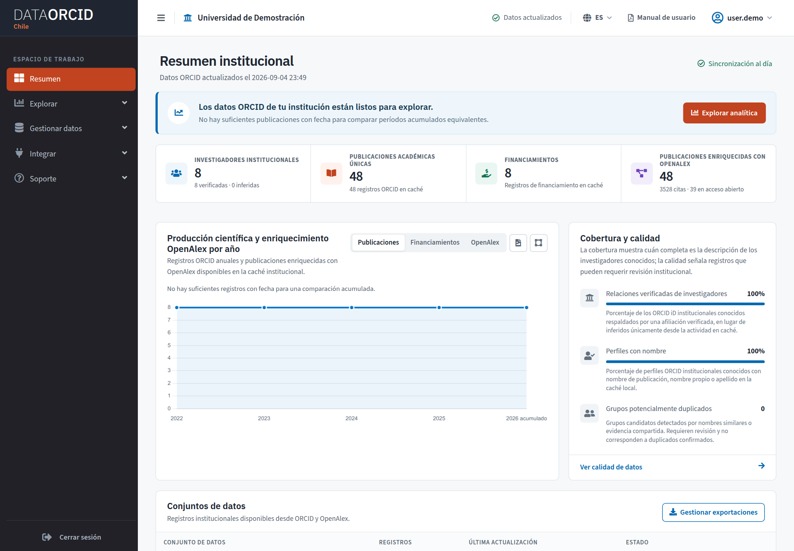

FIGURA 2. Resumen institucional y navegación con el perfil Usuario.

1. Comprueba que la institución mostrada corresponda a tu cuenta.
2. Abre un grupo del menú y selecciona la página que necesitas.
3. Revisa filtros y fecha de actualización en cada vista.
4. Al terminar, cierra la sesión desde la parte inferior del menú.

## 3. Explorar

### 3.1 Resumen institucional

El Resumen reúne investigadores institucionales, publicaciones académicas únicas, financiamientos y publicaciones enriquecidas con OpenAlex. Incluye tendencias, cobertura, calidad de datos y accesos a consultas y descargas.

Es el punto de partida para revisar el estado general. Abre la analítica correspondiente para profundizar en una cifra y utiliza los accesos de calidad para interpretar brechas de información.

Las cifras reflejan la información disponible en la plataforma. Un investigador puede pertenecer al directorio institucional sin contar con obras o financiamientos públicos en la caché.

FIGURA 3. Indicadores generales de la institución de demostración.

> **IMPORTANTE:** Los registros ORCID cuentan apariciones de origen. Las salidas canónicas consolidan registros con el mismo DOI o agrupaciones revisadas. Las coincidencias sin DOI requieren revisión. Estas cifras pueden diferir sin que exista un error.

## 3.2 Directorio de investigadores

El Directorio permite buscar por nombre, ORCID iD o correo, filtrar por Affiliation Manager y por evidencia de relación institucional, y ordenar los resultados. Puedes elegir 10, 25 o 50 filas por página.

La búsqueda y el orden se aplican al conjunto de resultados. CSV y Excel permiten exportar los resultados filtrados, incluidos los que no están en la página visible.

La evidencia verificada puede provenir de identificadores ROR, GRID o Ringgold. Una relación inferida desde caché sirve como señal operativa y debe distinguirse de una asociación verificada.

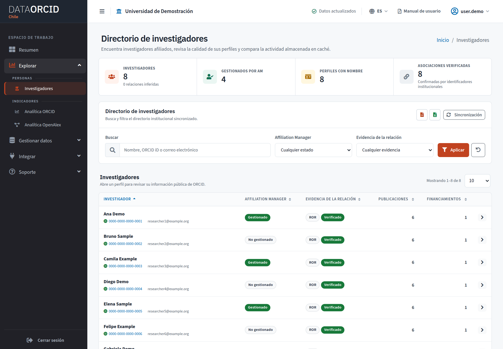

FIGURA 4. Directorio con filtros, orden, paginación y exportaciones.

1. Escribe un criterio y aplica los filtros pertinentes.
2. Selecciona un encabezado para cambiar el orden.
3. Abre un ORCID iD para consultar el portafolio o descarga el conjunto filtrado.

## 3.3 Portafolio de investigador

Al abrir un ORCID iD desde el Directorio, puedes consultar datos del registro público, biografía, identificadores, resumen visual, contexto institucional y actividades disponibles.

Actualizar desde ORCID solicita nuevamente ese perfil público; no actualiza toda la institución. Descargar informe completo genera un Excel. También puedes exportar secciones disponibles, como educación, empleos, obras y financiamientos.

El enlace ORCID.org abre el registro público original. La ausencia de una sección puede deberse a que no tiene datos públicos. El contexto institucional permite distinguir los registros de obras de las salidas únicas consolidadas.

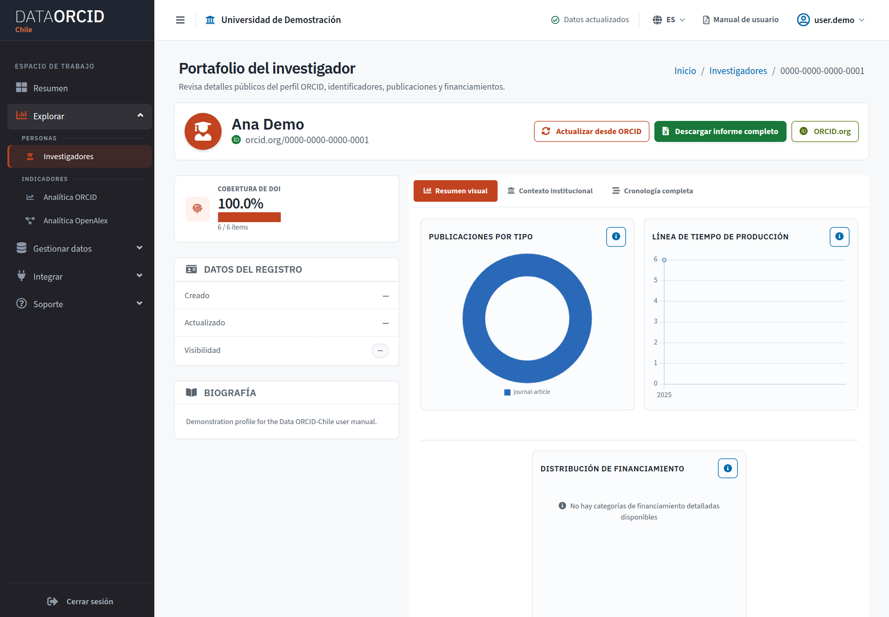

FIGURA 5. Portafolio público de un investigador ficticio.

## 3.4 Analítica ORCID

Analítica ORCID trabaja sobre los registros institucionales almacenados desde ORCID. Los filtros permiten combinar período, tipo de obra, tipo de financiamiento e investigador. Un filtro vacío incluye todos los valores disponibles.

Las secciones Resumen, Publicaciones, Financiamiento e Investigadores ofrecen distintas lecturas del conjunto filtrado. Comprueba los filtros al cambiar de sección.

Las exportaciones de cada gráfico recuperan sus datos en CSV o Excel. Cuando aparece el control de imagen, también puedes guardar la visualización.

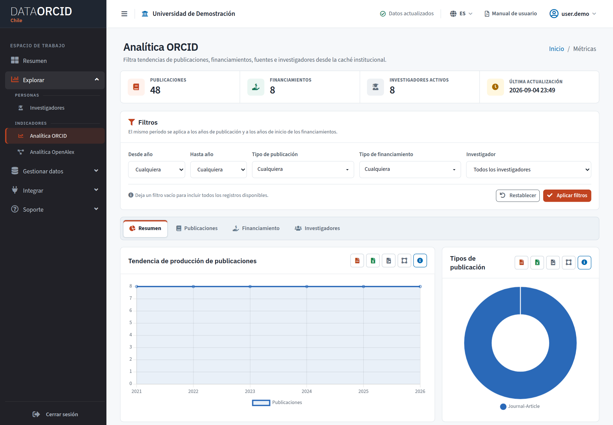

FIGURA 6. Resumen de Analítica ORCID y filtros comunes.

## 3.4.1 Publicaciones

Publicaciones presenta la evolución anual, los tipos de obra y las principales revistas o fuentes. Los indicadores se construyen con los registros ORCID incluidos en el ámbito y los filtros activos.

Utiliza el período para acotar la consulta y el tipo de obra para comparar conjuntos equivalentes. Antes de incorporar un gráfico a un informe, conserva su fecha de consulta y los criterios utilizados.

Una obra puede aparecer en más de un perfil ORCID. Por eso una suma de registros no equivale necesariamente a publicaciones únicas de la institución.

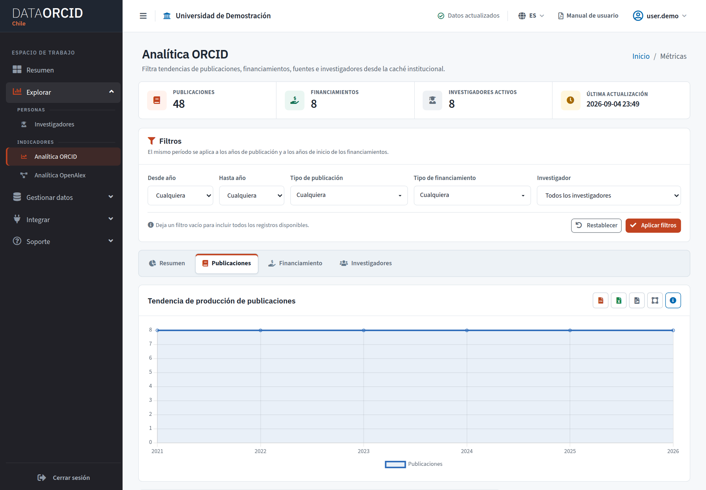

FIGURA 7. Indicadores de publicaciones ORCID.

## 3.4.2 Financiamiento

Financiamiento agrupa registros por año de inicio, tipo y organización financiadora. Puedes combinar los filtros de período, tipo de financiamiento e investigador para revisar la actividad declarada.

Los datos proceden de registros públicos ORCID. La falta de monto, moneda o número de proyecto describe una brecha de información disponible.

La presencia simultánea de una obra y un financiamiento en el perfil de una persona no prueba que esa publicación haya sido financiada por ese proyecto. Las tablas y gráficos deben interpretarse como contexto de actividad registrada.

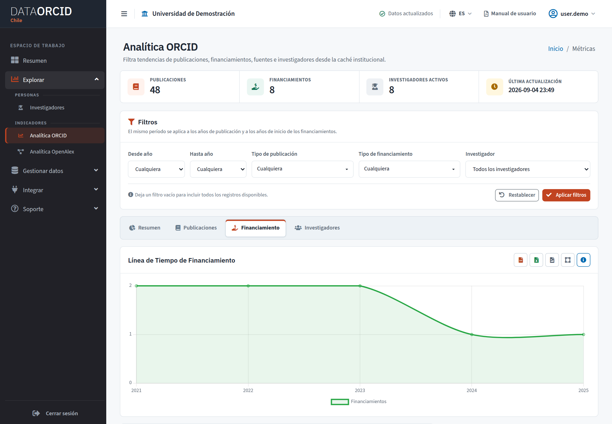

FIGURA 8. Indicadores de financiamiento visible públicamente en ORCID.

## 3.4.3 Investigadores

Investigadores permite reconocer quiénes concentran registros de obras o financiamientos dentro del conjunto filtrado. Los nombres y ORCID iD permiten volver al portafolio individual y las listas pueden exportarse.

Una posición en estas listas refleja la actividad registrada y su cobertura. No constituye una evaluación integral de desempeño ni incluye necesariamente toda la producción de una persona.

Para verificar un resultado, conserva el período y los filtros, abre el portafolio y contrasta la información con el registro público de origen.

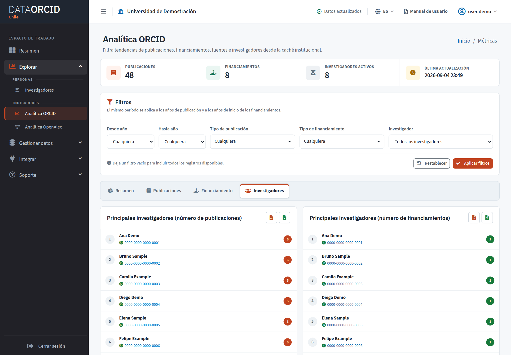

FIGURA 9. Listas de investigadores por actividad registrada.

## 4. Gestionar datos

### 4.1 Sincronización y descargas

Para Usuario y Usuario OAI, esta página es un monitor y centro de descargas. Informa la vigencia de obras, financiamientos, perfiles y metadatos OpenAlex, junto con la última ejecución disponible.

Las descargas institucionales incluyen obras ORCID, financiamientos, investigadores y enriquecimiento OpenAlex, según la disponibilidad de cada conjunto. Los archivos reflejan el estado de la caché indicado en la página.

Durante una actualización se mantiene disponible la versión publicada. Un resultado parcial indica que algunos perfiles no se actualizaron y pueden conservar datos anteriores. Consulta los recuentos del último intento y solicita al equipo responsable que revise los fallos.

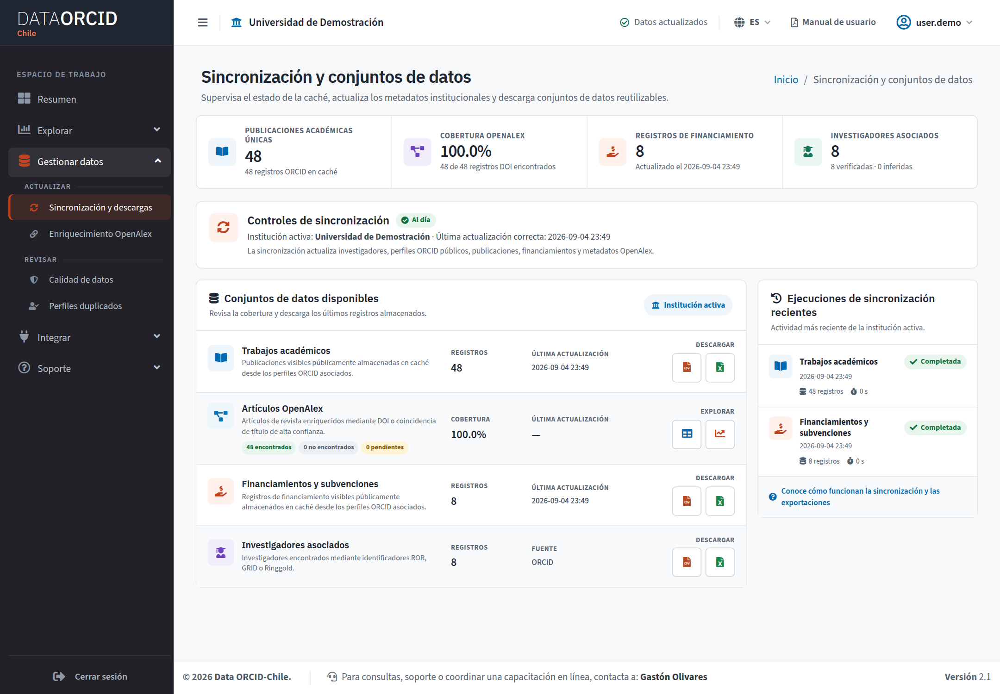

FIGURA 10. Estado institucional y conjuntos descargables.

## 4.2 Exportaciones en segundo plano

Las descargas grandes en CSV o Excel se preparan en segundo plano. El centro flotante Exportaciones muestra la espera, el progreso y el enlace privado cuando el archivo está listo. Puedes seguir navegando dentro de la plataforma.

Una solicitud equivalente puede reutilizar un archivo vigente. Si cambian los datos fuente, se prepara una nueva exportación. El archivo tiene una vigencia limitada; si ya venció, vuelve a solicitarlo desde la vista de origen.

Borrar todo elimina tus exportaciones finalizadas y sus archivos. Conserva los trabajos en cola o en ejecución. Cerrar o minimizar un aviso sólo cambia su visualización.

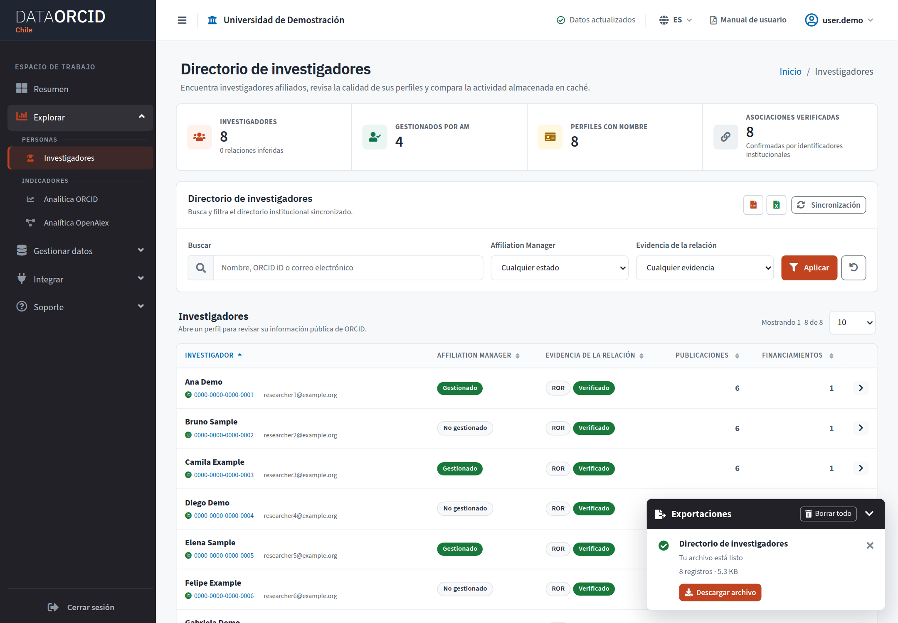

FIGURA 11. Centro flotante con una exportación de demostración lista para descargar.

1. Aplica los filtros y el orden que necesitas.
2. Selecciona CSV o Excel y revisa el aviso flotante.
3. Cuando indique que está listo, pulsa Descargar archivo.
4. Conserva el archivo junto con la fecha, el ámbito y los filtros de la consulta.

## 4.3 Calidad de datos

Calidad de datos separa cuatro perspectivas: Resumen, Evidencia de investigadores, Contexto de financiamiento e Integridad técnica. Permite revisar cobertura de DOI y años, completitud de financiamientos, relaciones verificadas o inferidas y consistencia de OpenAlex.

Los porcentajes describen campos disponibles. Una ausencia se informa como brecha de cobertura y no debe interpretarse automáticamente como un error del sistema.

Utiliza estas vistas para documentar límites de un informe y localizar registros que requieren revisión. Si detectas una inconsistencia, registra el módulo y el identificador pertinente y comunícala al equipo responsable.

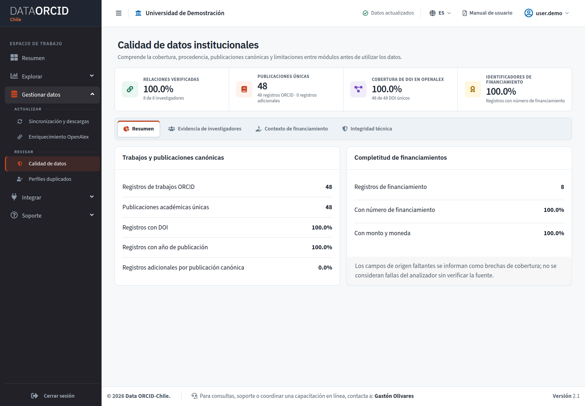

FIGURA 12. Resumen de calidad de los datos institucionales.

## 4.4 Perfiles duplicados

Este módulo identifica candidatos algorítmicos que podrían representar más de un ORCID iD para una misma persona. Puedes buscar, filtrar por confianza o estado, cambiar entre las vistas disponibles, consultar la metodología, refrescar el análisis y exportar resultados.

Usuario y Usuario OAI consultan los candidatos y su evidencia. Un candidato no confirma un duplicado y refrescar el análisis no fusiona ni modifica los registros ORCID.

Compara nombres, identificadores y evidencia disponible antes de informar un caso. La coincidencia de nombres, por sí sola, no basta para concluir que se trata de la misma persona.

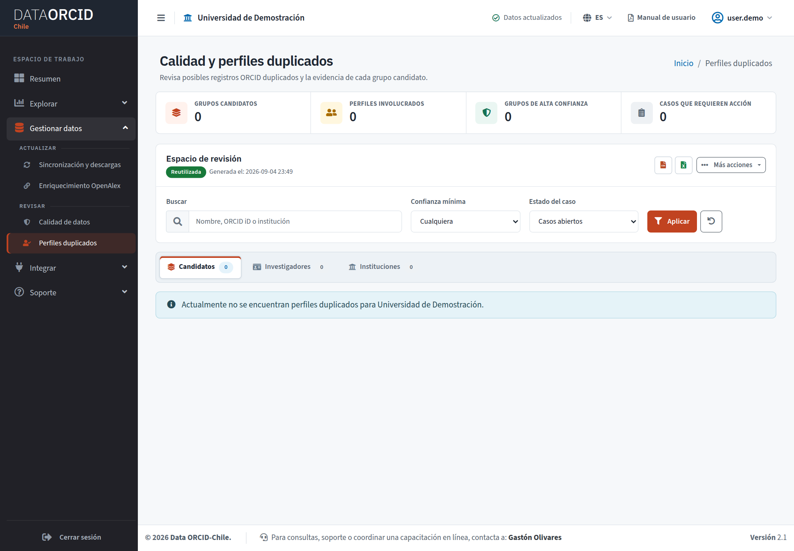

FIGURA 13. Consulta de posibles perfiles duplicados.

## 4.5 Enriquecimiento OpenAlex

La revisión de enriquecimiento clasifica artículos como coincidentes, pendientes, no encontrados, con error o sin DOI. Puedes buscar por título, DOI, ORCID iD, fuente o tema, ordenar, cambiar el tamaño de página y desplegar el detalle de una fila.

La exportación conserva los filtros del conjunto. El enlace Analítica conduce al análisis agregado. La cobertura se calcula sobre artículos ORCID elegibles y no sobre toda la producción posible de la institución.

La coincidencia prioriza DOI. Algunos registros pueden vincularse mediante una comparación conservadora de título, año y tipo. Un registro sin coincidencia sigue existiendo en ORCID aunque no aporte metadatos enriquecidos.

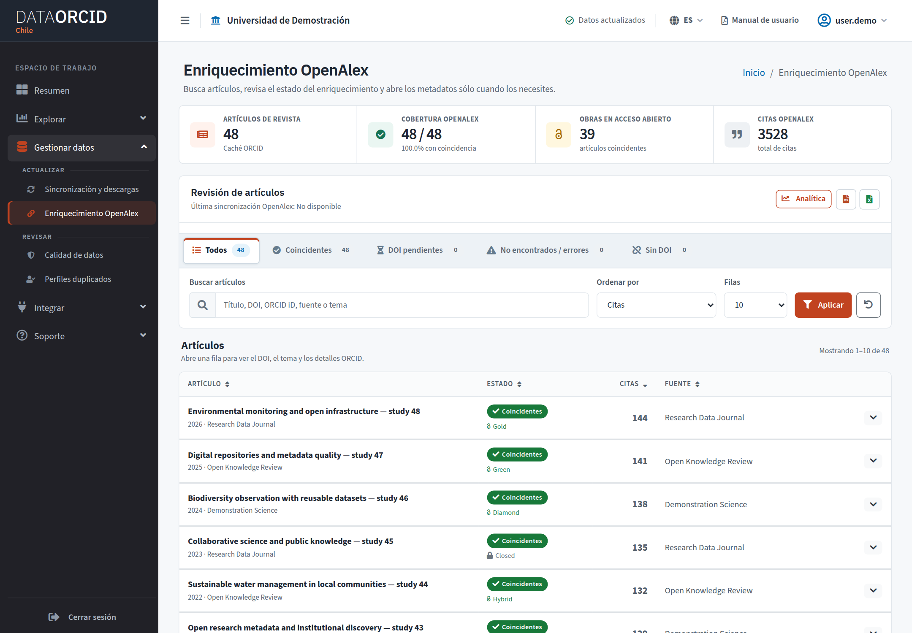

FIGURA 14. Artículos y estados de enriquecimiento OpenAlex.

## 5. Analítica OpenAlex

### 5.1 Filtros, métricas y exportaciones

Analítica OpenAlex complementa los artículos ORCID de la institución asignada con citas, acceso abierto, autorías, afiliaciones, temas, idiomas, fuentes y FWCI. Revisa la cobertura del conjunto antes de interpretar los resultados.

Los filtros generales incluyen período, tipo documental, acceso abierto, idioma y afiliación. Métricas visibles personaliza las tarjetas y los botones de información explican definiciones y métodos.

Los gráficos ofrecen PNG o SVG donde aparece el control. Las tablas ofrecen CSV o Excel. En las tablas con búsqueda, orden y paginación, estos criterios se aplican al conjunto completo, no solamente a las filas visibles.

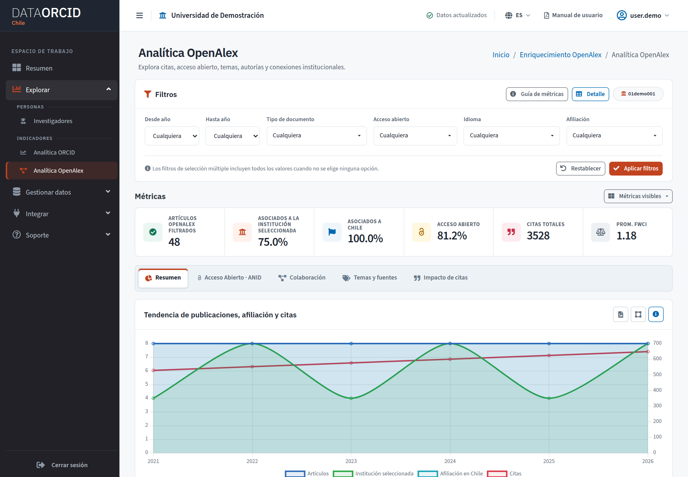

FIGURA 15. Resumen OpenAlex con filtros, métricas y tendencia anual.

## 5.2 Acceso abierto · ANID

Esta sección presenta producción, citas, fuentes y tendencias de artículos OA Diamante y OA Verde que cumplen los filtros activos. Las categorías corresponden al estado de acceso abierto registrado por OpenAlex.

Las categorías son mutuamente excluyentes según ese estado. El porcentaje de cada grupo utiliza como denominador todos los artículos enriquecidos que coinciden con los filtros; no sólo los artículos de acceso abierto.

Las visualizaciones permiten revisar evolución, composición y revistas con mayor producción o citación. En gráficos extensos, usa el desplazamiento vertical interno para recorrer las categorías.

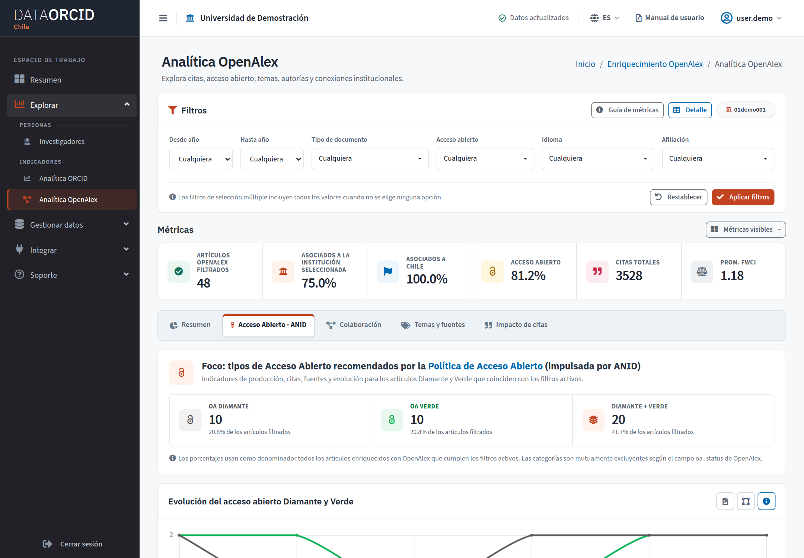

FIGURA 16. Indicadores de OA Diamante y OA Verde.

> **IMPORTANTE:** OA Verde es una condición del artículo por disponibilidad en repositorio. No implica que toda la revista sea verde ni certifica por sí sola el cumplimiento de una política.

## 5.2.1 Tablas de acceso abierto

Las tablas de revistas y artículos más citados ofrecen búsqueda, orden por columna, tamaño de página, paginación y exportación. Los resultados respetan los filtros generales de la página.

Para revisar una fuente, busca su nombre y ordena por producción o citas. Para identificar artículos, usa la tabla correspondiente y revisa el DOI, el año y el estado de acceso abierto.

Conserva el denominador y la fecha de consulta al comunicar un porcentaje. Un cambio puede deberse al período, a los filtros, a una actualización de OpenAlex o a una mayor cobertura de coincidencias.

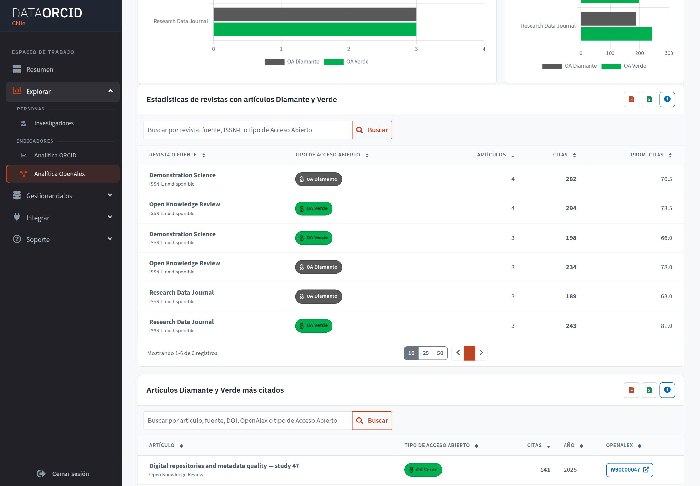

FIGURA 17. Tablas de fuentes y artículos de acceso abierto.

## 5.3 Colaboración

Colaboración muestra autores con afiliación chilena y países e instituciones presentes en las autorías OpenAlex. Estas visualizaciones describen las afiliaciones de los artículos enriquecidos incluidos en los filtros.

Un artículo puede contar en más de un país o institución. Por eso la suma de categorías puede superar el total de artículos. La afiliación registrada en una obra tampoco garantiza una vinculación laboral actual.

Utiliza la información de cada gráfico para revisar el método y exporta los datos si necesitas documentar una colaboración. Estas vistas no constituyen un censo de todos los perfiles ORCID de la institución.

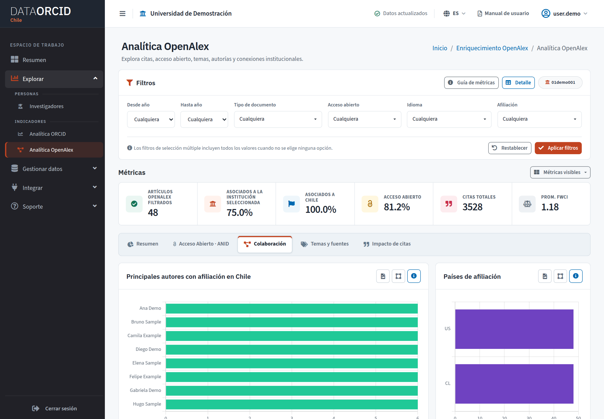

FIGURA 18. Colaboración derivada de autorías y afiliaciones OpenAlex.

## 5.4 Temas y fuentes

Esta sección distribuye artículos por dominios y campos temáticos, tipo documental, acceso abierto, idioma y fuente. Los temas proceden de la clasificación de OpenAlex.

Los idiomas se presentan con nombre localizado a partir del código disponible. Los valores ausentes se agrupan como desconocidos; esa categoría no debe interpretarse como un idioma o una disciplina adicional.

Puedes usar los filtros para revisar un período o conjunto específico y exportar tablas o gráficos. La distribución describe los artículos enriquecidos presentes, no toda la actividad disciplinaria de la institución.

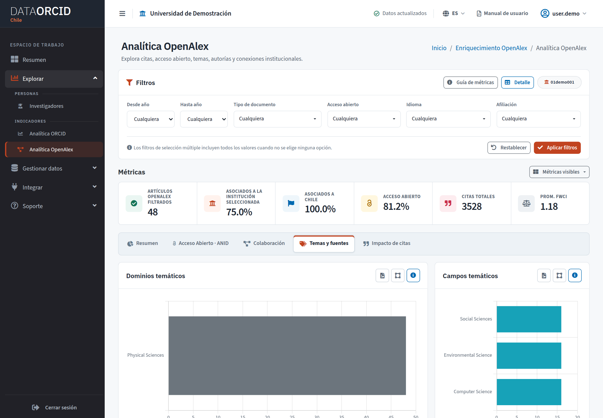

FIGURA 19. Campos temáticos, idiomas, tipos documentales y fuentes.

## 5.5 Impacto de citas

Impacto de citas ordena artículos filtrados por su contador actual de citas en OpenAlex. El total puede cambiar en actualizaciones posteriores. Revisa DOI, año y fuente al comparar publicaciones.

La tendencia de citas agrupa ese contador por año de publicación. No representa las citas recibidas durante cada año calendario.

FWCI aporta una lectura de impacto normalizada por campo, año y tipo documental cuando OpenAlex dispone del valor. Un dato ausente no equivale a cero. Consulta la definición de la métrica antes de utilizarla en un informe.

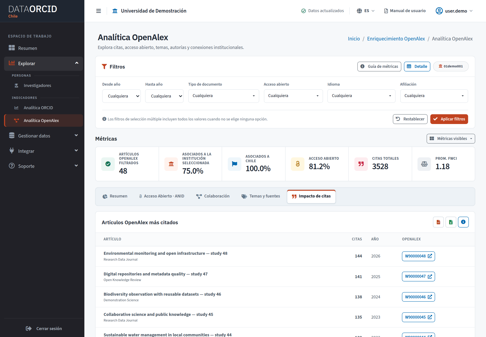

FIGURA 20. Artículos con mayor contador actual de citas.

## 6. Integrar

### 6.1 Leer desde la API ORCID

Leer desde la API reúne ejemplos cURL de búsquedas por institución, ROR, nombre y país, además de una referencia de endpoints públicos y enlaces de prueba. Está dirigida a personas que necesitan consultar la fuente desde una herramienta técnica.

Selecciona el ejemplo que corresponda, revisa los parámetros y reemplaza los valores de muestra antes de ejecutarlo en tu entorno. Las consultas recuperan datos con visibilidad pública.

La guía explica cómo leer ORCID. No constituye una operación de sincronización de toda tu institución ni concede permisos sobre registros privados.

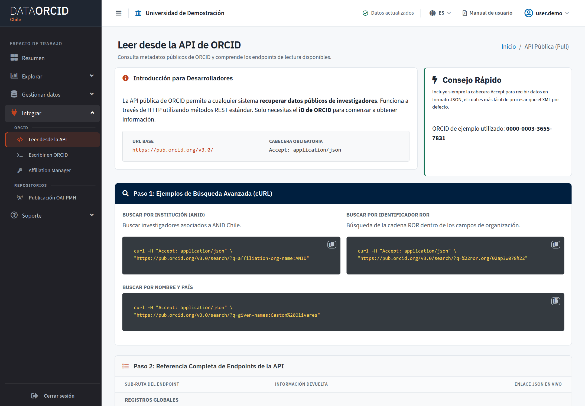

FIGURA 21. Guía de consulta de la API pública de ORCID.

## 6.2 Escribir en ORCID

Escribir en ORCID documenta un proyecto descargable, sus requisitos, configuración, estructura CSV y flujo de autorización. Permite comprender cómo una integración autorizada incorpora información a un registro.

Revisa las instrucciones del proyecto y coordina su uso con el equipo institucional responsable de ORCID. La cuenta de DATA ORCID CHILE no sustituye las credenciales y autorizaciones exigidas por ORCID.

Escribir en un registro requiere credenciales apropiadas y autorización explícita de la persona titular del ORCID iD. No incluyas secretos, contraseñas ni tokens en planillas o solicitudes de soporte.

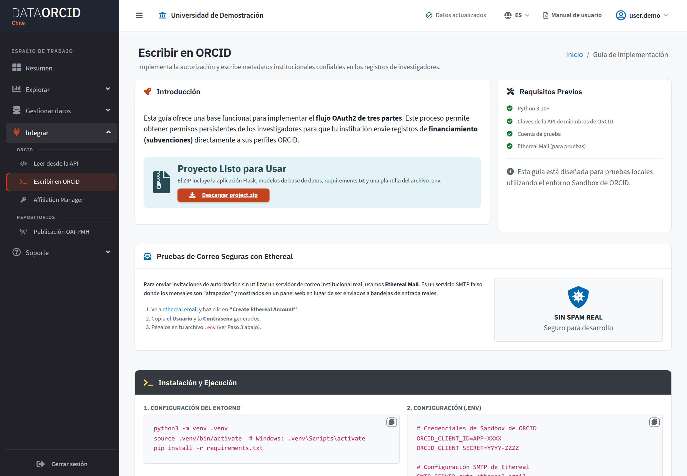

FIGURA 22. Guía y proyecto de referencia para escritura en ORCID.

## 6.3 Affiliation Manager

Esta opción guarda en tu cuenta el Client ID de la aplicación utilizada por el Affiliation Manager institucional. El valor suele comenzar con APP- y sirve para reconocer registros gestionados mediante esa aplicación.

Consulta el valor institucional correcto antes de editarlo, introdúcelo en el campo correspondiente y guarda. No es una contraseña, un secreto ni una clave de API.

El identificador ayuda a interpretar el estado de registros gestionados. Guardarlo no otorga por sí solo autorización de escritura sobre el ORCID iD de una persona.

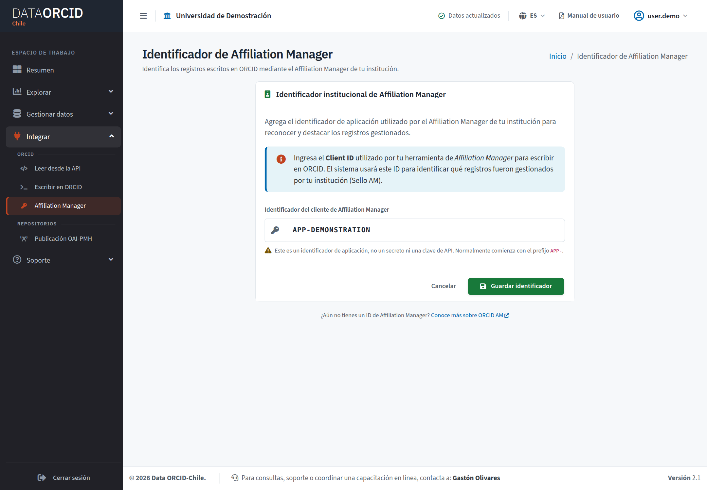

FIGURA 23. Identificador del Affiliation Manager en la cuenta.

> **IMPORTANTE:** Modifica este dato sólo si conoces el Client ID correcto o recibiste instrucciones del equipo responsable de ORCID.

## 6.4 Recursos ORCID

Recursos ORCID se encuentra en Soporte y reúne enlaces sobre membresía, credenciales API, Affiliation Manager, plantillas CSV e integraciones con plataformas como OJS, DSpace-CRIS, VIVO y Dataverse.

Elige el recurso según tu tarea: comprender una integración, preparar una plantilla o consultar documentación. Los enlaces externos se abren fuera de DATA ORCID CHILE y pueden tener sus propios requisitos de acceso.

Para dudas sobre las funciones de esta plataforma, utiliza primero el Centro de ayuda, que adapta su contenido a los módulos habilitados.

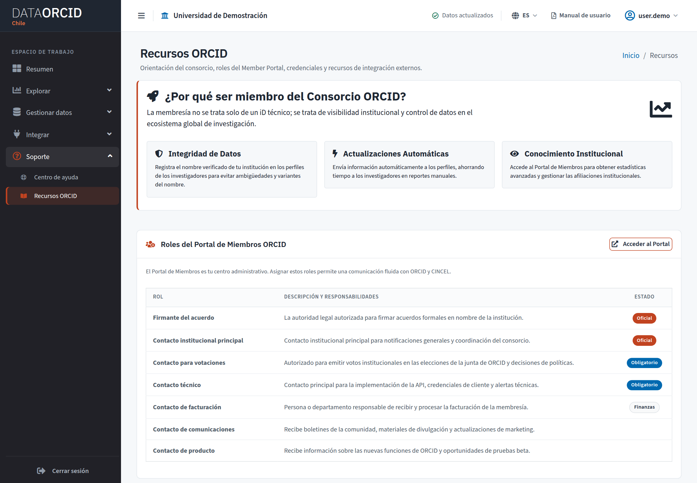

FIGURA 24. Recursos y documentación ORCID disponibles en Soporte.

## 6.5 Publicación OAI-PMH

Publicación OAI-PMH permite consultar el repositorio institucional desde el cual otros sistemas pueden recolectar metadatos de artículos seleccionados. Las pestañas organizan la vista general, los artículos, el mapeo de metadatos, las cargas DOI y el acceso de recolección.

Usuario puede consultar el contenido disponible. Usuario OAI también puede exponer o excluir artículos, cargar decisiones por DOI, deshacer la última carga activa, personalizar el formato dataorcid y administrar URL privadas de recolección.

La vista general muestra artículos disponibles, validados por OpenAlex, expuestos y no expuestos. La validación exige una afiliación OpenAlex que coincida con el ROR activo. La política predeterminada y las decisiones manuales determinan la selección efectiva.

Si el proveedor está deshabilitado o falta su configuración, solicita la habilitación al equipo responsable. Un artículo seleccionado se ofrece cuando el proveedor está habilitado y la URL utilizada tiene acceso.

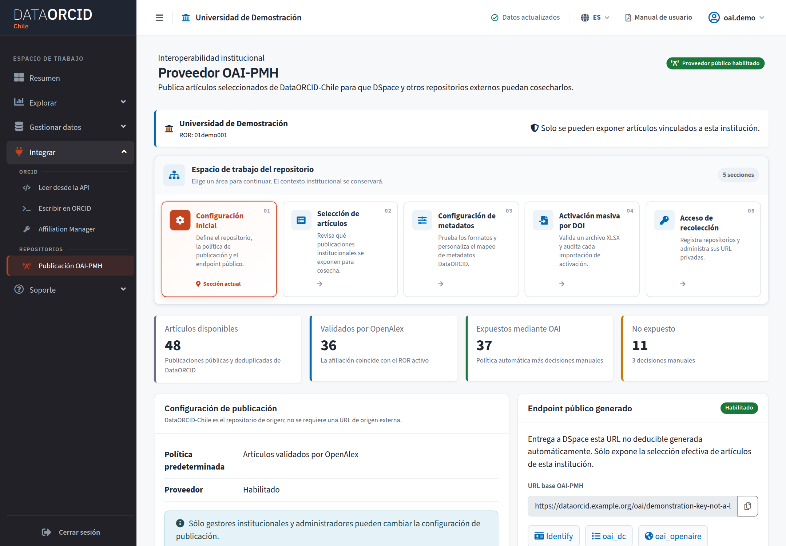

FIGURA 25. Vista general OAI-PMH disponible para Usuario OAI.

## 6.6 Selección de artículos OAI-PMH

La tabla permite buscar y filtrar por estado OAI, validación de afiliación, tipo documental y origen de activación. Puedes ordenar por las columnas disponibles y exportar la selección filtrada para su revisión.

Con Usuario OAI, Exponer o Excluir cambia un artículo. Para actuar sobre varios, marca las filas y utiliza Exponer seleccionados o Excluir seleccionados. Seleccionar esta página sólo marca las filas de la página actual.

Las decisiones manuales prevalecen sobre la política automática. Excluir no elimina el artículo de ORCID, OpenAlex o la caché. Si ya estaba publicado, OAI conserva un aviso de baja para los cosechadores compatibles. Una cosecha en curso mantiene su versión; la siguiente podrá recoger la baja.

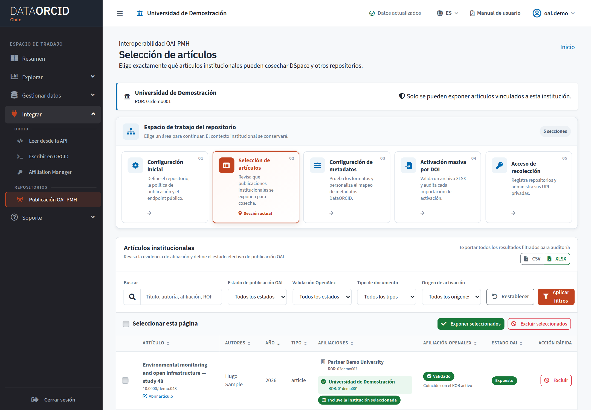

FIGURA 26. Selección de artículos con las acciones del perfil Usuario OAI.

1. Filtra y revisa DOI, título y afiliaciones antes de seleccionar.
2. Aplica la acción a las filas correctas y comprueba el nuevo estado.
3. Consulta el proveedor habilitado para revisar el resultado publicado.

## 6.7 Formatos y mapeo de metadatos

El proveedor ofrece tres formatos: oai_dc, oai_openaire y dataorcid. Los dos primeros conservan su estructura estándar. El editor personaliza únicamente el formato dataorcid.

Con Usuario OAI, selecciona un campo del catálogo y pulsa Agregar campo. Puedes cambiar su nombre de destino u ocultarlo. Título e identificador son obligatorios; los campos ocultos no se emiten.

Guarda el mapeo para aplicar los cambios. Restaurar valores predeterminados vuelve al perfil inicial cuando el control está disponible. Usuario puede consultar el mapeo, pero no editarlo.

La URL base generada y los enlaces de prueba permiten revisar la respuesta del proveedor habilitado. Coordina el formato requerido con quien recibe los metadatos. El mapeo cambia la salida publicada, no los datos originales de ORCID.

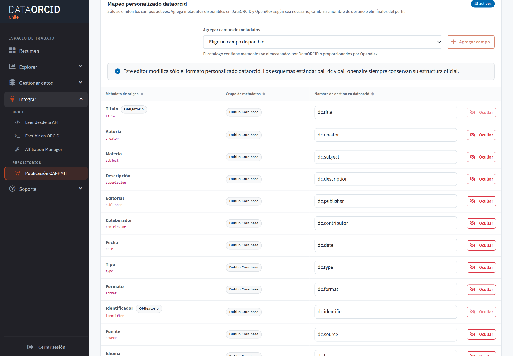

FIGURA 27. Editor del formato dataorcid para Usuario OAI.

## 6.8 Activación masiva por DOI

Usuario OAI puede activar artículos institucionales mediante una planilla XLSX. El sistema reconoce DOI que ya pertenecen a artículos públicos del ámbito institucional. La carga no incorpora publicaciones externas ni sincroniza ORCID.

Utiliza Descargar plantilla y completa un DOI por fila en la columna indicada. Selecciona el archivo XLSX y pulsa Validar y activar. Revisa el resultado antes de considerar completa la tarea.

Los DOI inválidos, repetidos o no encontrados se informan sin modificar artículos ajenos al ámbito. La carga conserva un historial con el archivo, fecha, resultados de validación y artículos activados.

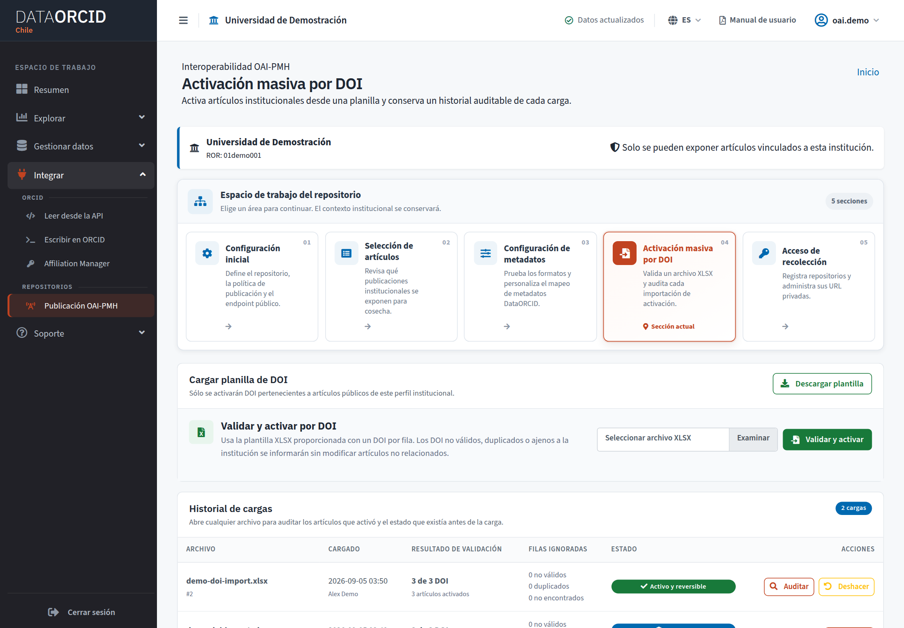

FIGURA 28. Carga de una planilla DOI e historial de importaciones.

> **IMPORTANTE:** Una carga DOI registra decisiones de publicación OAI-PMH. No certifica una afiliación faltante en OpenAlex ni modifica el registro público de origen.

## 6.9 Auditoría y reversión de cargas

En el historial de cargas, Auditar abre el detalle del archivo y permite revisar los artículos activados y el estado previo. Puedes distinguir cargas aplicadas, deshechas y la última carga activa reversible.

Usuario OAI puede deshacer la última carga activa. Revisa el detalle, selecciona Deshacer y confirma la acción en la plataforma. Para revertir una carga anterior debes deshacer primero las posteriores.

La reversión restaura los cambios atribuibles a esa carga y conserva cambios manuales posteriores. Comprueba el resultado y vuelve a la tabla de artículos para revisar el estado efectivo.

Usuario puede consultar el historial y la auditoría disponibles. Si necesitas una corrección y no dispones del permiso de edición OAI, solicita la revisión al equipo responsable.

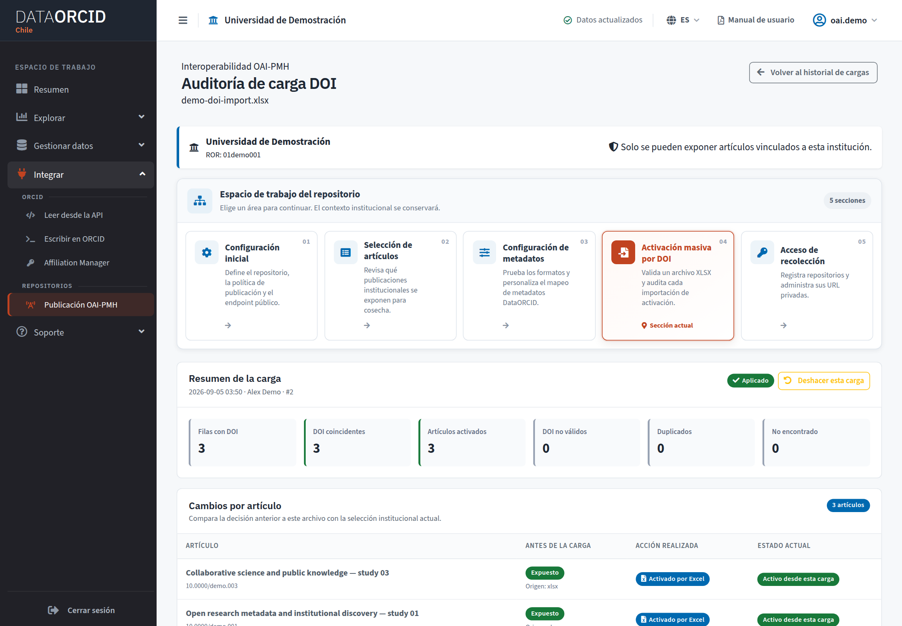

FIGURA 29. Auditoría de una carga DOI de demostración.

## 6.10 Acceso de recolección

En Acceso de recolección, Usuario OAI puede registrar la URI de cada repositorio de su institución y generar una URL privada para el recolector. Usuario consulta los repositorios y su estado; las claves y los controles quedan reservados a quienes tienen permiso de edición OAI.

Introduce la dirección HTTP o HTTPS del repositorio, sin credenciales, parámetros ni fragmentos, y pulsa Generar URL privada. Copia la dirección completa. La URI identifica al destinatario; la clave aleatoria de la URL concede el acceso sin depender de la IP o de Cloudflare.

En DSpace-CRIS, configura la URL privada como OAI Provider, el formato Simple Dublin Core (oai_dc) y la recolección de solo metadatos. Inicia o programa la cosecha en DSpace. No requiere iniciar sesión en DataORCID.

Después de configurar el recolector, activa Permitir recolección solo mediante URL privadas registradas y guarda el modo de acceso. La URL general dejará de funcionar. Revocar acceso bloquea una URL; Generar nueva URL invalida la anterior y exige actualizar el recolector.

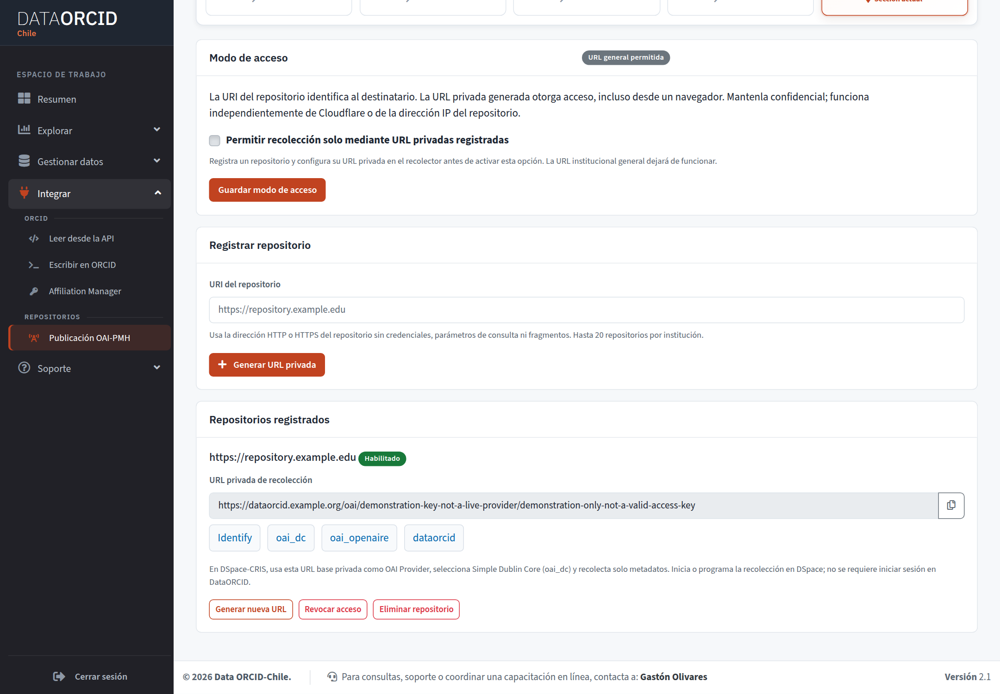

FIGURA 30. Repositorio de demostración con su URL privada de recolección.

> **IMPORTANTE:** Quien conozca una URL privada puede consultar el XML, incluso desde un navegador. Mantenla confidencial. Revocar todas las URL conserva el bloqueo de la URL general mientras el modo restringido esté activo.

## 7. Centro de ayuda

El Centro de ayuda se encuentra en Soporte. Incluye búsqueda instantánea y temas sobre primeros pasos, fuentes, flujo de datos, métricas, descargas, diccionario, permisos, integraciones, solución de problemas y notas de versión.

El contenido acompaña los flujos de Usuario y Usuario OAI. Los temas y enlaces se ajustan a los módulos habilitados; un módulo deshabilitado tampoco aparece documentado dentro de la ayuda activa.

Escribe una palabra como DOI, exportación o acceso abierto para localizar explicaciones. Abre el tema y utiliza sus enlaces para volver a la función correspondiente. Consulta esta ayuda antes de escalar una duda operativa.

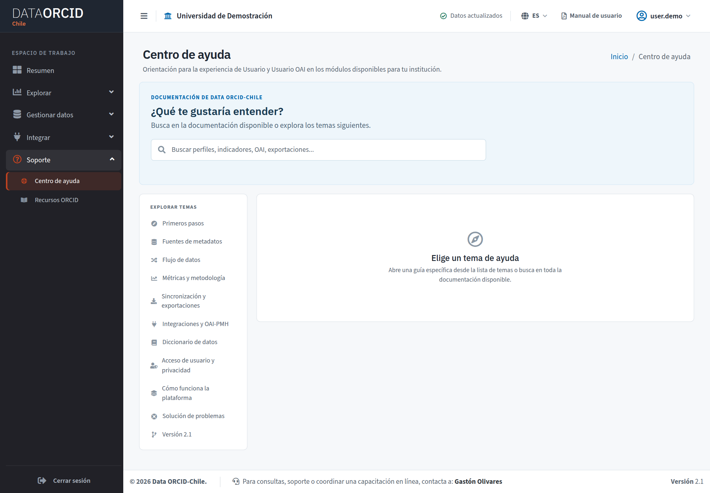

FIGURA 31. Buscador y temas del Centro de ayuda.

## 8. Cuenta y seguridad

### 8.1 Mi perfil

Desde las opciones personales puedes actualizar nombre, apellido, correo y cargo. Revisa los valores, realiza los cambios y guarda. El correo se utiliza para notificaciones y recuperación de contraseña.

La institución, el ROR y el rol no se modifican en esta pantalla. Si no corresponden a tu situación, solicita su revisión al equipo responsable.

El selector de idioma permite mantener la interfaz en el idioma que prefieras entre los habilitados. Tus cambios de cuenta no alteran el registro público ORCID de una persona investigadora.

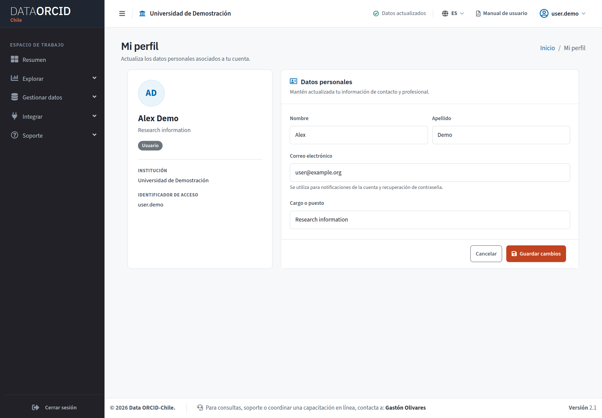

FIGURA 32. Edición de los datos personales de la cuenta ficticia.

## 8.2 Contraseña y cierre de sesión

Para cambiar la contraseña, ingresa la actual, una nueva de al menos ocho caracteres y su confirmación. El sistema también limita su longitud a 72 bytes UTF-8; algunos caracteres ocupan más de un byte.

Guarda el cambio y revisa la confirmación. Utiliza una contraseña exclusiva para esta cuenta y no la compartas. Si desconoces la actual, utiliza la recuperación disponible en el inicio de sesión.

Cerrar sesión se encuentra al pie del menú lateral. Utilízalo al terminar, especialmente en equipos compartidos. Evita incluir credenciales o información personal privada en búsquedas, archivos o solicitudes de soporte.

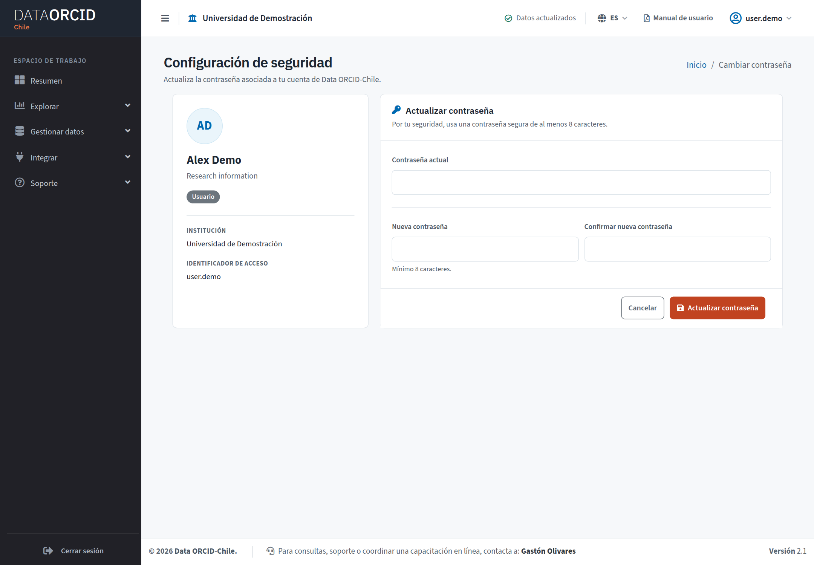

FIGURA 33. Cambio de contraseña de la cuenta.

## 9. Fuentes, metodología y buenas prácticas

### 9.1 Cómo se construye el ámbito institucional

ROR es la clave institucional principal. Los identificadores GRID o Ringgold verificados complementan la búsqueda en ORCID cuando están disponibles. Los resultados se combinan y deduplican por ORCID iD, conservando evidencia de su procedencia.

### 9.2 Relación entre ORCID, OpenAlex y OAI-PMH

ORCID aporta perfiles y registros públicos. OpenAlex añade metadatos analíticos para artículos elegibles con una coincidencia aceptada. OAI-PMH publica metadatos de la selección institucional efectiva; no descarga el texto completo ni modifica ORCID.

### 9.3 Recomendaciones de uso

1. Revisa fecha de actualización, institución y filtros antes de citar una cifra.
2. Distingue registros ORCID, salidas canónicas y artículos enriquecidos.
3. Consulta definición y método en los botones de información.
4. Conserva fecha, filtros y ámbito junto con cada exportación.
5. Trata duplicados y brechas de cobertura como señales sujetas a revisión.
6. Compara conjuntos con períodos, denominadores y coberturas equivalentes.
7. Revisa la selección OAI-PMH y el formato antes de compartir su URL con el sistema receptor.

## 10. Glosario

| CONCEPTO | DESCRIPCIÓN |
| --- | --- |
| ORCID iD | Identificador persistente de una persona investigadora. |
| ROR | Identificador institucional principal utilizado por la plataforma. |
| GRID y Ringgold | Identificadores institucionales históricos y verificados que complementan el descubrimiento; no reemplazan al ROR. |
| Registro ORCID | Dato público incorporado a un perfil, como una obra o un financiamiento. |
| Salida canónica | Publicación consolidada por DOI normalizado o, de manera conservadora, por título y año. |
| Caché | Copia local de información recuperada. Su fecha permite interpretar la vigencia del conjunto. |
| Cobertura OpenAlex | Proporción de artículos ORCID elegibles que cuentan con coincidencia y metadatos OpenAlex. |
| Citas | Contador actual de citas de una publicación según la información OpenAlex disponible. |
| FWCI | Impacto de citas ponderado por campo, año y tipo documental. |
| OA Diamante | Categoría OpenAlex para artículos en revistas completamente abiertas sin cargos de publicación para autores. |
| OA Verde | Categoría OpenAlex para acceso mediante una copia en repositorio. |
| AM | Affiliation Manager de ORCID; su Client ID ayuda a reconocer registros gestionados. |

## 10.1 Términos de exportación e integración

| CONCEPTO | DESCRIPCIÓN |
| --- | --- |
| Exportación en segundo plano | Preparación de un archivo mientras continúas usando la plataforma. |
| Archivo vigente | Exportación finalizada que todavía puede descargarse y, si corresponde, reutilizarse. |
| OAI-PMH | Protocolo utilizado para que un sistema recolecte metadatos de otro. |
| Proveedor | Servicio que expone la selección institucional a través de una URL base. |
| Recolector | Sistema receptor que consulta el proveedor e incorpora los metadatos. |
| Artículo expuesto | Artículo incluido en la selección efectiva; su disponibilidad pública también requiere un proveedor habilitado. |
| Validación OpenAlex | Coincidencia de una afiliación del artículo con el ROR de la institución activa. |
| Decisión manual | Inclusión o exclusión que prevalece sobre la política automática. |
| oai_dc | Formato de metadatos Dublin Core del proveedor. |
| oai_openaire | Formato OpenAIRE del proveedor. |
| dataorcid | Formato cuyo conjunto de campos y nombres de destino puede personalizar Usuario OAI. |
| Carga DOI | Planilla XLSX que activa artículos ya presentes en el ámbito institucional y conserva su auditoría. |
| Reversión de carga | Acción que deshace la última carga activa preservando cambios manuales posteriores. |

## 11. Solución de problemas

### No aparecen datos

Restablece los filtros y revisa el indicador de actualización. Si el conjunto institucional no está disponible, solicita al equipo responsable que revise el estado de los datos.

### Una cifra difiere entre módulos

Comprueba si cuenta registros ORCID, salidas canónicas o artículos OpenAlex. Revisa período, tipo, acceso abierto, afiliación y fecha de actualización.

### Una exportación está vacía, pendiente o vencida

Confirma que la vista tenga resultados y elimina filtros demasiado restrictivos. Revisa el centro flotante para conocer el estado. Un archivo vencido debe solicitarse nuevamente; si una tarea no avanza, comunica la vista y el momento de la solicitud.

### No puedo editar artículos o mapeos OAI-PMH

Usuario tiene acceso de consulta. La selección, las cargas DOI y el mapeo requieren Usuario OAI asignado a la institución. Si ese permiso corresponde a tu tarea, solicita su revisión.

### Un DOI no se activa o no puedo deshacer una carga

Revisa la plantilla y el informe de DOI inválidos, repetidos o no encontrados. La carga sólo activa artículos del ámbito institucional. Sólo se puede deshacer la última carga activa; revisa el historial y los cambios posteriores.

### No aparece un módulo o falla el proveedor público

La disponibilidad depende de los módulos habilitados y del estado del proveedor. Consulta el Centro de ayuda y solicita revisión al equipo responsable. Incluye página, fecha, filtros y una captura sin datos sensibles.

## INFORMACIÓN DE CONTACTO

Consorcio para el Acceso a la Información Científica Electrónica

Moneda 1375, piso 13 · Santiago de Chile · +56 2 2365 4589

[secretariaejecutiva@cincel.cl](mailto:secretariaejecutiva@cincel.cl) · [www.cincel.cl](https://www.cincel.cl)
