# DATA ORCID CHILE

Guia completo das opções e funções de Usuário e Usuário OAI.

**VERSÃO:** 2.1 · **ATUALIZAÇÃO:** Setembro de 2026

## 1. Objetivo e escopo

O DATA ORCID CHILE permite consultar e analisar informações públicas do ORCID enriquecidas com metadados do OpenAlex. Este manual acompanha os perfis Usuário e Usuário OAI: acesso, consulta, análises, transferências, integração e configurações da conta.

Ambos os perfis trabalham no âmbito da instituição associada à conta e dos módulos habilitados. O Usuário OAI também pode selecionar artigos, importar DOI, configurar o mapeamento de metadados OAI-PMH e gerenciar o acesso de coleta.

Esta edição inclui exportações em segundo plano, publicação OAI-PMH e ajuda adaptada aos módulos disponíveis.

| AÇÃO | USUÁRIO | USUÁRIO OAI |
| --- | --- | --- |
| Consultar módulos institucionais | Disponível | Disponível |
| Baixar dados e relatórios visíveis | Disponível | Disponível |
| Examinar possíveis duplicados | Consulta | Consulta |
| Consultar conteúdo OAI-PMH | Consulta | Disponível |
| Selecionar artigos e importar DOI | Consulta | Disponível |
| Editar mapeamento dataorcid | Consulta | Disponível |
| Editar a própria conta e senha | Disponível | Disponível |

> **IMPORTANTE:** As capturas mostram a interface da versão 2.1 com dados fictícios de demonstração. Nomes, ORCID iD, DOI, ROR e endereços de exemplo não devem ser usados como registros reais.

## 2. Acesso e navegação

### 2.1 Iniciar sessão

Acesse www.orcid.cl com o nome de usuário ou e-mail institucional e a senha da sua conta. A opção de manter a sessão iniciada é adequada apenas em um dispositivo pessoal ou gerenciado pela instituição.

O e-mail de boas-vindas inclui suas credenciais e um link para este manual PDF, que pode ser baixado sem iniciar sessão. O link abre a edição no idioma da conta: inglês, espanhol, francês, português ou alemão. Altere a senha temporária ao entrar.

Se esqueceu a senha, abra o link de recuperação, informe o e-mail da conta e siga o link recebido. A resposta na tela não revela se o endereço está cadastrado. Se a mensagem não chegar, verifique o spam e consulte a equipe responsável.

O seletor oferece os idiomas habilitados: inglês, espanhol, francês, português e alemão. Uma escolha feita durante a sessão fica salva como preferência da conta.

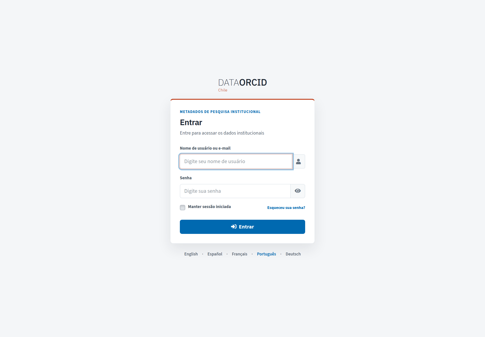

FIGURA 1. Início de sessão e seleção de idioma.

## 2.2 Estrutura da interface

O menu lateral organiza as funções em Explorar, Gerenciar dados, Integrar e Suporte, além do atalho para Visão geral. A barra superior mostra a instituição ativa, o idioma e as opções pessoais. Os módulos disponíveis dependem da configuração do serviço e do perfil da conta. O link “Manual do usuário”, com um ícone PDF ao lado das opções da sua conta, baixa este manual no idioma ativo.

Os indicadores de atualização ajudam a identificar se as informações estão atualizadas ou precisam de atenção. Verifique esse estado antes de interpretar um número ou baixar um conjunto de dados.

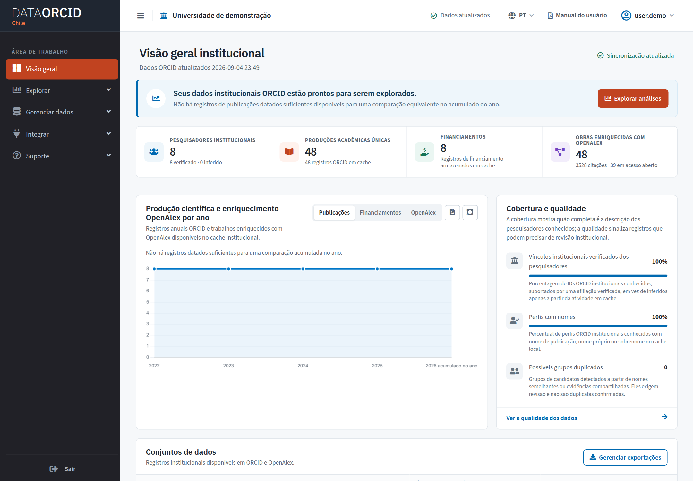

FIGURA 2. Visão geral institucional e navegação do perfil Usuário.

1. Confirme se a instituição exibida corresponde à sua conta.
2. Expanda um grupo do menu e escolha a página desejada.
3. Verifique filtros e datas de atualização em cada visualização.
4. Ao terminar, encerre a sessão na parte inferior do menu lateral.

## 3. Explorar

### 3.1 Visão geral institucional

A Visão geral reúne pesquisadores institucionais, produções científicas únicas, financiamentos e publicações enriquecidas com OpenAlex. Inclui tendências, cobertura, qualidade dos dados e atalhos para consultas e transferências.

Comece aqui para verificar o estado geral. Abra a análise correspondente para aprofundar um indicador e use os atalhos de qualidade para compreender lacunas de informação.

Os números refletem as informações disponíveis na plataforma. Um pesquisador pode constar no diretório institucional sem ter obras ou financiamentos públicos no cache.

FIGURA 3. Indicadores gerais da instituição de demonstração.

> **IMPORTANTE:** Os registros ORCID contam ocorrências na fonte. As produções canônicas consolidam possíveis repetições. Esses números podem ser diferentes sem que exista um erro.

## 3.2 Diretório de pesquisadores

O diretório permite buscar por nome, ORCID iD ou e-mail, filtrar por Affiliation Manager e por evidência de vínculo institucional, além de ordenar os resultados. É possível exibir 10, 25 ou 50 linhas por página.

A busca e a ordenação se aplicam ao conjunto de resultados. As exportações CSV e Excel incluem os resultados filtrados além da página visível.

Evidências verificadas podem vir de identificadores ROR, GRID ou Ringgold. Um vínculo inferido do cache é um indício operacional e deve ser distinguido de uma associação verificada.

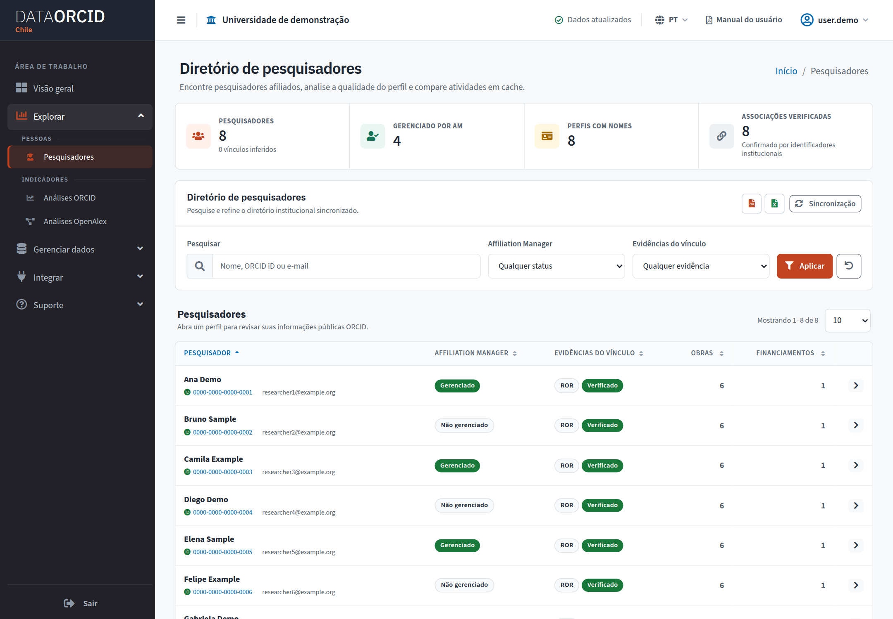

FIGURA 4. Diretório com filtros, ordenação, paginação e exportações.

1. Digite um critério de busca e aplique os filtros pertinentes.
2. Selecione um cabeçalho de coluna para alterar a ordenação.
3. Abra um ORCID iD para consultar o portfólio ou exporte o conjunto filtrado.

## 3.3 Portfólio do pesquisador

Ao abrir um ORCID iD pelo diretório, é possível consultar os dados do registro público, biografia, identificadores, resumos visuais, contexto institucional e atividades disponíveis.

Atualizar a partir do ORCID solicita novamente esse perfil público; não atualiza toda a instituição. Baixar relatório completo gera um arquivo Excel. Também é possível exportar seções disponíveis, como formação, empregos, obras e financiamentos.

O link ORCID.org abre o registro público original. Uma seção pode estar ausente por não conter dados públicos. O contexto institucional ajuda a distinguir registros de obras de produções únicas consolidadas.

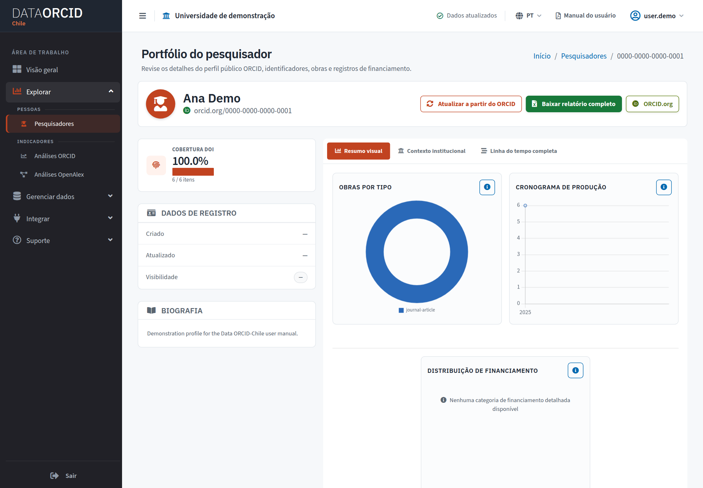

FIGURA 5. Portfólio público de um pesquisador fictício.

## 3.4 Análises ORCID

As Análises ORCID usam os registros institucionais armazenados em cache a partir do ORCID. Os filtros combinam período, tipo de obra, tipo de financiamento e pesquisador. Um filtro vazio inclui todos os valores disponíveis.

Visão geral, Publicações, Financiamento e Pesquisadores oferecem diferentes perspectivas do conjunto filtrado. Confira os filtros ao mudar de seção.

Cada gráfico permite exportar seus dados em CSV ou Excel. Quando houver um controle de imagem, também é possível salvar a visualização.

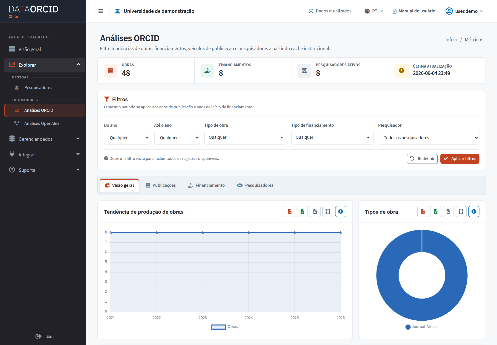

FIGURA 6. Visão geral das Análises ORCID e filtros comuns.

## 3.4.1 Publicações

Publicações apresenta a evolução anual, os tipos de obra e as principais revistas ou fontes. Os indicadores usam os registros ORCID do âmbito institucional e os filtros ativos.

Use o período para delimitar a consulta e o tipo de obra para comparar conjuntos equivalentes. Antes de incluir um gráfico em um relatório, registre a data de consulta e os critérios usados.

Uma obra pode aparecer em mais de um perfil ORCID. Portanto, a soma dos registros não representa necessariamente publicações únicas da instituição.

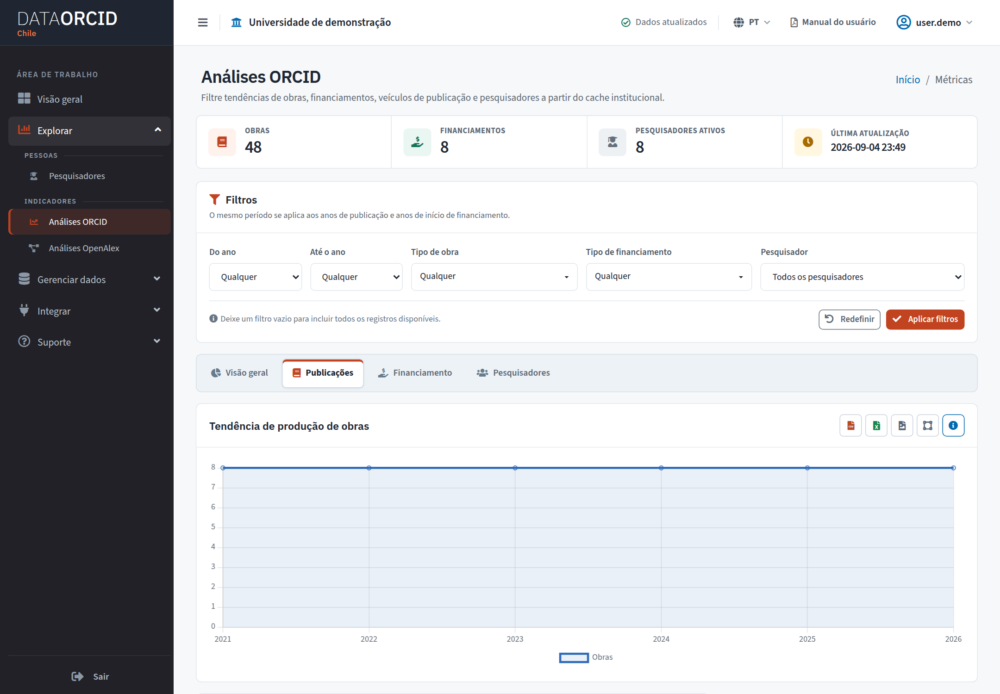

FIGURA 7. Indicadores de publicações ORCID.

## 3.4.2 Financiamento

Financiamento agrupa registros por ano de início, tipo e organização financiadora. Combine os filtros de período, tipo de financiamento e pesquisador para examinar a atividade declarada.

Os dados vêm de registros públicos ORCID. A ausência de valor, moeda ou número de projeto indica uma lacuna nas informações disponíveis.

Uma obra e um financiamento no mesmo perfil não comprovam que esse projeto financiou a publicação. Interprete tabelas e gráficos como contexto da atividade registrada.

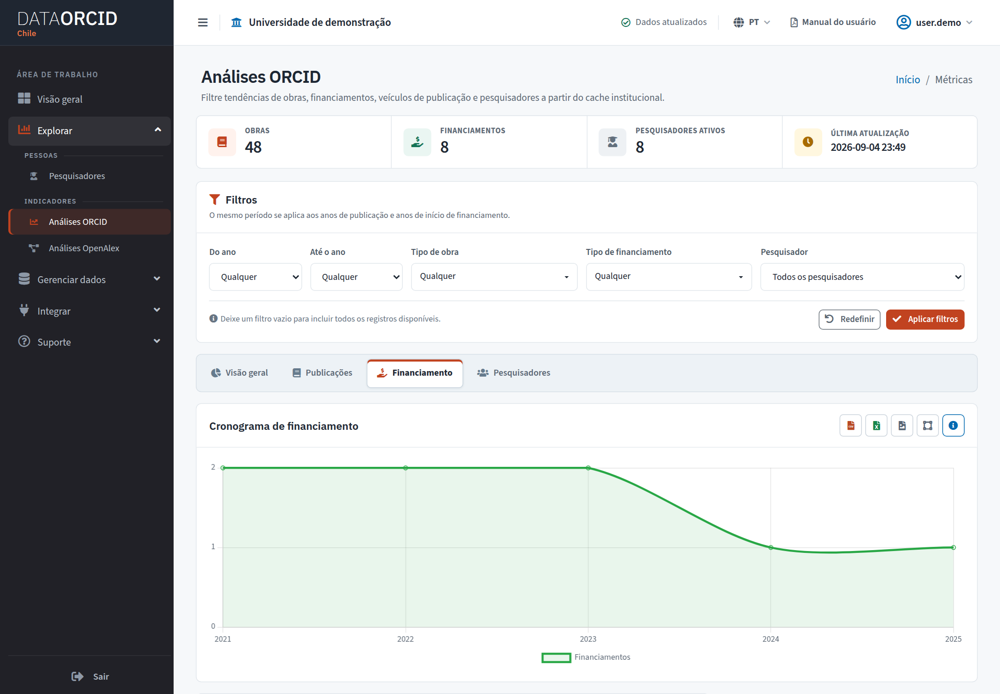

FIGURA 8. Indicadores de financiamentos declarados publicamente no ORCID.

## 3.4.3 Pesquisadores

Pesquisadores identifica as pessoas com mais registros de obras ou financiamentos no conjunto filtrado. Nomes e ORCID iD dão acesso aos portfólios individuais, e as listas podem ser exportadas.

A posição nessas listas reflete a atividade registrada e sua cobertura. Não constitui uma avaliação completa de desempenho e pode não incluir toda a produção de uma pessoa.

Para verificar um resultado, conserve o período e os filtros, abra o portfólio e compare as informações com o registro público de origem.

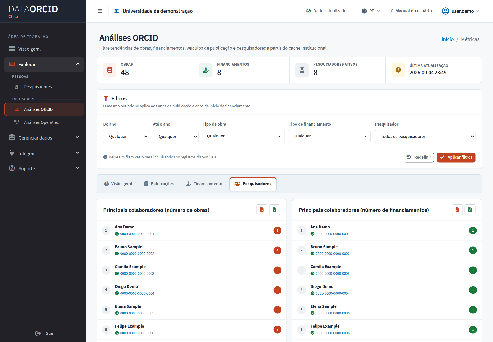

FIGURA 9. Listas de pesquisadores por atividade registrada.

## 4. Gerenciar dados

### 4.1 Sincronização e transferências

Para Usuário e Usuário OAI, esta página funciona como monitor de estado e centro de transferências. Mostra a atualidade de obras, financiamentos, perfis e metadados OpenAlex, além da última execução disponível.

As transferências institucionais incluem obras ORCID, financiamentos, pesquisadores e enriquecimento OpenAlex, conforme a disponibilidade de cada conjunto. Os arquivos refletem o estado do cache indicado na página.

Esses perfis consultam o estado e baixam os dados disponíveis. Se precisar de uma sincronização institucional ou houver uma execução com falha, solicite uma revisão à equipe responsável.

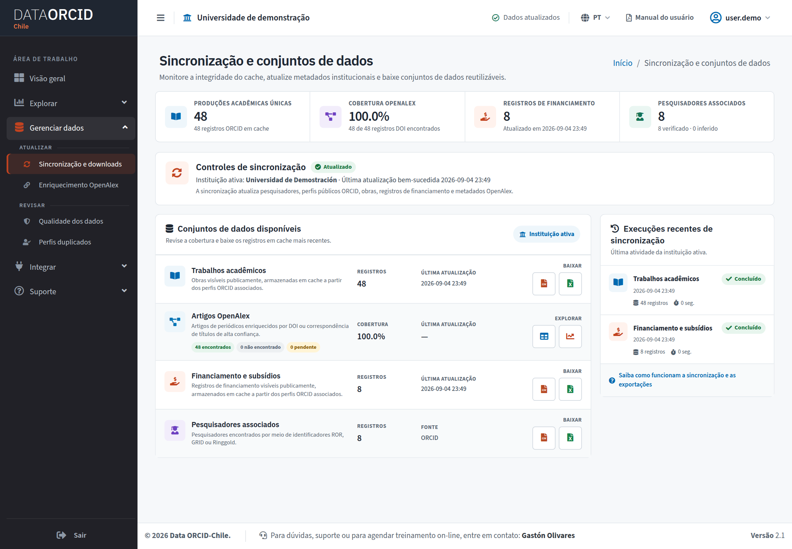

FIGURA 10. Estado institucional e conjuntos disponíveis para baixar.

## 4.2 Exportações em segundo plano

Downloads grandes em CSV ou Excel são preparadas em segundo plano. O centro flutuante Exportações mostra a espera, o progresso e um link privado quando o arquivo está pronto. É possível continuar navegando na plataforma.

Uma solicitação equivalente pode reutilizar um arquivo ainda válido. Se os dados de origem mudarem, uma nova exportação será preparada. Os arquivos têm validade limitada; solicite novamente um arquivo expirado pela visualização de origem.

A ação de apagar tudo remove suas exportações concluídas e os respectivos arquivos. As tarefas na fila ou em execução são preservadas. Fechar ou minimizar uma notificação altera apenas sua exibição.

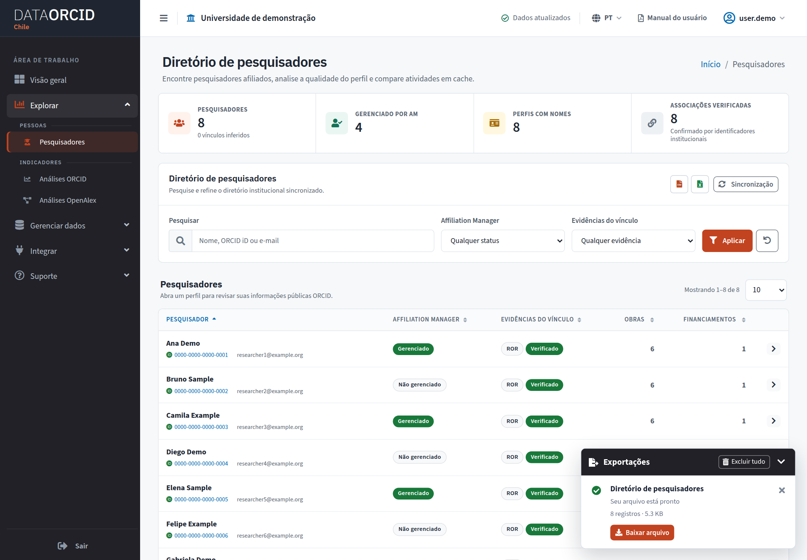

FIGURA 11. Centro flutuante com uma exportação de demonstração pronta para baixar.

1. Aplique os filtros e a ordenação necessários.
2. Selecione CSV ou Excel e verifique a notificação flutuante.
3. Quando o arquivo estiver pronto, use a ação de download.
4. Guarde o arquivo com a data, o âmbito institucional e os filtros da consulta.

## 4.3 Qualidade dos dados

A qualidade dos dados separa quatro perspectivas: visão geral, evidências dos pesquisadores, contexto de financiamento e integridade técnica. Apresenta cobertura de DOI e anos, completude dos financiamentos, vínculos verificados ou inferidos e consistência do OpenAlex.

As porcentagens descrevem os campos disponíveis. Uma ausência representa uma lacuna de cobertura e não deve ser interpretada automaticamente como erro do sistema.

Use essas visualizações para documentar os limites de um relatório e localizar registros que precisam de revisão. Ao encontrar uma inconsistência, anote o módulo e o identificador pertinentes e informe a equipe responsável.

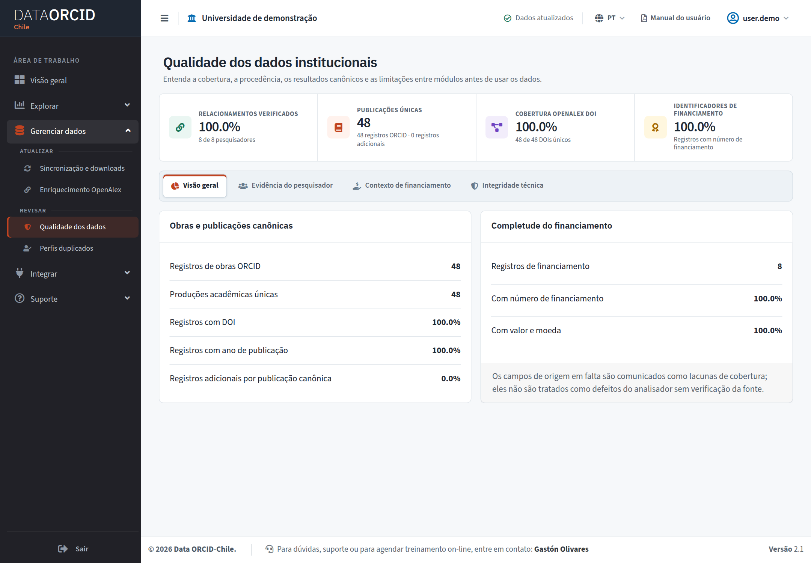

FIGURA 12. Visão geral da qualidade dos dados institucionais.

## 4.4 Perfis duplicados

Este módulo identifica candidatos por algoritmo que podem representar vários ORCID iD para uma mesma pessoa. É possível buscar, filtrar por confiança ou estado, alternar visualizações, consultar a metodologia, atualizar a análise e exportar resultados.

Usuário e Usuário OAI consultam os candidatos e suas evidências. Um candidato não confirma uma duplicação, e atualizar a análise não mescla nem modifica registros ORCID.

Compare nomes, identificadores e evidências disponíveis antes de comunicar um caso. Uma coincidência de nomes, por si só, não prova que os registros pertençam à mesma pessoa.

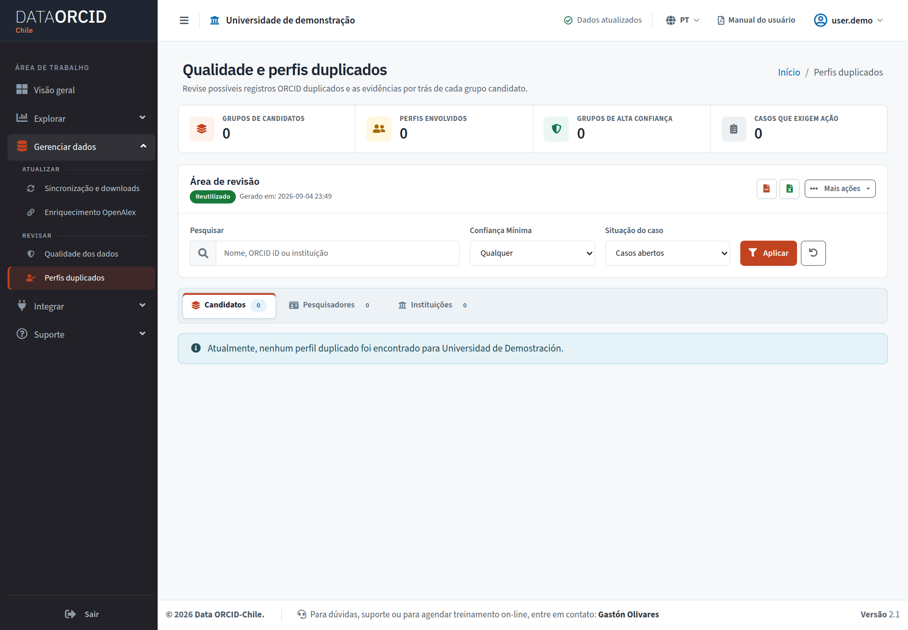

FIGURA 13. Consulta de possíveis perfis duplicados.

## 4.5 Enriquecimento OpenAlex

A revisão de enriquecimento classifica artigos como correspondentes, pendentes, não encontrados, com erro ou sem DOI. É possível buscar por título, DOI, ORCID iD, fonte ou tema, ordenar, alterar o tamanho da página e expandir os detalhes de uma linha.

A exportação mantém os filtros do conjunto. O link de análise abre os resultados agregados. A cobertura usa como base os artigos ORCID elegíveis, e não toda a produção possível da instituição.

A correspondência prioriza o DOI. Alguns registros podem ser associados por uma comparação conservadora de título, ano e tipo. Um registro sem correspondência continua no ORCID, mesmo sem contribuir com metadados enriquecidos.

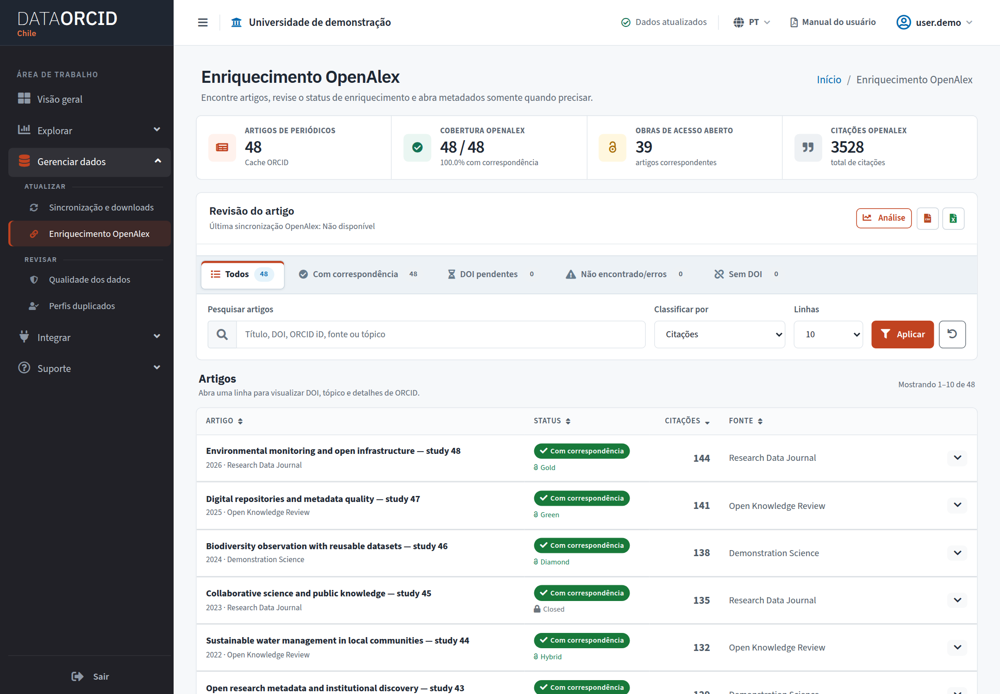

FIGURA 14. Artigos e estados de enriquecimento OpenAlex.

## 5. Análises OpenAlex

### 5.1 Filtros, métricas e exportações

As Análises OpenAlex complementam os artigos ORCID da instituição associada à conta com citações, acesso aberto, autorias, afiliações, temas, idiomas, fontes e FWCI. Verifique a cobertura do conjunto antes de interpretar os resultados.

Os filtros gerais incluem período, tipo documental, acesso aberto, idioma e afiliação. A seleção de métricas visíveis personaliza os cartões, e os botões de informação explicam definições e métodos.

Os gráficos oferecem PNG ou SVG quando o controle está disponível. As tabelas oferecem CSV ou Excel. Busca, ordenação e paginação se aplicam ao conjunto completo, além das linhas visíveis.

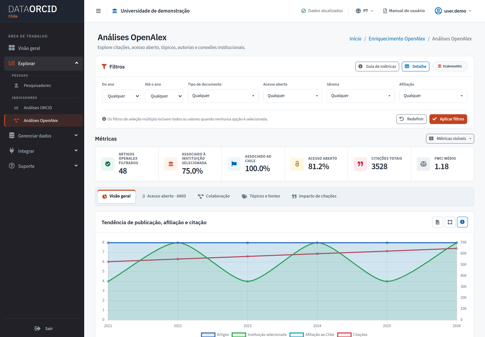

FIGURA 15. Visão geral OpenAlex com filtros, métricas e tendência anual.

## 5.2 Acesso aberto · ANID

Esta seção apresenta produção, citações, fontes e tendências de artigos de acesso aberto Diamante e Verde que atendem aos filtros ativos. As categorias seguem o estado de acesso aberto registrado pelo OpenAlex.

As categorias são mutuamente exclusivas conforme esse estado. A porcentagem de cada grupo usa como denominador todos os artigos enriquecidos que atendem aos filtros, e não apenas os de acesso aberto.

As visualizações mostram evolução, composição e revistas com maior produção ou número de citações. Em gráficos extensos, use a rolagem vertical interna para percorrer as categorias.

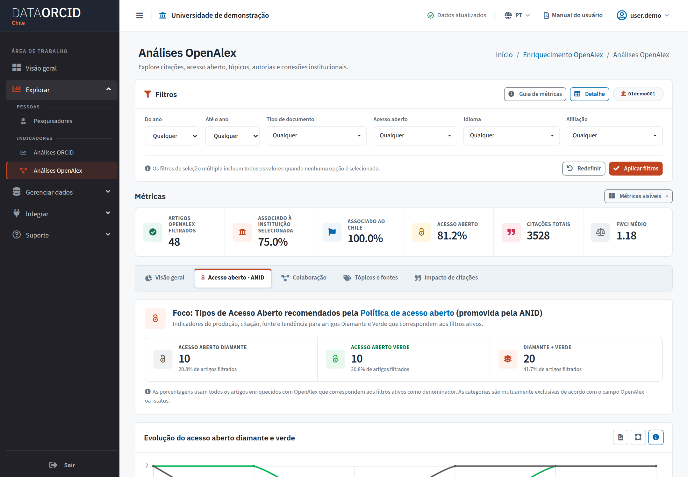

FIGURA 16. Indicadores de acesso aberto Diamante e Verde.

> **IMPORTANTE:** O acesso aberto Verde descreve a disponibilidade do artigo em um repositório. Não significa que toda a revista seja verde nem certifica, por si só, o cumprimento de uma política.

## 5.2.1 Tabelas de acesso aberto

As tabelas de revistas e artigos mais citados oferecem busca, ordenação por coluna, tamanho de página, paginação e exportação. Os resultados respeitam os filtros gerais da página.

Para examinar uma fonte, busque seu nome e ordene por produção ou citações. Para identificar artigos, use a tabela correspondente e confira DOI, ano e estado de acesso aberto.

Registre o denominador e a data de consulta ao comunicar uma porcentagem. Uma mudança pode resultar do período, dos filtros, de uma atualização do OpenAlex ou de maior cobertura das correspondências.

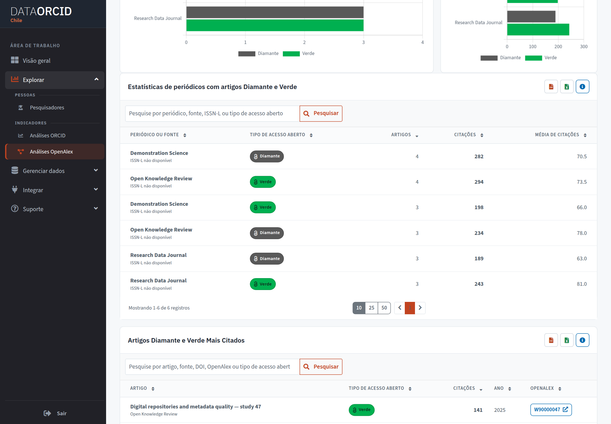

FIGURA 17. Tabelas de fontes e artigos de acesso aberto.

## 5.3 Colaboração

Colaboração mostra autores com afiliação chilena e países e instituições presentes nas autorias OpenAlex. Essas visualizações descrevem as afiliações dos artigos enriquecidos incluídos pelos filtros.

Um artigo pode contar em mais de um país ou instituição. Assim, a soma das categorias pode superar o total de artigos. Uma afiliação registrada em uma obra também não garante um vínculo de trabalho atual.

Use o botão de informação de cada gráfico para conferir o método e exporte os dados para documentar uma colaboração. Essas visualizações não constituem um censo de todos os perfis ORCID da instituição.

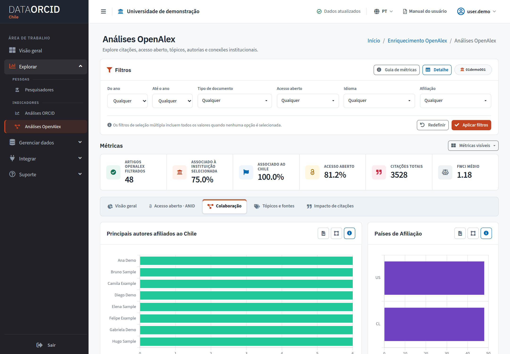

FIGURA 18. Colaboração derivada de autorias e afiliações OpenAlex.

## 5.4 Temas e fontes

Esta seção distribui artigos por domínios e campos temáticos, tipo documental, acesso aberto, idioma e fonte. Os temas vêm da classificação OpenAlex.

Os idiomas aparecem com nomes traduzidos a partir dos códigos disponíveis. Valores ausentes são agrupados como desconhecidos; essa categoria não representa um idioma ou uma disciplina adicional.

Use os filtros para examinar um período ou conjunto específico e exporte tabelas ou gráficos. A distribuição descreve os artigos enriquecidos disponíveis, e não toda a atividade disciplinar da instituição.

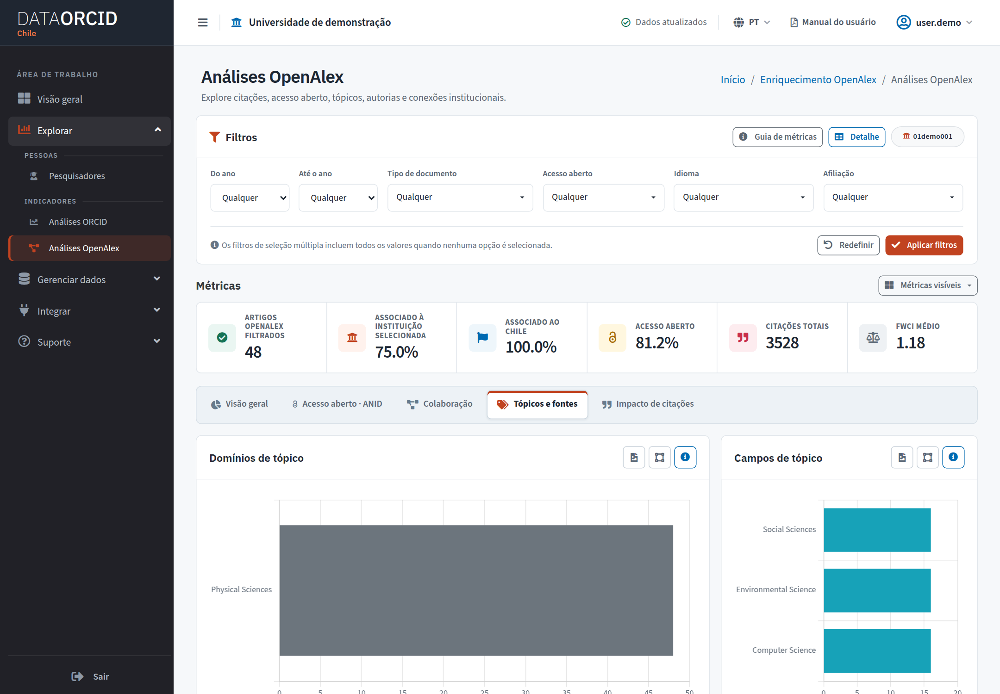

FIGURA 19. Campos temáticos, idiomas, tipos documentais e fontes.

## 5.5 Impacto de citações

O impacto de citações ordena os artigos filtrados pelo número atual de citações no OpenAlex. Os totais podem mudar em atualizações posteriores. Confira DOI, ano e fonte ao comparar publicações.

A tendência de citações agrupa esse contador atual pelo ano de publicação. Não representa as citações recebidas em cada ano civil.

O FWCI oferece uma medida de impacto normalizada por campo, ano e tipo documental quando o OpenAlex fornece o valor. Um dado ausente não equivale a zero. Consulte a definição da métrica antes de usá-la em um relatório.

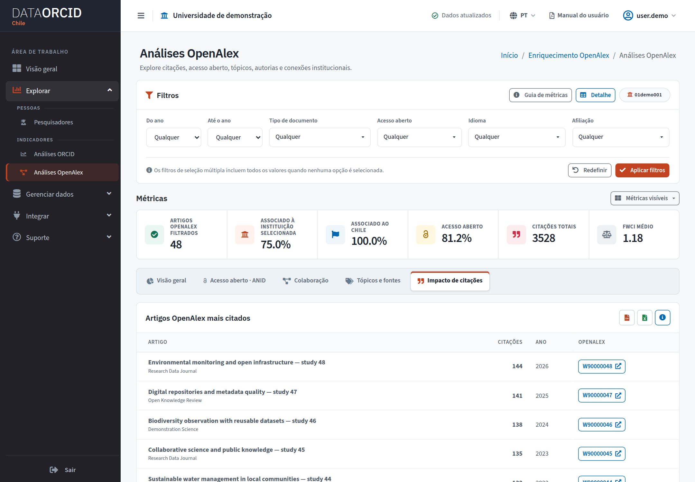

FIGURA 20. Artigos com os maiores números atuais de citações.

## 6. Integrar

### 6.1 Ler pela API ORCID

O guia de leitura pela API reúne exemplos cURL de buscas por instituição, ROR, nome e país, além de referências a endpoints públicos e links de teste. Destina-se a quem precisa consultar a fonte com uma ferramenta técnica.

Escolha o exemplo adequado, confira os parâmetros e substitua os valores de demonstração antes de executá-lo no seu ambiente. As consultas recuperam dados com visibilidade pública.

O guia explica como ler o ORCID. Não executa uma sincronização de toda a instituição nem concede acesso a registros privados.

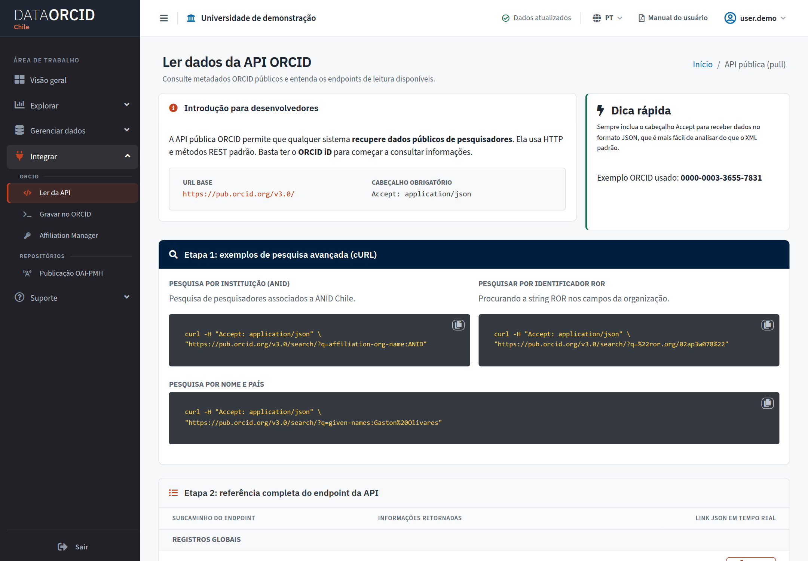

FIGURA 21. Guia de consulta da API pública ORCID.

## 6.2 Escrever no ORCID

O guia de escrita no ORCID documenta um projeto para download, seus requisitos, configuração, estrutura CSV e fluxo de autorização. Explica como uma integração autorizada adiciona informações a um registro.

Leia as instruções do projeto e coordene o uso com a equipe institucional responsável pelo ORCID. Uma conta DATA ORCID CHILE não substitui as credenciais e autorizações exigidas pelo ORCID.

Escrever em um registro exige credenciais apropriadas e autorização explícita da pessoa titular do ORCID iD. Não inclua segredos, senhas ou tokens em planilhas ou solicitações de suporte.

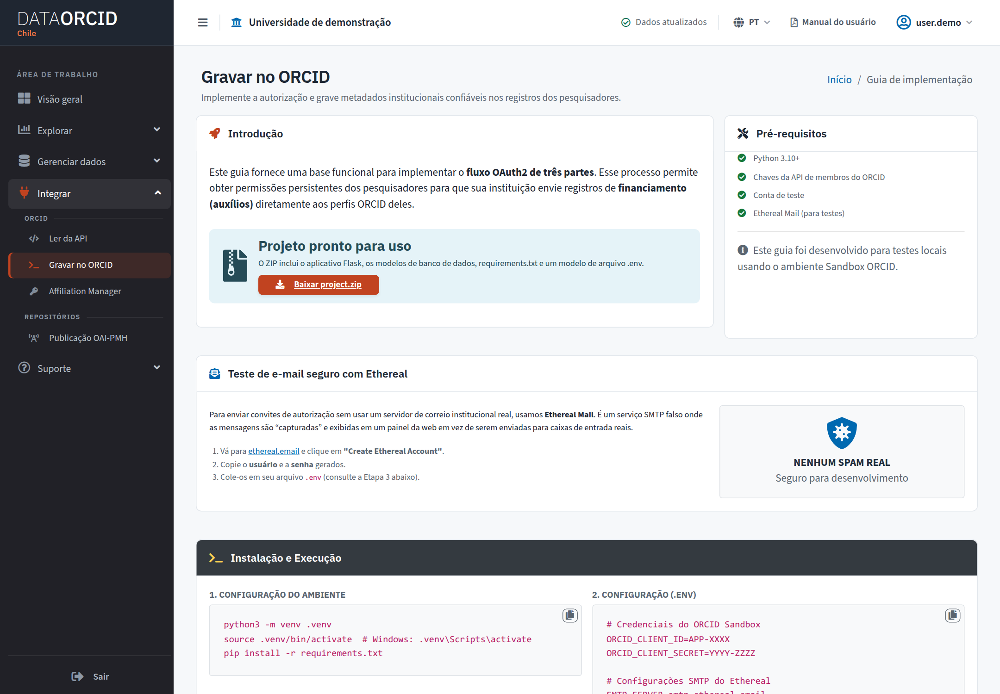

FIGURA 22. Guia e projeto de referência para escrita no ORCID.

## 6.3 Affiliation Manager

Esta opção armazena na sua conta o Client ID da aplicação usada pelo Affiliation Manager institucional. O valor geralmente começa com APP- e ajuda a identificar registros gerenciados por essa aplicação.

Confirme o valor institucional correto antes de editar, preencha o campo e salve. Não se trata de senha, segredo ou chave de API.

O identificador ajuda a interpretar o estado dos registros gerenciados. Salvá-lo não concede, por si só, permissão para escrever no registro ORCID de uma pessoa.

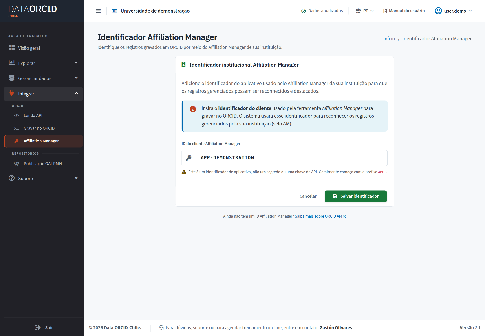

FIGURA 23. Identificador do Affiliation Manager na conta.

> **IMPORTANTE:** Altere esse valor somente se souber o Client ID correto ou tiver recebido instruções da equipe responsável pelo ORCID.

## 6.4 Recursos ORCID

Os recursos ORCID ficam em Suporte e reúnem links sobre associação, credenciais API, Affiliation Manager, modelos CSV e integrações com plataformas como OJS, DSpace-CRIS, VIVO e Dataverse.

Escolha o recurso conforme a tarefa: compreender uma integração, preparar um modelo ou consultar documentação. Os links externos abrem fora do DATA ORCID CHILE e podem ter requisitos próprios de acesso.

Para dúvidas sobre funções desta plataforma, comece pela central de ajuda, que adapta o conteúdo aos módulos habilitados.

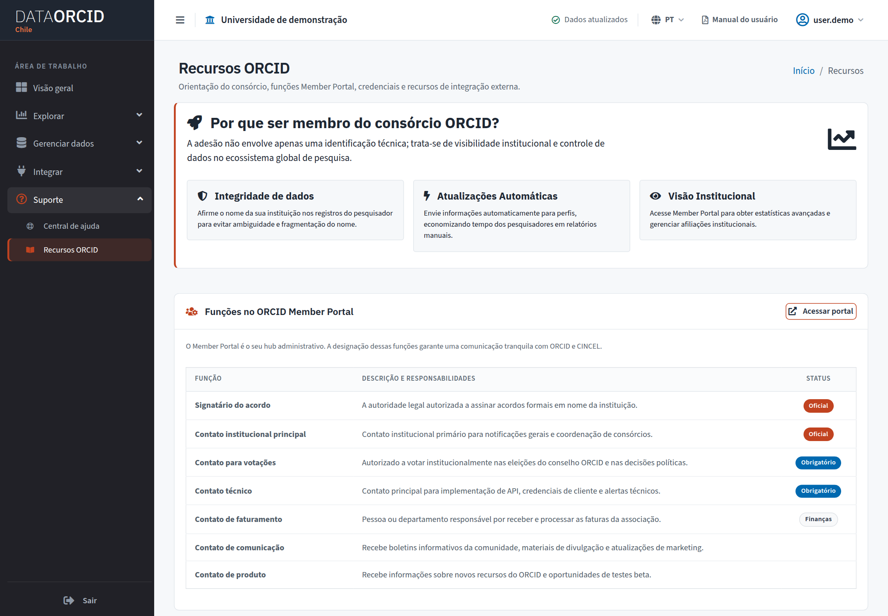

FIGURA 24. Recursos e documentação ORCID disponíveis em Suporte.

## 6.5 Publicação OAI-PMH

A publicação OAI-PMH permite consultar o repositório institucional do qual outros sistemas coletam metadados dos artigos selecionados. As abas organizam visão geral, artigos, mapeamento de metadados, importações DOI e acesso de coleta.

Usuário consulta o conteúdo disponível. Usuário OAI também pode expor ou excluir artigos, importar decisões por DOI, desfazer a última importação ativa, personalizar o formato dataorcid e gerenciar URLs privadas de coleta.

A visão geral mostra artigos disponíveis, validados pelo OpenAlex, expostos e não expostos. A validação exige uma afiliação OpenAlex correspondente ao ROR ativo. A política padrão e as decisões manuais determinam a seleção efetiva.

Se o provedor estiver desabilitado ou sem configuração, solicite sua habilitação à equipe responsável. Um artigo selecionado fica disponível enquanto o provedor estiver habilitado e a URL utilizada tiver acesso.

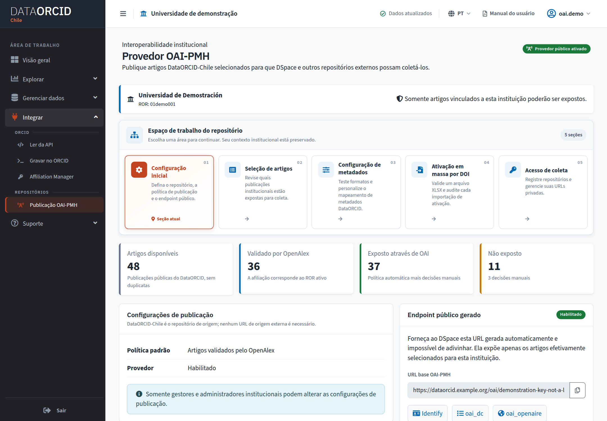

FIGURA 25. Visão geral OAI-PMH disponível para Usuário OAI.

## 6.6 Seleção de artigos OAI-PMH

A tabela permite buscar e filtrar por estado OAI, validação de afiliação, tipo documental e origem da ativação. É possível ordenar pelas colunas disponíveis e exportar a seleção filtrada para revisão.

Com Usuário OAI, Expor ou Excluir altera um artigo. Para agir sobre vários, marque as linhas e use as ações de expor ou excluir os selecionados. A seleção da página marca apenas as linhas da página atual.

Decisões manuais prevalecem sobre a política automática. Excluir um artigo do OAI-PMH não o remove do ORCID, do OpenAlex ou do cache de consulta.

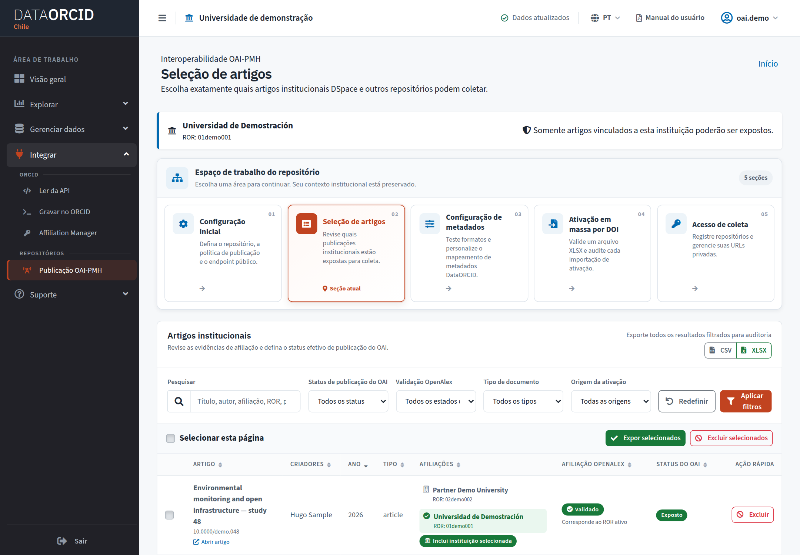

FIGURA 26. Seleção de artigos com as ações do perfil Usuário OAI.

1. Filtre e confira DOI, título e afiliações antes de selecionar.
2. Aplique a ação às linhas desejadas e verifique o novo estado.
3. Consulte o provedor habilitado para conferir o resultado publicado.

## 6.7 Formatos e mapeamento de metadados

O provedor oferece três formatos: oai_dc, oai_openaire e dataorcid. Os dois primeiros mantêm a estrutura padrão. O editor personaliza apenas o formato dataorcid.

Com Usuário OAI, selecione um campo do catálogo e adicione-o. Você pode alterar seu nome de destino ou ocultá-lo. Título e identificador são obrigatórios; campos ocultos não são emitidos.

Salvar mapeamento aplica as alterações. Restaurar padrões retorna ao perfil inicial quando o controle está disponível. Usuário pode consultar o mapeamento, mas não editá-lo.

A URL base gerada e os links de teste permitem examinar a resposta do provedor habilitado. Combine o formato necessário com quem recebe os metadados. O mapeamento altera a saída publicada, não os dados originais do ORCID.

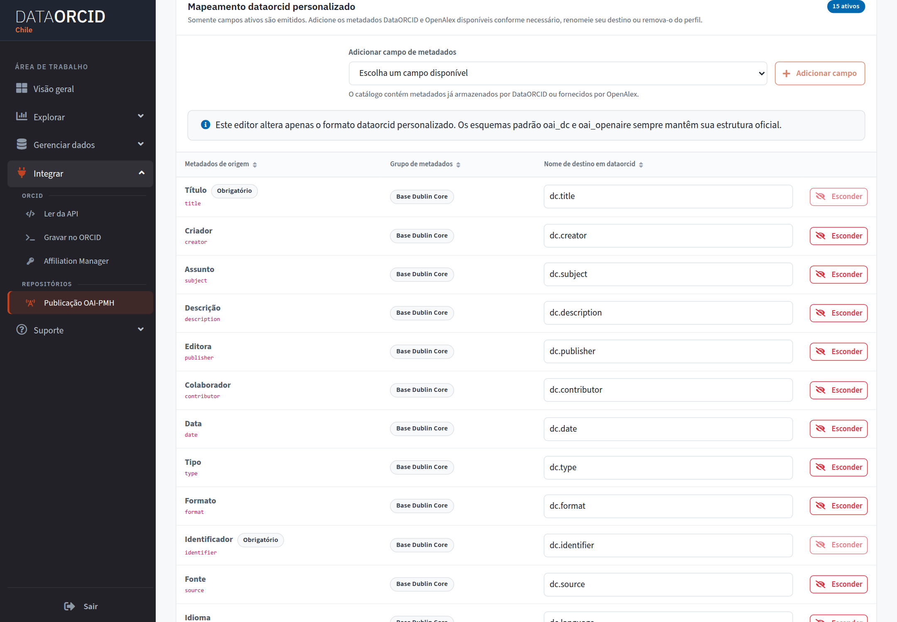

FIGURA 27. Editor do formato dataorcid para Usuário OAI.

## 6.8 Ativação em lote por DOI

Usuário OAI pode ativar artigos institucionais com uma planilha XLSX. O sistema reconhece DOI que já pertencem a artigos públicos no âmbito institucional. A importação não adiciona publicações externas nem sincroniza o ORCID.

Baixe o modelo e preencha um DOI por linha na coluna indicada. Selecione o arquivo XLSX e execute a validação e ativação. Confira o resultado antes de considerar a tarefa concluída.

DOI inválidos, repetidos ou não encontrados são informados sem modificar artigos fora do âmbito. Cada importação mantém um histórico com arquivo, data, resultados de validação e artigos ativados.

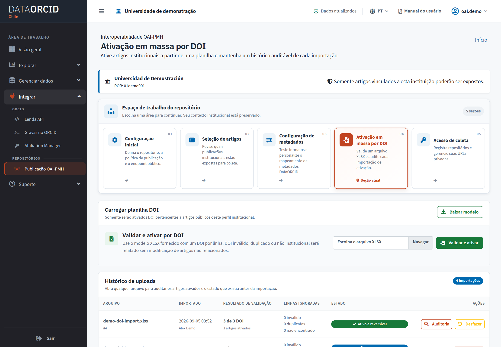

FIGURA 28. Envio de uma planilha DOI e histórico de importações.

> **IMPORTANTE:** Uma importação DOI registra decisões de publicação OAI-PMH. Não certifica uma afiliação ausente no OpenAlex nem modifica o registro público de origem.

## 6.9 Auditoria e reversão de importações

No histórico de importações, a auditoria abre os detalhes do arquivo para examinar os artigos ativados e o estado anterior. É possível distinguir importações aplicadas, desfeitas e a última importação ativa reversível.

Usuário OAI pode desfazer a última importação ativa. Examine os detalhes, selecione a ação de desfazer e confirme na plataforma. Para reverter uma importação anterior, desfaça primeiro as posteriores.

A reversão restaura as alterações atribuíveis àquela importação e preserva mudanças manuais posteriores. Confira o resultado e volte à tabela de artigos para verificar o estado efetivo.

Usuário pode consultar o histórico e a auditoria disponíveis. Se precisar de uma correção e não tiver permissão de edição OAI, solicite uma revisão à equipe responsável.

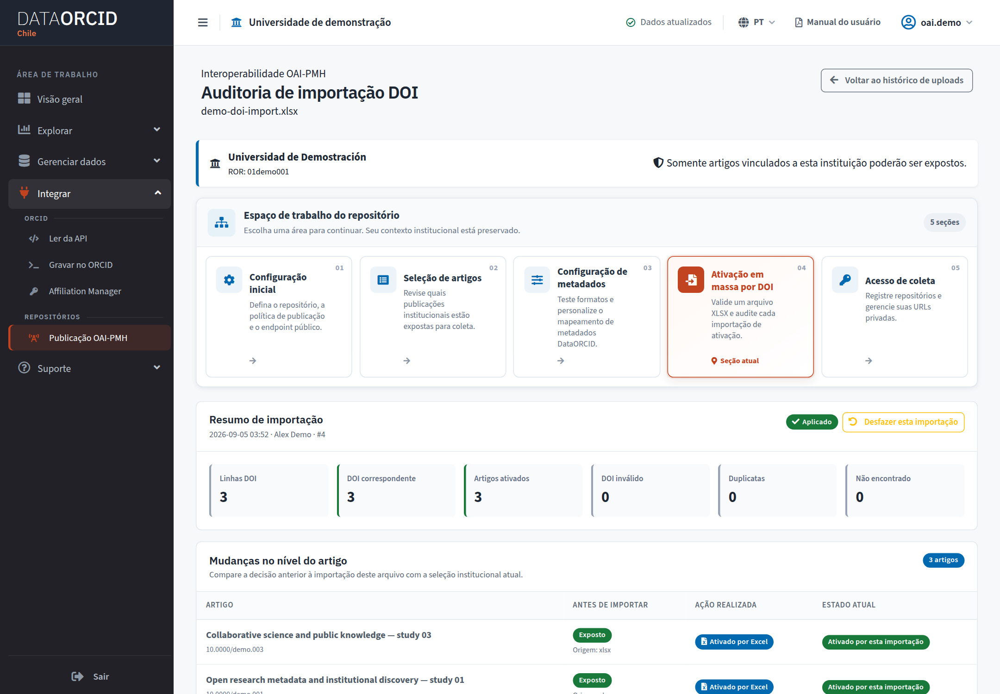

FIGURA 29. Auditoria de uma importação DOI de demonstração.

## 6.10 Acesso de coleta

Em Acesso de coleta, Usuário OAI pode cadastrar a URI de cada repositório institucional e gerar uma URL privada para o coletor. Usuário consulta os repositórios e seu estado; as chaves e os controles ficam reservados às contas com permissão de edição OAI.

Digite o endereço HTTP ou HTTPS do repositório sem credenciais, parâmetros de consulta ou fragmento e selecione Gerar URL privada. Copie o endereço completo. A URI identifica o destinatário; a chave aleatória da URL concede acesso independentemente do IP ou do Cloudflare.

No DSpace-CRIS, configure a URL privada como OAI Provider, escolha Simple Dublin Core (oai_dc) e coleta apenas de metadados. Inicie ou agende a coleta no DSpace. Não é necessário iniciar sessão no DataORCID.

Após configurar o coletor, ative a restrição a URLs privadas cadastradas e salve o modo de acesso. A URL geral deixará de funcionar. Revogar acesso bloqueia uma URL; gerar uma nova URL invalida a anterior e exige atualizar o coletor.

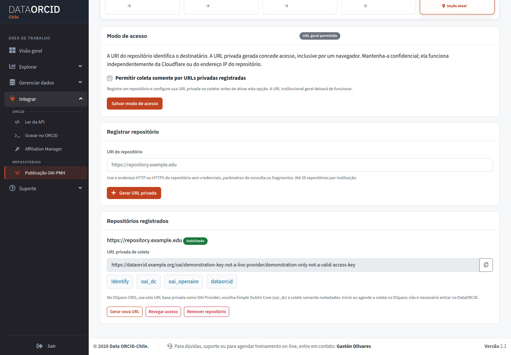

FIGURA 30. Repositório de demonstração e sua URL privada de coleta.

> **IMPORTANTE:** Quem conhece uma URL privada pode ler o XML, inclusive em um navegador. Mantenha-a confidencial. Revogar todas as URLs mantém a URL geral bloqueada enquanto o modo restrito estiver ativo.

## 7. Central de ajuda

A central de ajuda fica em Suporte. Inclui busca instantânea e temas sobre primeiros passos, fontes, fluxo de dados, métricas, transferências, dicionário de dados, permissões, integrações, solução de problemas e notas de versão.

O conteúdo acompanha os fluxos de Usuário e Usuário OAI. Temas e links se ajustam aos módulos habilitados; um módulo desabilitado também não aparece na ajuda ativa.

Digite um termo como DOI, exportação ou acesso aberto para localizar explicações. Abra o tema e use os links para voltar à função correspondente. Consulte essa ajuda antes de encaminhar uma dúvida operacional.

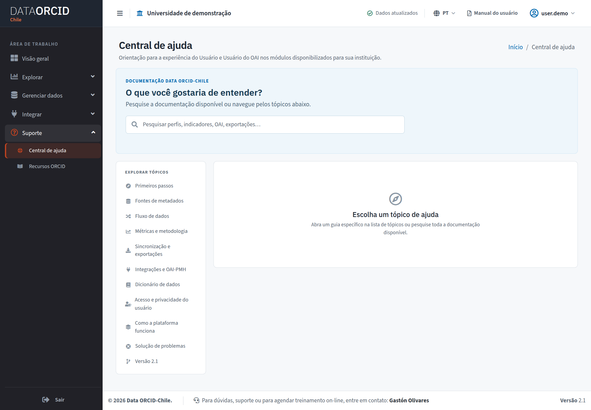

FIGURA 31. Busca e temas da central de ajuda.

## 8. Conta e segurança

### 8.1 Meu perfil

As opções pessoais permitem atualizar nome, sobrenome, e-mail e cargo. Confira os valores, faça as alterações e salve. O e-mail é usado para notificações e recuperação de senha.

Instituição, ROR e perfil não podem ser alterados nessa tela. Se não corresponderem à sua situação, solicite uma revisão à equipe responsável.

O seletor de idioma permite manter a interface no idioma habilitado de sua preferência. Alterações na conta não modificam o registro público ORCID de um pesquisador.

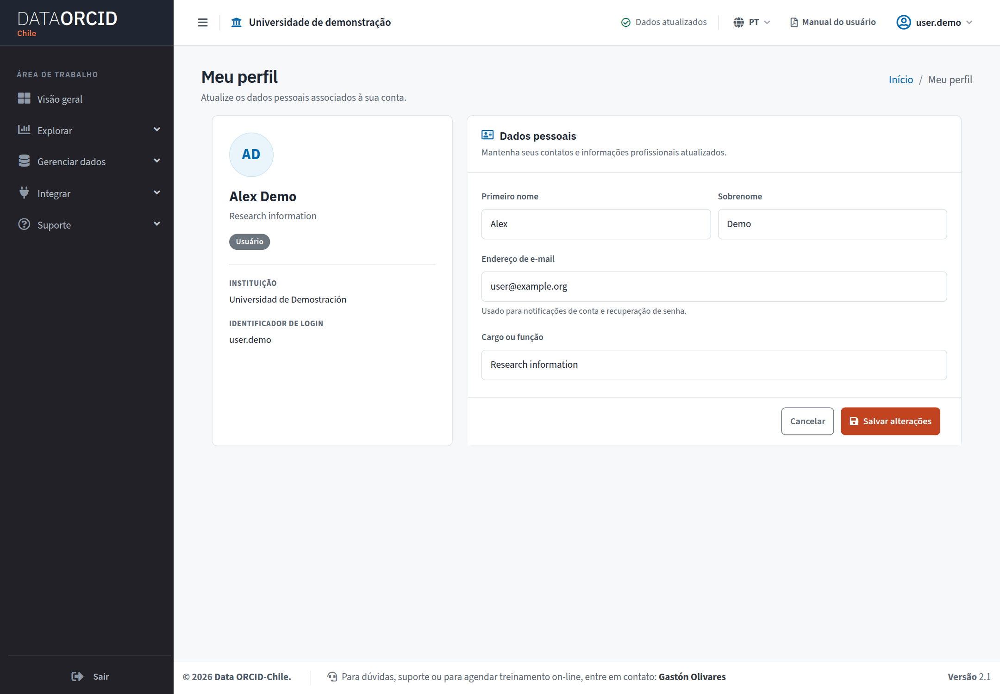

FIGURA 32. Edição dos dados pessoais da conta fictícia.

## 8.2 Senha e encerramento de sessão

Para alterar a senha, informe a atual, uma nova com pelo menos oito caracteres e sua confirmação. O sistema também limita o comprimento a 72 bytes UTF-8; alguns caracteres ocupam mais de um byte.

Salve a alteração e confira a confirmação. Use uma senha exclusiva para esta conta e não a compartilhe. Se não souber a senha atual, use a recuperação na página de início de sessão.

A opção de encerrar sessão fica na parte inferior do menu lateral. Use-a ao terminar, especialmente em dispositivos compartilhados. Evite incluir credenciais ou informações pessoais privadas em buscas, arquivos ou solicitações de suporte.

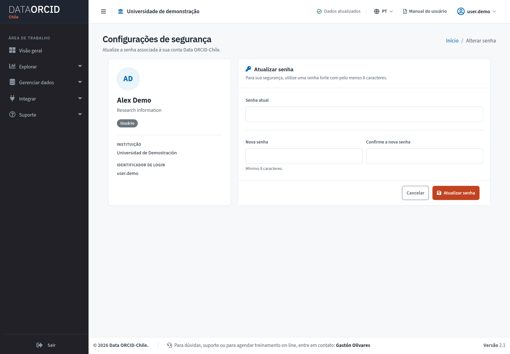

FIGURA 33. Alteração da senha da conta.

## 9. Fontes, metodologia e boas práticas

### 9.1 Como se constrói o âmbito institucional

O ROR é a chave institucional principal. Identificadores GRID ou Ringgold verificados complementam a busca no ORCID quando disponíveis. Os resultados são combinados e deduplicados por ORCID iD, preservando evidências de origem.

### 9.2 Relação entre ORCID, OpenAlex e OAI-PMH

O ORCID fornece perfis e registros públicos. O OpenAlex acrescenta metadados analíticos aos artigos elegíveis com correspondência aceita. O OAI-PMH publica metadados da seleção institucional efetiva; não baixa o texto completo nem modifica o ORCID.

### 9.3 Boas práticas

1. Confira data de atualização, instituição e filtros antes de citar um número.
2. Diferencie registros ORCID, produções canônicas e artigos enriquecidos.
3. Consulte definições e métodos nos botões de informação.
4. Guarde data, filtros e âmbito com cada exportação.
5. Trate possíveis duplicados e lacunas de cobertura como indícios sujeitos a revisão.
6. Compare conjuntos com períodos, denominadores e coberturas equivalentes.
7. Confira a seleção OAI-PMH e o formato antes de compartilhar sua URL com o sistema receptor.

## 10. Glossário

| CONCEITO | DESCRIÇÃO |
| --- | --- |
| ORCID iD | Identificador persistente de um pesquisador. |
| ROR | Identificador institucional principal usado pela plataforma. |
| GRID e Ringgold | Identificadores institucionais históricos e verificados que complementam a busca; não substituem o ROR. |
| Registro ORCID | Dado público adicionado a um perfil, como uma obra ou um financiamento. |
| Produção canônica | Publicação consolidada por DOI normalizado ou, de forma conservadora, por título e ano. |
| Cache | Cópia local das informações recuperadas. Sua data ajuda a avaliar a atualidade do conjunto. |
| Cobertura OpenAlex | Proporção dos artigos ORCID elegíveis que possuem correspondência e metadados OpenAlex. |
| Citações | Número atual de citações de uma publicação segundo as informações OpenAlex disponíveis. |
| FWCI | Impacto de citações normalizado por campo, ano e tipo documental. |
| Acesso aberto Diamante | Categoria OpenAlex de artigos em revistas totalmente abertas sem taxas de publicação para autores. |
| Acesso aberto Verde | Categoria OpenAlex de acesso por meio de uma cópia em repositório. |
| AM | Affiliation Manager do ORCID; seu Client ID ajuda a reconhecer registros gerenciados. |

## 10.1 Termos de exportação e integração

| CONCEITO | DESCRIÇÃO |
| --- | --- |
| Exportação em segundo plano | Preparação de um arquivo enquanto você continua usando a plataforma. |
| Arquivo válido | Exportação concluída que ainda pode ser baixada e, quando aplicável, reutilizada. |
| OAI-PMH | Protocolo que permite a um sistema coletar metadados de outro. |
| Provedor | Serviço que expõe a seleção institucional por uma URL base. |
| Coletor | Sistema receptor que consulta o provedor e incorpora metadados. |
| Artigo exposto | Artigo incluído na seleção efetiva; a disponibilidade pública também exige um provedor habilitado. |
| Validação OpenAlex | Correspondência de uma afiliação do artigo com o ROR da instituição ativa. |
| Decisão manual | Inclusão ou exclusão que prevalece sobre a política automática. |
| oai_dc | Formato de metadados Dublin Core do provedor. |
| oai_openaire | Formato OpenAIRE do provedor. |
| dataorcid | Formato cujos campos e nomes de destino podem ser personalizados pelo Usuário OAI. |
| Importação DOI | Planilha XLSX que ativa artigos já presentes no âmbito institucional e mantém uma auditoria. |
| Reversão de importação | Ação que desfaz a última importação ativa e preserva alterações manuais posteriores. |

## 11. Solução de problemas

### Não aparecem dados

Redefina os filtros e confira o indicador de atualização. Se o conjunto institucional estiver indisponível, solicite à equipe responsável uma revisão do estado dos dados.

### Um número difere entre os módulos

Verifique se conta registros ORCID, produções canônicas ou artigos OpenAlex. Confira período, tipo, acesso aberto, afiliação e data de atualização.

### Uma exportação está vazia, pendente ou expirada

Confirme se a visualização tem resultados e remova filtros muito restritivos. Consulte o centro flutuante para verificar o estado. Solicite novamente um arquivo expirado; se uma tarefa não avançar, informe a visualização e o horário da solicitação.

### Não consigo editar artigos ou mapeamentos OAI-PMH

Usuário tem acesso de consulta. Seleção, importações DOI e mapeamento exigem Usuário OAI associado à instituição. Se precisar dessa permissão para o trabalho, solicite uma revisão.

### Um DOI não é ativado ou não consigo desfazer uma importação

Confira o modelo e o relatório de DOI inválidos, repetidos ou não encontrados. A importação só ativa artigos do âmbito institucional. Apenas a última importação ativa pode ser desfeita; consulte o histórico e as alterações posteriores.

### Um módulo não aparece ou o provedor público falha

A disponibilidade depende dos módulos habilitados e do estado do provedor. Consulte a central de ajuda e solicite uma revisão à equipe responsável. Inclua página, data, filtros e uma captura sem informações sensíveis.

## INFORMAÇÕES DE CONTATO

Consorcio para el Acceso a la Información Científica Electrónica

Moneda 1375, 13º andar · Santiago, Chile · +56 2 2365 4589

[secretariaejecutiva@cincel.cl](mailto:secretariaejecutiva@cincel.cl) · [www.cincel.cl](https://www.cincel.cl)
